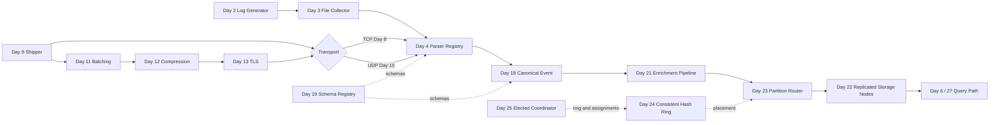

# SDCourse Days 1–25: System Evolution and Why Each Lesson Matters

> Original guide based on the public curriculum and general distributed-systems knowledge. It does not reproduce subscriber-only text.

## The system built across 25 days

The sequence develops one LogStream platform in four stages: a reliable local pipeline, secure network transport, governed structured data, and a distributed storage control plane. Each day should leave an executable capability and a testable contract for the next day.

## Week 1: Setting Up the Infrastructure

Build a trustworthy single-machine vertical slice: generate, collect, parse, store, query, and integrate. The emphasis is deterministic behaviour and explicit durability boundaries.

### Day 1: Set up development environment (Docker, Git, VS Code) and create project repository

- **Importance:** Establishes a reproducible engineering baseline. Distributed-system bugs are difficult enough without differences in JDKs, operating systems, ports, container versions, or build tools adding noise.
- **System contribution:** Creates the repository, module boundaries, local Docker network, configuration conventions, quality gates, and the first executable service skeletons.
- **Java 21/Spring Boot direction:** Use Java 21, Gradle or Maven, Spring Boot, Testcontainers, Docker Compose, Spotless/Checkstyle, JUnit 5, and a multi-module layout such as common-model, generator, collector, parser, storage, query-cli, and integration-tests.
- **Main validation:** Validate a clean checkout can build, test, and start the same stack with one command. Record versions and fail fast when required ports, certificates, or directories are missing.
- **Expected outcome:** Configured development environment with all necessary tools and initialized repository
- **Article:** https://sdcourse.substack.com/p/day-1-setting-up-your-distributed

### Day 2: Implement a basic log generator that produces sample logs at configurable rates

- **Importance:** A controllable producer is the foundation for every later correctness and performance experiment. Without deterministic input, throughput, ordering, retries, and data-loss claims cannot be trusted.
- **System contribution:** Adds a synthetic event source that emits timestamped, uniquely identified log records at configurable rates and distributions.
- **Java 21/Spring Boot direction:** Implement a Spring Boot command-line or lightweight service using ScheduledExecutorService, virtual threads where useful, a token-bucket rate controller, Jackson, and a pluggable LogEventFactory. Include eventId, sourceId, sequence, eventTime, level, payload, and schemaVersion.
- **Main validation:** Test exact and burst rates, monotonic sequence generation, shutdown flushing, deterministic seeds, malformed payload modes, and timestamp skew. Expose generated_total, generation_rate, and generation_lag metrics.
- **Expected outcome:** Working log generator that creates timestamped events with configurable throughput
- **Article:** https://sdcourse.substack.com/p/day-2-building-your-first-log-generator

### Day 3: Create a simple log collector service that reads local log files

- **Importance:** Collection is where external side effects become durable processing state. A file tailer that forgets offsets or mishandles rotation silently duplicates or loses data.
- **System contribution:** Introduces a collector that watches files, reads appended bytes, converts complete lines into records, and checkpoints progress.
- **Java 21/Spring Boot direction:** Use Java NIO WatchService only as a notification hint, then poll file size and identity. Persist a checkpoint containing source, file key, byte offset, last event hash, and update time. Keep reading and checkpoint commits separate.
- **Main validation:** Test append, truncate, rename-and-create rotation, copy-truncate rotation, partial trailing lines, process restart, permission failures, and duplicate notifications. A checkpoint must advance only after downstream acceptance.
- **Expected outcome:** Service that watches log files and detects new entries
- **Article:** https://sdcourse.substack.com/p/day-3-creating-a-simple-log-collector

### Day 4: Implement log parsing functionality to extract structured data from common log formats

- **Importance:** Parsing converts transport text into data the rest of the platform can reason about. Poor parsing spreads format-specific assumptions into storage and query layers.
- **System contribution:** Adds format detection and parser strategies for Apache, Nginx, JSON, and other common layouts, producing a canonical structured event.
- **Java 21/Spring Boot direction:** Define LogParser and ParseResult interfaces, a parser registry, typed error codes, and a CanonicalLogEvent record. Avoid one large regex; compile patterns, bound input length, and isolate expensive parsers. Use Jackson for JSON and DateTimeFormatter for timestamps.
- **Main validation:** Use golden-file tests, malformed and adversarial input, timezone variations, optional fields, oversized lines, and parser ambiguity. Preserve rawLine and parserVersion for audit and replay.
- **Expected outcome:** Parser for Apache/Nginx logs that extracts timestamp, IP, status code, etc.
- **Article:** https://sdcourse.substack.com/p/day-4-log-parsing-extracting-structure

### Day 5: Build a basic log storage mechanism using flat files with rotation policies

- **Importance:** The first storage layer teaches append-only durability, segment lifecycle, retention, and the operational consequences of disk limits before distributed storage adds complexity.
- **System contribution:** Adds append-only segment files, rotation by size or time, retention, and basic segment metadata.
- **Java 21/Spring Boot direction:** Create a SegmentWriter with one writer thread per partition, buffered channels, configurable fsync policy, atomic rename from active to sealed segments, and a manifest containing segmentId, time range, byte size, checksum, and record count.
- **Main validation:** Test crash during append, crash during rotation, disk full, corrupted tail, concurrent readers, retention safety, and restart recovery. Never delete the active segment or a segment still referenced by a reader.
- **Expected outcome:** Log storage system with configurable rotation based on size/time
- **Article:** https://sdcourse.substack.com/p/day-5-building-a-log-storage-system

### Day 6: Create a simple CLI tool to query and filter collected logs

- **Importance:** A query tool makes the system observable and useful while exposing whether storage metadata and event contracts support efficient retrieval.
- **System contribution:** Adds a CLI capable of selecting time ranges, sources, levels, status codes, and text patterns over stored segments.
- **Java 21/Spring Boot direction:** Use Picocli with a QueryRequest record, streaming iterators, bounded memory, and an explain mode that lists selected partitions and segments. Separate parsing of CLI arguments from query planning and execution.
- **Main validation:** Test empty results, huge result sets, invalid filters, regex timeouts, concurrent segment rotation, deterministic ordering, cancellation, and broken pipes when output is redirected.
- **Expected outcome:** Command-line utility that can search and filter logs using basic patterns
- **Article:** https://sdcourse.substack.com/p/day-6-building-a-log-query-cli-tool

### Day 7: Integrate the components into a simple local log processing pipeline

- **Importance:** Integration reveals mismatched assumptions between independently correct components. This is the first point where data loss, backpressure, shutdown, and tracing must work end to end.
- **System contribution:** Connects generator, collector, parser, storage, and query into one local pipeline with shared contracts and lifecycle control.
- **Java 21/Spring Boot direction:** Use explicit ports between components, bounded BlockingQueue or Reactor sinks, lifecycle phases, and an integration test launched with Testcontainers. Propagate eventId and correlationId through every stage.
- **Main validation:** Kill each component independently, fill queues, slow storage, rotate files mid-flight, and verify produced = stored + explicitly rejected. Shutdown should stop intake, drain accepted work, persist checkpoints, and close files.
- **Expected outcome:** End-to-end system generating, collecting, storing, and querying logs on a single machine
- **Article:** https://sdcourse.substack.com/p/day-7-integrate-components-into-a

## Week 2: Network-Based Log Collection

Move the pipeline across machines and progressively add transport choices, client reliability, batching, compression, encryption, and evidence-driven performance testing.

### Day 8: Implement a TCP server to receive logs over the network

- **Importance:** Moving ingestion onto a network introduces connection state, message framing, partial reads, client isolation, and resource exhaustion risks.
- **System contribution:** Adds a TCP ingestion server that accepts concurrent shippers and converts framed network messages into internal records.
- **Java 21/Spring Boot direction:** Use Netty or Java NIO, length-prefixed frames, maximum frame sizes, idle timeouts, connection quotas, and a bounded handoff queue. Spring Boot can host management endpoints while Netty handles the data plane.
- **Main validation:** Test fragmented frames, multiple frames per packet, slowloris clients, abrupt disconnects, oversized frames, connection storms, and server restarts. A TCP write success is not yet a durable acknowledgement.
- **Expected outcome:** Server accepting TCP connections with log data
- **Article:** https://sdcourse.substack.com/p/day8-building-a-tcp-server-for-network

### Day 9: Create a log shipping client that forwards logs to the TCP server

- **Importance:** The shipper defines the client-side durability boundary. It must survive network interruption without blocking applications or silently discarding accepted logs.
- **System contribution:** Adds a client agent that tails local logs, buffers records, connects to the server, transmits frames, and tracks acknowledgements.
- **Java 21/Spring Boot direction:** Build a ShipperAgent with a local spool, connection state machine, bounded in-flight map, exponential backoff, and acknowledgement correlation by eventId or batchId. Use virtual threads for isolated blocking connections or Netty for many destinations.
- **Main validation:** Test offline operation, spool saturation, duplicate acknowledgement, server reset, DNS changes, certificate changes, and restart with unacknowledged data. The source checkpoint advances only after the defined remote durability acknowledgement.
- **Expected outcome:** Client sending logs from one machine to another over TCP
- **Article:** https://sdcourse.substack.com/p/day-9-create-a-log-shipping-client

### Day 10: Add UDP support for high-throughput log shipping

- **Importance:** UDP demonstrates the trade between lower overhead and weaker delivery guarantees. It is appropriate only when loss is acceptable or recovered at another layer.
- **System contribution:** Adds datagram-based transport beside TCP with explicit limits and observability for drops, reordering, and duplication.
- **Java 21/Spring Boot direction:** Use DatagramChannel or Netty DatagramPacket, keep payloads below a safe MTU, include sourceId and sequence, and expose separate UDP policies. Do not emulate full TCP reliability accidentally without evaluating the complexity.
- **Main validation:** Inject packet loss, duplication, reordering, truncation, and receiver overload. Measure kernel receive-buffer drops and define whether missing sequences create alerts, gaps, or retransmission requests.
- **Expected outcome:** Server and client handling log transmission over UDP
- **Article:** https://sdcourse.substack.com/p/day-10-adding-udp-support-for-high

### Day 11: Implement batching in the log shipper to optimize network usage

- **Importance:** Batching amortizes syscall, framing, encryption, and acknowledgement costs, but increases latency and enlarges the failure unit.
- **System contribution:** Groups records by maximum count, bytes, or dwell time and sends one batch with one identity and acknowledgement contract.
- **Java 21/Spring Boot direction:** Implement a BatchAccumulator with count, byte, and time triggers; a BatchEnvelope with batchId and record checksums; and an Ack result that can represent whole-batch or per-record outcomes.
- **Main validation:** Test low traffic, burst traffic, timer races, shutdown flush, oversized single records, partial rejection, retry duplication, and adaptive sizing. Measure batch_fill_ratio and oldest_record_age.
- **Expected outcome:** Client that efficiently batches logs with configurable batch size and interval
- **Article:** https://sdcourse.substack.com/p/day-11-implement-batching-in-the

### Day 12: Add compression to reduce network bandwidth usage

- **Importance:** Compression lowers bandwidth and storage pressure at the cost of CPU, latency, and larger corruption domains. The correct codec depends on payload size and operational goals.
- **System contribution:** Adds negotiated compression to batch envelopes and records codec, original length, and checksum metadata.
- **Java 21/Spring Boot direction:** Support codecs behind a CompressionCodec interface, initially gzip and a fast codec such as LZ4 or Zstandard. Compress batches rather than tiny individual events, and enforce maximum decompressed size.
- **Main validation:** Test corrupted payloads, zip bombs, unsupported codecs, mixed versions, small-batch regressions, and fallback negotiation. Track bytes_before, bytes_after, compression_ratio, and codec CPU time.
- **Expected outcome:** Compressed log transmission with measurable bandwidth reduction
- **Article:** https://sdcourse.substack.com/p/day-12-add-compression-to-reduce

### Day 13: Implement TLS encryption for secure log transmission

- **Importance:** Logs frequently contain identifiers, tokens, infrastructure details, and customer data. Encryption and peer identity are mandatory when crossing trust boundaries.
- **System contribution:** Adds TLS, certificate validation, optional mutual TLS, and certificate rotation procedures to the network path.
- **Java 21/Spring Boot direction:** Configure Netty SslContext or Spring SSL bundles, TLS 1.3, hostname verification, short-lived certificates, and reloadable trust/key material. Map certificate identity to an authorized tenant/source.
- **Main validation:** Test expired, revoked, mismatched, and untrusted certificates; rotation overlap; clock skew; handshake floods; and downgrade attempts. Observe handshake failures and certificate-expiry lead time.
- **Expected outcome:** Encrypted log transmission with certificate management
- **Article:** https://sdcourse.substack.com/p/day-13-tls-encryption-for-secure

### Day 14: Build a simple load generator and measure throughput of the system

- **Importance:** A benchmark turns architectural claims into evidence and identifies the saturation point, bottleneck, and failure behaviour under load.
- **System contribution:** Adds a workload driver, metrics collection, latency histograms, resource monitoring, and repeatable benchmark scenarios.
- **Java 21/Spring Boot direction:** Use a separate load-generator process with HDR Histogram, configurable source counts and payloads, warm-up and steady phases, and exported run metadata. Gatling or a custom Netty client can drive transport tests.
- **Main validation:** Benchmark normal load, spikes, slow storage, packet loss, restart recovery, and sustained overload. Report p50/p95/p99/p99.9, accepted and durable throughput, error rate, queue depth, CPU, memory, GC, network, and disk.
- **Expected outcome:** Benchmark report showing logs/second processing capability
- **Article:** https://sdcourse.substack.com/p/day-14-building-your-first-load-generator

## Week 3: Data Serialization and Formats

Separate wire formats from the canonical model, introduce schema evolution and governance, support real operating-system sources, and enrich events with useful context.

### Day 15: Add JSON support for structured log data

- **Importance:** JSON introduces a broadly interoperable structured format and forces explicit decisions about schemas, versioning, unknown fields, and validation failures.
- **System contribution:** Allows producers and collectors to exchange structured events with a documented envelope and validation rules.
- **Java 21/Spring Boot direction:** Use Jackson records, explicit schemaVersion, strict limits, ISO-8601 UTC timestamps, and JSON Schema validation at trust boundaries. Keep domain objects separate from wire DTOs.
- **Main validation:** Test missing and unknown fields, numeric overflow, invalid UTF-8, deeply nested input, large strings, mixed versions, and stable serialization. Validation failures need a quarantine path, not silent dropping.
- **Expected outcome:** End-to-end JSON log processing with schema validation
- **Article:** https://sdcourse.substack.com/p/day-15-json-support-for-structured

### Day 16: Implement Protocol Buffers for efficient binary serialization

- **Importance:** Protocol Buffers demonstrates compact binary contracts and generated, strongly typed clients, while teaching compatibility rules that cannot be fixed after field numbers are reused.
- **System contribution:** Adds protobuf encoding/decoding and content-type negotiation alongside JSON.
- **Java 21/Spring Boot direction:** Define .proto files in a contracts module, reserve removed field numbers, avoid required semantics, wrap events in a versioned envelope, and generate Java classes in the build. Translate generated types at the domain boundary.
- **Main validation:** Run old-writer/new-reader and new-writer/old-reader tests, preserve unknown fields, test corrupted lengths and huge allocations, and compare CPU, bytes, and latency with JSON.
- **Expected outcome:** Log system using Protocol Buffers with measurable performance gain
- **Article:** https://sdcourse.substack.com/p/day-16-implement-protocol-buffers

### Day 17: Create Avro serialization support for schema evolution

- **Importance:** Avro makes writer and reader schemas explicit and is useful where records evolve independently and schema resolution occurs at read time.
- **System contribution:** Adds Avro serialization and schema-resolution behaviour, preparing for centralized schema governance.
- **Java 21/Spring Boot direction:** Use Apache Avro SpecificRecord or GenericRecord intentionally, carry a schema ID/fingerprint in the envelope, provide defaults for added fields, and test aliases and type promotion.
- **Main validation:** Build a compatibility matrix, test missing defaults, incompatible type changes, unknown schema IDs, registry outages, and schema-cache eviction. Record schema IDs with stored events for replay.
- **Expected outcome:** Log system using Avro with schema versioning demonstration
- **Article:** https://sdcourse.substack.com/p/day-17-create-avro-serialization

### Day 18: Implement log normalization to convert between formats

- **Importance:** Normalization prevents every downstream component from supporting every source format. It also makes unavoidable information loss and provenance explicit.
- **System contribution:** Adds a translation layer from text, JSON, Protobuf, and Avro into one canonical event, plus optional re-encoding for destinations.
- **Java 21/Spring Boot direction:** Implement Decoder<T>, Normalizer<T>, and Encoder<T> ports. The canonical model should include raw payload reference, source format, schema ID, normalized fields, and extension attributes so uncommon data is not discarded.
- **Main validation:** Use round-trip and property-based tests, define loss reports, preserve raw data for replay, test unknown fields, and version normalization rules. A transformation failure must identify the stage and schema.
- **Expected outcome:** Service that can transform logs between different formats (text, JSON, Protobuf, Avro)
- **Article:** https://sdcourse.substack.com/p/day-18-building-a-universal-log-translator

### Day 19: Add a schema registry service for format management

- **Importance:** A schema registry turns format evolution into a governed distributed-system capability rather than a convention hidden in individual services.
- **System contribution:** Adds schema registration, immutable versions, compatibility checks, lookup by ID, caching, and authorization.
- **Java 21/Spring Boot direction:** Build a Spring Boot registry API with PostgreSQL or another durable store, content-addressed schema IDs, optimistic concurrency, compatibility validators for JSON/Protobuf/Avro, and Caffeine caches in clients.
- **Main validation:** Test concurrent registration, duplicate schemas, incompatible updates, cache staleness, registry outage, authorization boundaries, and disaster recovery. Producers should fail safely when a required schema cannot be resolved.
- **Expected outcome:** Central service for managing and validating log formats and schemas
- **Article:** https://sdcourse.substack.com/p/day-19-schema-registry-service-the

### Day 20: Build compatibility layer for common logging formats (syslog, journald)

- **Importance:** Real systems must ingest established operating-system formats. Adapters isolate source-specific cursor and framing semantics from the core pipeline.
- **System contribution:** Adds syslog and journald adapters that emit the canonical event and preserve source metadata.
- **Java 21/Spring Boot direction:** Implement adapters around syslog TCP/UDP framing and journalctl export or native bindings. Map facility, severity, hostname, app name, process ID, message ID, and structured fields into canonical attributes.
- **Main validation:** Test multiline messages, invalid priority values, cursor expiry, reboot boundaries, duplicate replay, timezone differences, UDP loss, and privileged access. Keep adapter checkpoints independent per source.
- **Expected outcome:** Adapters for ingesting logs from system services
- **Article:** https://sdcourse.substack.com/p/day-20-building-universal-log-language

### Day 21: Implement a simple log enrichment pipeline adding metadata to raw logs

- **Importance:** Enrichment converts technically correct logs into operationally useful events by attaching service, host, deployment, geography, ownership, and business context.
- **System contribution:** Adds enrichment processors and reference-data caches between normalization and storage.
- **Java 21/Spring Boot direction:** Use an ordered EnrichmentStage chain with immutable events, bounded Caffeine caches, async refresh, per-stage timeout, and attributes recording enrichment version and source. Keep optional enrichment from blocking ingestion indefinitely.
- **Main validation:** Test stale and missing metadata, lookup outages, slow providers, conflicting values, replay determinism, and privacy redaction. Measure stage latency, cache hit rate, and unenriched event counts.
- **Expected outcome:** A working backend system that processes logs end-to-end
- **Article:** https://sdcourse.substack.com/p/day-21-building-your-first-log-enrichment

## Week 4: Distributed Log Storage

Distribute partitions and replicas across nodes, balance placement with consistent hashing, and introduce a leader-elected control plane for safe coordination.

### Day 22: Set up a multi-node storage cluster using simple file replication

- **Importance:** Replication is the first major distributed-storage step. It introduces partial failure, replica lag, write acknowledgement policy, and recovery of missing copies.
- **System contribution:** Turns local segments into replicated partitions distributed across several storage nodes.
- **Java 21/Spring Boot direction:** Create a storage-node service with partition replicas, append RPCs, durable offsets, checksums, and replica state. Start with a primary-replica model and clearly define when a write is acknowledged: local durable, quorum durable, or all replicas.
- **Main validation:** Test node loss before and after acknowledgement, duplicate replication, lagging replicas, disk corruption, network partition, replacement nodes, and recovery throttling. Expose under_replicated_partitions and replica_lag_bytes.
- **Expected outcome:** Log storage distributed across multiple nodes with basic replication
- **Article:** https://sdcourse.substack.com/p/day-22-building-your-first-multi

### Day 23: Implement partitioning strategy for logs based on source or time

- **Importance:** Partitioning enables horizontal scale and query pruning, but a poor key creates hot partitions, expensive fan-out, or unbalanced retention.
- **System contribution:** Assigns each event to a partition using source, tenant, time bucket, or a composite strategy and routes reads to relevant partitions.
- **Java 21/Spring Boot direction:** Define PartitionStrategy and PartitionId contracts. A practical first key is tenant/source plus time bucket, with hash sub-partitions for high-volume sources. Persist partition metadata and make routing deterministic.
- **Main validation:** Test skewed tenants, clock boundaries, late events, key changes, partition-count changes, and queries spanning buckets. Measure partition byte and event distribution, not only node totals.
- **Expected outcome:** Partitioned storage demonstrating improved query performance
- **Article:** https://sdcourse.substack.com/p/day-23-smart-log-partitioning-making

### Day 24: Add consistent hashing for balanced distribution

- **Importance:** Consistent hashing minimizes movement when nodes join or leave and provides stable routing, but production balance depends on virtual nodes, weights, and controlled handoff.
- **System contribution:** Adds a hash ring that maps partitions or event keys to an ordered replica set and coordinates rebalancing.
- **Java 21/Spring Boot direction:** Implement an immutable ring snapshot using a sorted map of tokens, many virtual nodes per physical node, weighted token counts, and a version/epoch. Route using a stable hash and select distinct physical nodes for replicas.
- **Main validation:** Test deterministic routing, evenness, node add/remove movement percentage, weighted nodes, hash collisions, stale ring versions, dual routing during migration, and rollback. Use fencing by ring epoch for writes during handoff.
- **Expected outcome:** Storage nodes with even distribution of logs using consistent hashing
- **Article:** https://sdcourse.substack.com/p/day-24-consistent-hashing-for-balanced

### Day 25: Implement leader election for cluster management

- **Importance:** Leader election establishes a single coordinator for control-plane duties without pretending the entire data plane must be single-leader. Correctness depends on terms, leases, and fencing—not merely choosing one node.
- **System contribution:** Adds an elected cluster coordinator for membership changes, ring publication, partition assignments, or administrative operations, with automatic failover.
- **Java 21/Spring Boot direction:** For learning, implement a simplified Raft-style election with persistent currentTerm and votedFor, randomized election timeout, RequestVote and heartbeat RPCs, and majority election. Every coordinator command carries the term as a fencing token. For production, use an established consensus system rather than a home-grown protocol.
- **Main validation:** Test simultaneous candidates, network partitions, paused leaders, clock issues with leases, stale leader writes, restart with persisted term, minority isolation, and recovery. Assert at most one leader per term and reject stale fencing tokens.
- **Expected outcome:** Storage cluster with automatic leader election recovery
- **Article:** https://sdcourse.substack.com/p/day-25-implement-leader-election

## Cross-cutting review after Day 25

- Reconcile generated, accepted, stored, replicated, rejected, and retried event counts.
- Prove checkpoints never advance before the chosen durability acknowledgement.
- Demonstrate bounded queues, overload behaviour, recovery, schema evolution, partition skew, rebalancing, and stale-leader fencing.
- Keep public source captures and article images separate from these original explanations.
