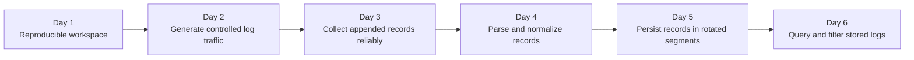

# SDCourse Python/JavaScript — Module 1, Week 1 Review Pack

This folder contains the first five **original exploration documents** produced after running the public SDCourse collector.

## Source and copyright boundary

For each day, the pipeline first saves its runtime output privately under:

```text
engineering-knowledge-base/output/daily-learning/sdcourse-python-js/day-NNN/
├── 01-public-source.md
├── 02-completed-lesson.md
└── STATUS.json
```

The `output` directory is ignored by Git because it may contain publicly visible article text and image links captured during personal study. The files in this `learning` directory are different: they are original explanations based on the public curriculum objective, the anonymously visible introduction/diagrams, and general engineering knowledge. They do not reproduce subscriber-only course text.

## First five lessons

1. [Day 1 — Reproducible Development Environment](day-001-development-environment.md)
2. [Day 2 — Configurable Log Generator](day-002-configurable-log-generator.md)
3. [Day 3 — Reliable Local File Collector](day-003-local-log-collector.md)
4. [Day 4 — Multi-format Log Parser](day-004-log-parsing.md)
5. [Day 5 — Flat-file Storage and Rotation](day-005-flat-file-storage.md)

## How the five days connect



Together, these lessons form the first local vertical slice of the LogStream platform:

```text
controlled producer -> file collector -> parser -> local durable storage -> query tool
```

The key learning objective is not merely to make each script run. It is to define stable contracts and failure semantics early, so the same components can later be distributed across machines without being rewritten from scratch.
