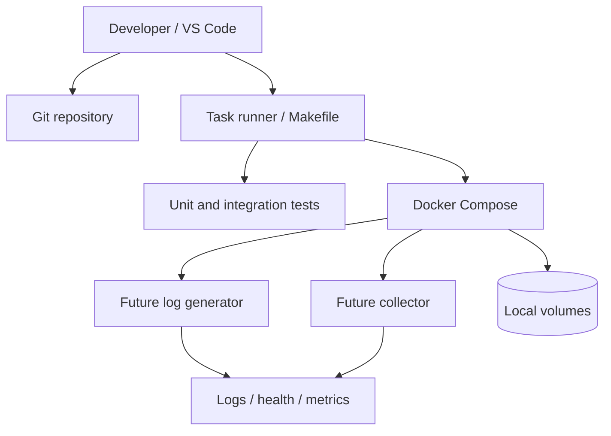

# Day 1 — Build a Reproducible Development Environment

## Public source signals used

The public curriculum asks for a Docker-, Git-, and VS Code-based environment with an initialized repository. The important idea is reproducibility: every later lesson should run with the same commands on another developer machine and in CI.

This document is an original implementation guide. It does not reproduce the course article.

## What you are actually building

Day 1 is not an IDE-installation exercise. It establishes the engineering contract for the next 253 lessons:

- source code has an intentional structure;
- runtime versions are pinned;
- dependencies are reproducible;
- configuration is externalized;
- services can start with one command;
- health and diagnostic information exists before business complexity arrives;
- generated logs, secrets, and local state do not leak into Git.

A weak foundation creates hidden differences between machines. Those differences become much harder to diagnose once networking, queues, storage, and concurrency are added.

## Target local architecture



The environment should support both of these workflows:

1. **Fast inner loop:** run Python directly in a virtual environment for tests and debugging.
2. **Production-shaped loop:** run components in containers with explicit ports, volumes, configuration, and health checks.

## Recommended repository structure

```text
logstream/
├── README.md
├── pyproject.toml
├── .python-version
├── .gitignore
├── .env.example
├── Makefile
├── docker-compose.yml
├── docs/
│   ├── architecture.md
│   └── decisions/
├── libs/
│   └── contracts/
│       ├── __init__.py
│       └── log_event.py
├── services/
│   ├── log_generator/
│   ├── file_collector/
│   ├── parser/
│   └── storage/
├── tests/
│   ├── unit/
│   ├── integration/
│   └── fixtures/
├── data/
│   ├── input/.gitkeep
│   └── output/.gitkeep
└── scripts/
    ├── bootstrap.sh
    └── smoke_test.sh
```

This does not mean all services must be implemented on Day 1. Empty directories or small placeholders make the intended boundaries visible and prevent one large script from becoming the architecture.

## Version and dependency strategy

Pin the major execution environment deliberately:

```toml
# pyproject.toml
[project]
name = "logstream"
version = "0.1.0"
requires-python = ">=3.12,<3.13"
dependencies = []

[project.optional-dependencies]
dev = [
  "pytest>=8,<9",
  "ruff>=0.6,<1",
  "mypy>=1.11,<2",
]

[tool.pytest.ini_options]
testpaths = ["tests"]

[tool.ruff]
line-length = 100
```

Use a lock file generated by the selected package manager. The lock file is the reproducible dependency graph; `pyproject.toml` alone expresses allowed ranges, not the exact environment.

Important rules:

- do not install dependencies globally;
- do not use `latest` container tags;
- keep development and CI on the same Python minor version;
- make upgrades explicit pull requests rather than accidental workstation changes.

## Configuration model

Configuration should come from environment variables or a local configuration file excluded from Git.

```dotenv
# .env.example
LOG_LEVEL=INFO
LOGSTREAM_DATA_DIR=/data
LOGSTREAM_HEALTH_PORT=8080
LOGSTREAM_ENV=local
```

Commit `.env.example`, but ignore `.env`. Never put real tokens, passwords, private registry credentials, or cloud keys in the repository.

A small typed configuration object prevents every service from reading environment variables differently:

```python
from dataclasses import dataclass
from pathlib import Path
import os

@dataclass(frozen=True)
class Settings:
    environment: str
    log_level: str
    data_dir: Path

    @classmethod
    def from_environment(cls) -> "Settings":
        return cls(
            environment=os.getenv("LOGSTREAM_ENV", "local"),
            log_level=os.getenv("LOG_LEVEL", "INFO"),
            data_dir=Path(os.getenv("LOGSTREAM_DATA_DIR", "./data")),
        )
```

Validate configuration at process startup. A service should fail immediately with a useful message rather than run for ten minutes and fail on its first write.

## Docker baseline

A small base image is useful, but repeatability and debuggability matter more than minimizing every megabyte on Day 1.

```dockerfile
FROM python:3.12-slim

ENV PYTHONDONTWRITEBYTECODE=1 \
    PYTHONUNBUFFERED=1

WORKDIR /app
COPY pyproject.toml ./
COPY services ./services
COPY libs ./libs

CMD ["python", "-m", "services.log_generator"]
```

A Compose file should declare networking and state explicitly:

```yaml
services:
  log-generator:
    build: .
    environment:
      LOGSTREAM_ENV: local
      LOGSTREAM_DATA_DIR: /data
    volumes:
      - ./data:/data
    healthcheck:
      test: ["CMD", "python", "-c", "print('healthy')"]
      interval: 10s
      timeout: 3s
      retries: 3
```

The placeholder health check must later be replaced with a real readiness check. A process being alive does not mean it can read configuration, access its volume, or serve traffic.

## One-command developer workflow

Provide stable commands through a Makefile or task runner:

```makefile
.PHONY: setup test lint typecheck up down smoke

setup:
	python -m venv .venv
	.venv/bin/pip install -e ".[dev]"

test:
	.venv/bin/pytest -q

lint:
	.venv/bin/ruff check .

typecheck:
	.venv/bin/mypy services libs

up:
	docker compose up --build -d

down:
	docker compose down

smoke:
	bash scripts/smoke_test.sh
```

The exact task runner is less important than making the command predictable for humans and CI.

## Establish the first shared contract

Even before Day 2, define the minimum event envelope future components will share:

```python
from dataclasses import dataclass
from datetime import datetime

@dataclass(frozen=True)
class LogEvent:
    event_id: str
    occurred_at: datetime
    source: str
    message: str
    schema_version: int = 1
```

This is intentionally small. The purpose is to establish ownership and versioning, not guess every future field. Raw input can evolve, but the platform needs a clear internal contract.

## Observability baseline

Every component should eventually emit structured operational records with at least:

- timestamp in UTC;
- severity;
- service name;
- environment;
- process or instance identifier;
- correlation/event identifier when available;
- exception type and stack trace for failures.

Do not wait until the system becomes distributed to add observability. Distributed debugging is local debugging multiplied by network and timing uncertainty.

## Security and local hygiene

Create a `.gitignore` that excludes:

```gitignore
.venv/
.env
__pycache__/
.pytest_cache/
.mypy_cache/
.ruff_cache/
data/input/*
data/output/*
!data/input/.gitkeep
!data/output/.gitkeep
*.log
```

Also:

- run containers as a non-root user when the implementation stabilizes;
- mount only required directories;
- avoid mounting the Docker socket;
- scan dependencies and images in CI;
- keep example data synthetic and free of personal information.

## Failure modes to understand now

| Failure | Why it happens | Required response |
|---|---|---|
| Works only on one laptop | implicit versions or paths | pin versions and use relative/project paths |
| Container is running but unusable | no readiness semantics | add meaningful health checks |
| State disappears | unmounted container filesystem | declare volumes explicitly |
| Tests modify developer data | shared mutable directories | use temporary test directories |
| Secret reaches Git history | `.env` or credentials committed | ignore, scan, rotate, and remove history carefully |
| CI behaves differently | separate commands/configuration | reuse the same task-runner commands |

## Validation checklist

A new developer should be able to:

1. clone the repository;
2. copy `.env.example` to `.env`;
3. run one setup command;
4. execute linting and tests;
5. start the Compose stack;
6. see a healthy status;
7. stop and restart without losing intended local data;
8. delete generated state without touching source code.

Recommended proof commands:

```bash
make setup
make lint
make typecheck
make test
make up
docker compose ps
make smoke
make down
```

## Definition of done

Day 1 is complete when:

- repository structure and ownership boundaries are visible;
- Python and container versions are pinned;
- local configuration has a safe example;
- generated data and secrets are ignored;
- one command runs tests;
- one command starts the environment;
- health output proves the process is operational;
- the README explains setup and troubleshooting;
- another machine can reproduce the result.

## Connection to Day 2

Day 2 will create controlled log traffic. The generator should enter this repository as one service, reuse the shared event contract and configuration style, and inherit the same testing and container conventions. That continuity is the real value of Day 1.
