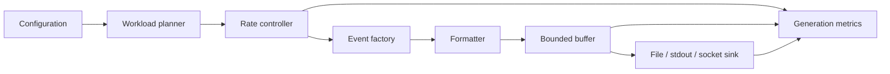

# Day 2 — Design a Configurable Log Generator

## Public source signals used

The curriculum asks for a generator that emits timestamped sample logs at configurable throughput. That simple requirement introduces several production concepts: workload modeling, pacing accuracy, deterministic test data, event identity, output backpressure, and measurable rate control.

This document is an original exploration based on those public signals and general engineering knowledge.

## Why a generator matters

A log generator is the controlled producer for the whole learning platform. Without it, later components are tested using hand-written files or unpredictable real applications. A useful generator lets you answer questions such as:

- Can the collector keep up with 100, 1,000, or 10,000 events per second?
- What happens during bursts?
- Does retrying a write create duplicate event IDs?
- Can a parser handle malformed records?
- Does storage rotation behave correctly under sustained load?
- Can a test be replayed with exactly the same data?

The generator is therefore both a component and a test instrument.

## Functional contract

The generator should accept configuration describing:

```text
rate, duration, format, output destination, source count,
severity distribution, message templates, random seed,
burst pattern, malformed-event percentage, and flush policy
```

Its output should be an ordered stream of records with stable identifiers and timestamps.

A minimal event envelope:

```json
{
  "schema_version": 1,
  "event_id": "01JABC...",
  "occurred_at": "2026-07-20T12:00:00.123456Z",
  "source": "checkout-api-03",
  "level": "INFO",
  "message": "payment request accepted",
  "sequence": 3812,
  "attributes": {
    "region": "dxb",
    "request_id": "req-123"
  }
}
```

Important distinctions:

- `event_id` identifies the logical event globally.
- `sequence` expresses order within one generator/source.
- `occurred_at` is business/event time.
- the write time is a separate operational timestamp and should not overwrite event time.

## Architecture



Separate responsibilities so that later lessons can replace the sink without rewriting event generation.

## Rate-control models

### Fixed interval

For `R` events per second, the nominal interval is:

```text
interval = 1 / R seconds
```

This is easy but naive implementations drift because they sleep after work finishes. The correct schedule is based on the next target deadline:

```python
next_deadline += interval
sleep(max(0, next_deadline - monotonic_now()))
```

Use a monotonic clock for elapsed-time scheduling. Wall clocks can jump because of time synchronization or manual changes.

### Token bucket

A token bucket models an average rate while allowing bounded bursts.

- tokens are added at `rate` per second;
- the bucket has a maximum capacity;
- one event consumes one token;
- generation waits when no token is available.

This is useful for simulating realistic clients that are quiet and then briefly busy.

### Poisson arrivals

Many independent request arrivals can be approximated using exponentially distributed gaps:

```python
import random

gap_seconds = random.expovariate(events_per_second)
```

This avoids the artificial regularity of fixed-interval traffic and is useful for queueing experiments.

### Explicit burst schedule

For repeatable tests, define phases:

```yaml
phases:
  - duration_seconds: 30
    rate_per_second: 100
  - duration_seconds: 10
    rate_per_second: 2000
  - duration_seconds: 30
    rate_per_second: 200
```

This makes expected behavior and saturation points easy to compare across runs.

## Determinism and replay

Random data is valuable only when failures can be reproduced. Accept a seed and use a generator-local random instance:

```python
rng = random.Random(settings.seed)
```

Record the effective configuration and seed at startup. Given the same seed, schema version, and template set, the generator should produce the same logical sequence, excluding deliberately real-time fields.

For fully replayable tests, support a virtual clock or allow a fixed starting timestamp.

## Suggested Python design

```python
from dataclasses import dataclass
from datetime import datetime, timezone
from typing import Protocol
import time
import uuid

class EventSink(Protocol):
    def write(self, payload: bytes) -> None: ...
    def flush(self) -> None: ...

@dataclass(frozen=True)
class GeneratorSettings:
    rate_per_second: float
    total_events: int | None
    duration_seconds: float | None
    source: str
    flush_every: int = 100

class LogGenerator:
    def __init__(self, settings: GeneratorSettings, sink: EventSink):
        self.settings = settings
        self.sink = sink

    def run(self) -> int:
        interval = 1.0 / self.settings.rate_per_second
        next_deadline = time.monotonic()
        sequence = 0

        while self._should_continue(sequence):
            event = {
                "schema_version": 1,
                "event_id": str(uuid.uuid4()),
                "occurred_at": datetime.now(timezone.utc).isoformat(),
                "source": self.settings.source,
                "sequence": sequence,
                "level": "INFO",
                "message": f"synthetic event {sequence}",
            }
            self.sink.write(serialize(event))
            sequence += 1

            if sequence % self.settings.flush_every == 0:
                self.sink.flush()

            next_deadline += interval
            delay = next_deadline - time.monotonic()
            if delay > 0:
                time.sleep(delay)

        self.sink.flush()
        return sequence
```

The example omits error handling and richer workload models, but the interfaces are the important part. A future TCP or message-queue sink can implement the same protocol.

## Output and buffering

A generator can create records faster than a sink can persist them. Decide the policy explicitly:

1. **Block producer:** preserves events but achieved rate falls.
2. **Drop new events:** protects memory but loses traffic.
3. **Drop oldest events:** favors recent traffic.
4. **Spill to disk:** preserves more data with additional complexity.
5. **Fail run:** useful in strict benchmarks because overload becomes visible.

For Day 2, a bounded queue with blocking writes is usually safest. Report the time spent blocked so the measured output rate is not mistaken for the configured target.

Do not use an unbounded queue. It converts sustained overload into memory exhaustion.

## Timestamp and ordering semantics

Use UTC and an unambiguous format such as ISO 8601 with `Z` or explicit offset. Preserve both:

- event time from the generated record;
- monotonic elapsed time for pacing and benchmark measurement.

If multiple logical sources are simulated, each should have its own sequence counter. A global sequence gives total order only inside one generator process and does not generalize to a distributed system.

## Multiple formats

Design the event object independently from serialization. Then provide formatters:

```python
class JsonFormatter:
    def format(self, event: LogEvent) -> bytes: ...

class ApacheFormatter:
    def format(self, event: LogEvent) -> bytes: ...

class NginxFormatter:
    def format(self, event: LogEvent) -> bytes: ...
```

This prepares Day 4 without mixing parsing concerns into the generator.

Support deliberate bad-data modes:

- missing timestamp;
- invalid status code;
- truncated JSON;
- oversized line;
- invalid UTF-8 bytes;
- unknown schema version.

These should be controlled by configuration and disabled by default.

## Observability

At minimum, expose or periodically log:

| Metric | Meaning |
|---|---|
| `events_generated_total` | logical events created |
| `events_written_total` | events accepted by sink |
| `events_failed_total` | write/serialization failures |
| `configured_rate_per_second` | target workload |
| `actual_rate_per_second` | measured completed writes |
| `generation_lag_seconds` | delay behind target schedule |
| `sink_block_seconds_total` | backpressure time |
| `buffer_depth` | current queued items |
| `payload_bytes_total` | generated traffic volume |

Log the final summary with duration, target rate, achieved rate, failures, seed, and configuration hash.

## Failure handling

### Sink unavailable

Retry only when the sink contract allows it. If the sink may have persisted the record before returning an error, a retry can duplicate it. Stable `event_id` values make later deduplication possible.

### Disk full

Stop or enter a clearly reported degraded state. Never silently continue counting events as written.

### Clock lag

When generation falls behind, choose whether to:

- catch up rapidly;
- skip missed schedule slots;
- maintain the slower achieved rate.

For performance tests, skipping missed slots often gives clearer rate semantics. For replay tests, preserving every event may be more important.

### Serialization failure

Treat it as a generator defect or intentional invalid-data scenario. Count and report it separately from sink failures.

## Testing strategy

### Unit tests

- configuration validation rejects zero or negative rates;
- seeded generation produces deterministic fields;
- formatter outputs valid JSON and line termination;
- fixed interval uses target deadlines without accumulating work-time drift;
- token bucket respects refill rate and capacity;
- stop conditions work for count and duration;
- invalid-event percentage matches expected boundaries.

Use a fake clock so tests do not actually sleep.

### Integration tests

- write 10,000 events to a temporary file;
- verify line count and unique IDs;
- restart using the same output path;
- simulate slow writes and confirm backpressure metrics;
- send malformed records and verify they are intentional and measurable.

### Performance test

Run rates such as 100, 1,000, 5,000, and 10,000 events/second. Measure CPU, memory, lag, bytes, flush time, and achieved rate. The first goal is not maximum throughput; it is knowing why throughput stops increasing.

## Practical exercise

Implement these CLI options:

```text
--rate 1000
--duration 60
--format json
--output ./data/input/app.log
--sources 5
--seed 42
--burst-capacity 2000
--malformed-percent 0.5
--flush-every 100
```

At the end, produce a machine-readable run report:

```json
{
  "configured_rate": 1000,
  "actual_rate": 987.4,
  "events_attempted": 60000,
  "events_written": 60000,
  "failures": 0,
  "duration_seconds": 60.77,
  "seed": 42
}
```

## Definition of done

Day 2 is complete when:

- rate and duration are configurable;
- event IDs and per-source sequence numbers exist;
- pacing uses a monotonic clock;
- the generator is deterministic with a seed;
- output formatting is replaceable;
- buffers are bounded;
- actual throughput and lag are measured;
- failures are visible and do not inflate success counts;
- unit and temporary-file integration tests pass.

## Connection to Day 3

Day 3’s collector will consume the generated file as it grows. The most important integration contract is simple but strict: every output record must be framed unambiguously—typically one complete event per newline—and the generator must define when bytes are flushed so the collector can observe them predictably.
