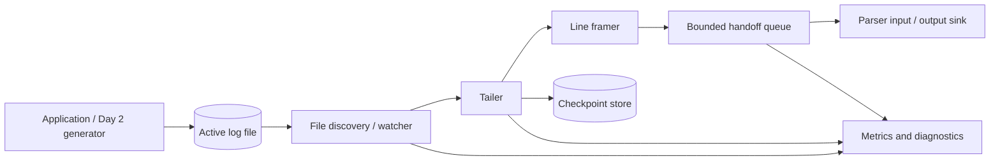

# Day 3 — Build a Reliable Local Log File Collector

## Public source signals used

The public curriculum asks for a service that watches local log files and detects newly appended entries. The visible lesson context positions the collector between applications that write files and later parsing/storage stages.

This document is an original engineering exploration. It does not reproduce the course article.

## The real problem behind “tail a file”

Reading a file once is trivial. Continuously collecting new records without losing or duplicating them is a state-management problem.

A useful collector must answer:

- Where did I stop reading?
- Is this path still the same physical file?
- What happens when the writer rotates or truncates it?
- What if the process crashes after reading but before forwarding?
- What if the final line is only partially written?
- What if downstream processing is slower than new writes?
- What does “delivered” mean?

These questions introduce the first delivery-semantics lesson in the course.

## Architecture



Keep file discovery, byte reading, record framing, checkpointing, and downstream delivery separate. Rotation handling becomes much easier when these responsibilities are not buried in one loop.

## Collector state model

A pathname is not a durable file identity. On Unix-like systems, track at least:

```text
path + device ID + inode + byte offset
```

A checkpoint record can look like:

```json
{
  "path": "/data/input/application.log",
  "device": 2049,
  "inode": 491938,
  "offset": 183922,
  "updated_at": "2026-07-20T12:00:00Z",
  "collector_id": "collector-local-1"
}
```

On platforms where inode semantics differ, use the strongest available file identity plus size/creation metadata. The abstraction should be “file generation,” not merely a string path.

## Polling versus filesystem notifications

### Polling

Repeatedly inspect file metadata and read when size increases.

Advantages:

- predictable and portable;
- easy to test with a fake clock;
- recovers naturally if notifications are missed.

Costs:

- introduces polling latency;
- spends system calls when idle;
- requires interval tuning.

### Filesystem notifications

Libraries such as `watchdog` can use inotify, FSEvents, or platform equivalents.

Advantages:

- low-latency reaction;
- less idle polling.

Costs:

- events can be coalesced or missed;
- rename/rotation semantics vary;
- network filesystems may behave differently;
- a watcher still needs periodic reconciliation.

A robust design uses notifications as a hint and periodic scanning as the source of truth.

## Correct record framing

The generator writes newline-delimited records, but a collector cannot assume one read equals one line. A writer may flush half a record, and the next read completes it.

Maintain a per-file partial buffer:

```python
buffer += newly_read_text
complete_lines = buffer.split("\n")
buffer = complete_lines.pop()  # incomplete suffix
for line in complete_lines:
    emit(line)
```

Do not advance the durable checkpoint beyond bytes that are safely represented in the handoff contract. If the process dies after checkpointing a partial line, the missing prefix may never be reconstructed.

For binary-safe collection, read bytes and define encoding handling explicitly. Invalid UTF-8 should be quarantined or decoded with a configured policy; silent replacement can corrupt forensic data.

## Rotation scenarios

### Rename-and-create rotation

Common sequence:

```text
application.log -> application.log.1
new empty application.log created
```

The old file can remain open and receive buffered writes briefly. The collector should:

1. detect that the path points to a new file identity;
2. keep reading the old file until EOF and a quiet period;
3. open the new file at offset zero;
4. maintain separate checkpoints until the old generation is complete.

### Copy-and-truncate rotation

Sequence:

```text
copy application.log to archive
truncate original path to zero
```

The inode may stay the same while size becomes smaller than the checkpoint offset. Detect:

```text
current_size < stored_offset
```

Then treat it as a new generation and restart at zero. This method has an unavoidable race: bytes written between copy and truncate may be lost. The collector should report the rotation style and possible gap.

### File deletion or temporary absence

Do not instantly delete checkpoint state. The file may be recreated or a mount may be briefly unavailable. Mark it missing, retry with bounded backoff, and expose the duration.

## Delivery semantics

### At-most-once

Checkpoint before downstream acceptance.

- low duplication risk;
- records can be lost after checkpoint but before processing.

### At-least-once

Checkpoint after downstream acceptance.

- records survive crashes better;
- replay can create duplicates.

For operational logs, at-least-once is usually the better teaching default. Attach source identity and byte range so later stages can deduplicate:

```json
{
  "file_id": "2049:491938",
  "start_offset": 183922,
  "end_offset": 184101,
  "raw_line": "..."
}
```

A deduplication key can be derived from `file_id + start_offset + end_offset`.

## Durability boundary

The checkpoint must not claim progress that downstream has not accepted. A safe sequence is:

1. read bytes;
2. frame complete records;
3. place records into a durable or acknowledged handoff;
4. receive acknowledgement;
5. atomically persist the new checkpoint.

On Day 3 the handoff may be an in-memory queue or output file, but document its semantics. An in-memory acknowledgement does not survive process failure.

Write checkpoints atomically:

```python
write temp file -> flush -> fsync -> rename over checkpoint
```

For multiple watched files, SQLite is often a better local checkpoint store than many loosely updated JSON files.

## Suggested interfaces

```python
from dataclasses import dataclass
from pathlib import Path
from typing import Protocol

@dataclass(frozen=True)
class FileIdentity:
    path: Path
    device: int
    inode: int

@dataclass(frozen=True)
class CollectedRecord:
    file_identity: FileIdentity
    start_offset: int
    end_offset: int
    payload: bytes

class RecordSink(Protocol):
    def deliver(self, record: CollectedRecord) -> None: ...

class CheckpointStore(Protocol):
    def load(self, identity: FileIdentity) -> int: ...
    def commit(self, identity: FileIdentity, offset: int) -> None: ...
```

The collector should not know whether the next stage is a parser, local queue, TCP sender, or message broker.

## Bounded concurrency and backpressure

Watching many files creates competing work. Use a bounded number of tailing workers and a bounded handoff queue.

When downstream slows:

- stop reading temporarily rather than buffering indefinitely;
- report queue depth and oldest queued record age;
- keep file descriptors under a configured limit;
- use fair scheduling so one noisy file does not starve quieter files.

Disk files provide natural upstream buffering, but only until rotation/retention removes them. Therefore monitor unread bytes and estimated catch-up time.

## Recovery behavior

On restart:

1. load checkpoints;
2. scan matching files;
3. match stored file identities;
4. reopen at committed offsets;
5. discover rotated generations not yet completed;
6. resume delivery;
7. warn if the saved generation no longer exists.

Never default silently to “start at end” or “start at beginning.” Make the initial-position policy explicit:

```text
beginning | end | checkpoint-required
```

For a learning environment, `beginning` is convenient. For production onboarding of a huge existing file, `end` may prevent an accidental historical flood.

## Observability

Track per file and total:

| Metric | Purpose |
|---|---|
| `records_collected_total` | completed records emitted |
| `bytes_read_total` | raw collection volume |
| `read_errors_total` | filesystem/encoding failures |
| `rotation_events_total` | detected generations |
| `truncation_events_total` | copy-truncate detection |
| `checkpoint_commit_total` | durable progress updates |
| `checkpoint_lag_bytes` | file size minus committed offset |
| `partial_record_bytes` | unframed suffix size |
| `handoff_queue_depth` | downstream pressure |
| `oldest_pending_seconds` | processing lag |
| `watched_files` | active file count |

Structured logs should include file identity, path, old/new offset, rotation reason, and retry count.

## Security and operational controls

- allowlist directories and filename patterns;
- prevent path traversal through configuration;
- run with read-only permission on source logs where possible;
- never follow arbitrary symbolic links unless explicitly enabled;
- cap maximum line size to resist memory exhaustion;
- redact secrets only in later processing—preserve the raw source under controlled access if forensic integrity requires it;
- avoid logging entire sensitive records in collector diagnostics.

## Test strategy

### Unit tests

- reads only newly appended bytes;
- preserves an incomplete final line;
- completes the line on the next write;
- resumes at a checkpoint;
- does not checkpoint before sink acknowledgement;
- detects truncation when size drops below offset;
- validates maximum line size;
- handles invalid encoding according to policy.

### Rotation integration tests

1. open `app.log` and append records;
2. rename it to `app.log.1`;
3. create a new `app.log`;
4. append to both old and new descriptors;
5. verify each logical record is collected;
6. restart the collector and verify no committed record is lost.

Also test copy-truncate and rapid multiple rotations.

### Failure injection

- kill the process after downstream write but before checkpoint;
- kill after checkpoint temp-file write but before rename;
- make checkpoint storage read-only;
- fill the downstream queue;
- delete a rotated file before it is drained;
- produce a record larger than the configured limit.

## Definition of done

Day 3 is complete when:

- file identity and offset are checkpointed;
- appended records are framed correctly across partial writes;
- rename and truncation rotation are recognized;
- checkpointing follows a documented acknowledgement boundary;
- queues and line sizes are bounded;
- restart resumes from committed state;
- collection lag and failures are observable;
- tests prove rotation, partial-line, crash, and slow-sink behavior.

## Connection to Day 4

The collector should deliver both the raw record and source metadata. Day 4 will parse the raw line into a canonical event, but it must retain the collector’s file identity and offsets for traceability, replay, and deduplication.
