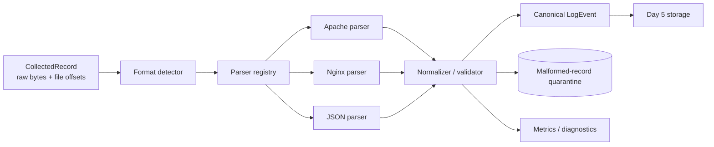

# Day 4 — Parse Heterogeneous Logs into a Canonical Event Model

## Public source signals used

The public preview introduces Apache, Nginx, and JSON records, shows the parser between collection and downstream analytics/storage, and emphasizes normalization into a consistent schema. Only the anonymously visible introduction, examples, diagrams, curriculum objective, and links are treated as source signals here.

This is an original technical exploration, not a reconstruction of the paid implementation.

## Why parsing is an architectural boundary

A collector transports bytes. A parser gives those bytes meaning.

Without a parser, every downstream component must understand every producer format. That creates an `N × M` integration problem: each new source must be added independently to storage, search, alerts, analytics, and dashboards. A canonical event contract changes it to `N + M`:

```text
many source formats -> parser adapters -> one canonical contract -> many consumers
```

The parser must balance two goals:

- normalize enough fields for common processing;
- preserve enough original information to avoid destroying evidence or source-specific meaning.

## Architecture



Format detection, parsing, normalization, and validation should remain separate. Detection chooses an adapter; parsing extracts source fields; normalization maps them to the platform contract; validation enforces invariants.

## Canonical event contract

A practical initial schema:

```json
{
  "schema_version": 1,
  "event_id": "collector-file-id:offset-range",
  "observed_at": "2026-07-20T12:00:01.050Z",
  "occurred_at": "2026-07-20T12:00:00.000Z",
  "source": {
    "type": "nginx-access",
    "service": "edge-proxy",
    "host": "web-03",
    "file_path": "/var/log/nginx/access.log"
  },
  "severity": "INFO",
  "message": "GET /api/users -> 404",
  "http": {
    "method": "GET",
    "path": "/api/users",
    "protocol": "HTTP/1.1",
    "status_code": 404,
    "response_bytes": 52,
    "client_ip": "192.168.1.10",
    "user_agent": "Mozilla/5.0"
  },
  "labels": {},
  "raw": "original record",
  "provenance": {
    "file_id": "2049:491938",
    "start_offset": 183922,
    "end_offset": 184101,
    "parser": "nginx-combined-v1"
  }
}
```

Key rules:

- `observed_at` is when the collector/platform saw the record.
- `occurred_at` is parsed event time and may be absent or invalid.
- preserve `raw` or a raw-reference according to retention/security policy.
- provenance must survive every transformation.
- optional domain-specific fields belong in namespaced objects, not hundreds of top-level columns.

## Parser result model

A parser should not return either “event” or “exception” only. Use a result that distinguishes expected bad input from system failure:

```python
from dataclasses import dataclass, field
from typing import Any

@dataclass(frozen=True)
class ParseIssue:
    code: str
    message: str
    field: str | None = None

@dataclass(frozen=True)
class ParseResult:
    success: bool
    event: dict[str, Any] | None
    issues: tuple[ParseIssue, ...] = field(default_factory=tuple)
    parser_name: str = "unknown"
```

Examples of data-quality issues:

```text
UNKNOWN_FORMAT
TIMESTAMP_INVALID
STATUS_OUT_OF_RANGE
JSON_MALFORMED
FIELD_MISSING
LINE_TOO_LARGE
ENCODING_INVALID
```

An unexpected parser bug is different and should raise an operational error with a stack trace.

## Parser registry

Use adapters selected by explicit source configuration when possible:

```python
class ParserRegistry:
    def __init__(self, parsers):
        self._by_name = {parser.name: parser for parser in parsers}

    def parse(self, parser_name: str, record: CollectedRecord) -> ParseResult:
        parser = self._by_name.get(parser_name)
        if parser is None:
            return ParseResult(
                success=False,
                event=None,
                issues=(ParseIssue("PARSER_NOT_FOUND", parser_name),),
            )
        return parser.parse(record)
```

Automatic detection is convenient but ambiguous. Prefer this order:

1. configured parser for source/path;
2. explicit content-type or schema marker;
3. safe detector heuristics;
4. quarantine as unknown.

Do not try every expensive regular expression against every line under load.

## Apache and Nginx parsing

Access-log formats are configurable, so one hard-coded regex is never universally correct. Treat a format string as configuration and compile it into a parser plan.

For a known combined-log pattern, named groups make extraction maintainable:

```python
COMBINED = re.compile(
    r'^(?P<ip>\S+) \S+ (?P<user>\S+) '
    r'\[(?P<timestamp>[^\]]+)\] '
    r'"(?P<method>[A-Z]+) (?P<path>\S+) (?P<protocol>[^"]+)" '
    r'(?P<status>\d{3}) (?P<bytes>\S+) '
    r'"(?P<referrer>[^"]*)" "(?P<agent>[^"]*)"$'
)
```

Then validate extracted values instead of assuming regex success means semantic correctness:

- status must be `100..599`;
- bytes may be `-` and should map to `null`;
- timestamps require an explicit timezone;
- paths may need length limits but should not be decoded destructively;
- IP fields may contain proxies or Unix socket values depending on configuration.

### Regex safety

Complex regexes can exhibit catastrophic backtracking on malicious or malformed input. Protect the parser by:

- anchoring patterns with `^` and `$`;
- avoiding nested ambiguous quantifiers;
- limiting input size before regex evaluation;
- using deterministic parsers where practical;
- benchmarking worst-case malformed lines;
- running untrusted custom patterns with timeout/isolation if user-configurable.

## JSON parsing

JSON is structured but not automatically valid for your schema.

```python
payload = json.loads(raw_line)
```

After decoding:

- check object versus array/scalar;
- validate schema version;
- parse timestamps strictly;
- map source field names to canonical names;
- constrain deeply nested or very large attributes;
- preserve unknown fields under a controlled extension object;
- avoid converting all numbers to strings.

For high-volume systems, schema validation must be measured. Full JSON Schema validation may be appropriate at ingress or sampled, while a compiled typed model can be faster for the hot path.

## Timestamp normalization

Time is one of the most common causes of incorrect analytics.

Rules:

1. Parse using the source’s documented format.
2. Require or supply a configured timezone; never guess silently.
3. Convert to UTC for canonical storage.
4. Preserve original timestamp text when forensic fidelity matters.
5. Record a parse issue when event time is unavailable.
6. Never replace invalid event time with current time without marking the substitution.

Keep event time and observed time separate. Their difference is ingestion delay and becomes an important operational metric.

## Validation versus enrichment

Parsing extracts what the record says. Enrichment adds external context.

Examples of enrichment:

- map host to environment/region;
- map service ID to team;
- GeoIP lookup;
- attach deployment version;
- classify endpoint route.

Do not mix external network calls into the parser hot path. Emit a canonical event first, then enrich asynchronously or using bounded local caches. Otherwise a slow metadata service can stop all parsing.

## Malformed-record quarantine

A bad record should not crash the stream or disappear silently. Write a quarantine envelope:

```json
{
  "reason_code": "TIMESTAMP_INVALID",
  "parser": "apache-combined-v1",
  "source": "web-03",
  "provenance": {"file_id": "...", "start_offset": 100},
  "raw_record": "...",
  "observed_at": "..."
}
```

Quarantine requires:

- retention limit;
- access controls because raw records may contain secrets;
- metrics and alerts;
- replay tooling after parser fixes;
- a stable relationship to the original checkpoint/delivery semantics.

Decide whether a quarantined record counts as “accepted.” Usually it does: it has reached a durable failure destination, so the collector can advance.

## Backpressure and parallelism

Parsing is often CPU-bound. Parallelism can improve throughput, but ordering becomes important.

Options:

- one worker per file/source preserves source order;
- partition records by source identity across workers;
- process globally in parallel and attach sequence/provenance so downstream can reorder if needed.

Use bounded queues between collector and parser. Measure queue time separately from parse time.

Do not share mutable parser state unnecessarily. Compiled regex objects can be reused, while temporary extraction data should be local to each call.

## Observability

| Metric | Meaning |
|---|---|
| `records_parsed_total{parser}` | successful events |
| `records_quarantined_total{reason}` | expected bad-data outcomes |
| `parser_failures_total{parser}` | unexpected code/system failures |
| `parse_duration_seconds{parser}` | processing latency |
| `input_bytes_total{parser}` | raw volume |
| `event_time_lag_seconds` | observed time minus event time |
| `unknown_format_total` | routing/configuration gaps |
| `field_missing_total{field}` | schema-quality trend |
| `queue_depth` | backpressure |
| `oldest_record_age_seconds` | end-to-end lag signal |

Avoid high-cardinality labels such as raw path, event ID, or client IP in metrics. Put those details in structured logs or traces.

## Security considerations

Logs frequently contain credentials, tokens, personal information, and internal network details.

- cap line and nested-object sizes;
- treat parser configuration as trusted administrative data;
- restrict custom regex and code execution;
- redact only through explicit policies, not ad hoc string replacement;
- keep raw quarantine encrypted and access-controlled;
- prevent formula/CSV injection if later exporting fields;
- do not include full raw records in normal error logs;
- version redaction rules and preserve audit evidence.

## Testing strategy

### Golden fixtures

Maintain fixtures for:

- Apache common and combined logs;
- Nginx variants;
- JSON records;
- timezone offsets;
- escaped quotes and spaces;
- missing bytes (`-`);
- IPv4 and IPv6;
- malformed/truncated records;
- oversized input;
- unknown format.

For each fixture, compare the complete canonical event to an approved expected JSON document.

### Property and fuzz testing

Generate arbitrary text and verify:

- parser never hangs;
- memory remains bounded;
- failures become typed issues;
- raw input/provenance remains associated;
- successful status codes and timestamps satisfy invariants.

### Performance testing

Benchmark records per second by parser and payload size. Include malformed worst cases, because the failure path may be slower than normal input.

## Definition of done

Day 4 is complete when:

- Apache/Nginx/JSON parsers implement a common interface;
- canonical event schema is documented and versioned;
- event time and observed time are separate;
- raw provenance from Day 3 is preserved;
- malformed records reach a bounded durable quarantine;
- parser bugs are distinguishable from bad input;
- queues, line sizes, and regex behavior are bounded;
- metrics show success, failure reason, latency, and lag;
- golden, malformed, and performance tests pass.

## Connection to Day 5

Day 5 should store canonical events without needing source-specific parsing logic. It should also store or reference quarantine records separately. The storage layer can trust the schema version and provenance fields, while remaining append-oriented and agnostic to Apache, Nginx, or JSON origins.
