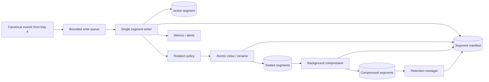

# Day 5 — Build Durable Flat-file Storage with Rotation

## Public source signals used

The public preview describes a local storage component placed after parsing and before future search/analytics. It highlights flat-file writes, size- or time-based rotation, compression, retention, and the operational risk of files growing without bounds. Only the anonymously visible introduction, diagrams, capabilities, curriculum objective, and links are used as source signals.

This document is an original implementation and design exploration. It does not reproduce subscriber-only code or text.

## What you are building

Day 5 creates the first durable boundary in the local pipeline:

```text
Day 2 generator -> Day 3 collector -> Day 4 parser -> Day 5 segment storage
```

The objective is not “append strings to a file.” A usable storage component must define:

- when a write is acknowledged;
- how records are framed;
- how active files become immutable segments;
- what triggers rotation;
- how segment names remain unique and sortable;
- how compression and retention avoid corrupting active data;
- what happens on disk-full, crash, restart, or concurrent writers;
- how Day 6 can discover and query available segments.

## Architecture



Use one logical writer per partition or stream. Multiple threads appending and rotating the same file without coordination will eventually corrupt framing or create conflicting rotations.

## Segment-oriented data model

Think in immutable segments rather than one endlessly growing file.

```text
logs/
├── active/
│   └── events-current.ndjson
├── sealed/
│   ├── events-20260720T120000Z-000001.ndjson
│   └── events-20260720T121500Z-000002.ndjson
├── archive/
│   └── events-20260720T120000Z-000001.ndjson.gz
├── quarantine/
└── manifest.jsonl
```

A segment lifecycle:

```text
ACTIVE -> SEALED -> COMPRESSED -> EXPIRED/DELETED
```

Only `ACTIVE` is writable. `SEALED` and `COMPRESSED` segments are immutable. Immutability makes querying, checksums, backup, and retention much safer.

## Record framing

Newline-delimited JSON is a good learning format because it supports sequential append and line-oriented tools:

```json
{"schema_version":1,"event_id":"evt-1","occurred_at":"..."}
{"schema_version":1,"event_id":"evt-2","occurred_at":"..."}
```

Rules:

- serialize one event to one line;
- escape embedded newlines through JSON encoding;
- terminate every committed record with `\n`;
- reject or quarantine records over a configured maximum;
- encode using UTF-8;
- preserve schema version and provenance fields;
- optionally add a checksum per record or segment if corruption detection is required.

Do not pretty-print JSON in the append file. Multi-line records make recovery and streaming queries harder.

## Acknowledgement and durability levels

“Write succeeded” can mean different things:

1. copied into application memory;
2. written to the operating-system page cache;
3. flushed from the language runtime;
4. synchronized to the filesystem/device with `fsync`;
5. replicated elsewhere—which is outside Day 5.

Expose a deliberate durability mode:

```text
buffered | flush-each-batch | fsync-each-batch | fsync-each-record
```

Trade-off:

- frequent `fsync` reduces potential data loss but limits throughput;
- large buffered batches improve throughput but increase the crash-loss window.

A practical default is batch-based flushing with periodic `fsync`, for example every 100 records or one second, whichever occurs first. The acknowledgement must match the chosen level. Do not acknowledge durable success before the configured boundary is reached.

## Single-writer implementation model

A bounded queue separates producers from disk I/O:

```python
from dataclasses import dataclass
from pathlib import Path
from queue import Queue
from threading import Thread

@dataclass(frozen=True)
class StorageSettings:
    directory: Path
    max_segment_bytes: int
    max_segment_age_seconds: float
    flush_every_records: int
    queue_capacity: int

class SegmentWriter:
    def __init__(self, settings: StorageSettings):
        self.settings = settings
        self.queue: Queue[bytes | None] = Queue(maxsize=settings.queue_capacity)
        self.worker = Thread(target=self._run, daemon=False)

    def append(self, encoded_event: bytes) -> None:
        self.queue.put(encoded_event)  # blocks under backpressure

    def close(self) -> None:
        self.queue.put(None)
        self.worker.join()
```

The worker owns the active file handle and all rotation decisions. This prevents callers from racing with rename, close, and compression.

## Rotation policy

Rotation usually combines size and time:

```text
rotate if active_bytes + next_record_bytes > max_segment_bytes
OR active_age >= max_segment_age
```

Check before writing a record so one record is never split across segments. If one event itself exceeds the segment limit, apply the maximum-record policy rather than rotating forever.

### Size-based rotation

Advantages:

- predictable segment size;
- easier upload, compression, and bounded query work.

Risks:

- quiet streams can leave one active segment open for days;
- high traffic creates many segments quickly.

### Time-based rotation

Advantages:

- natural time windows;
- sealed files appear even under low traffic.

Risks:

- segment sizes vary widely;
- clock changes can cause surprising behavior.

Use a monotonic clock for segment age, while using UTC wall-clock timestamps only for names and metadata.

## Safe rotation sequence

A crash-safe rotation should follow an explicit sequence:

1. stop accepting writes into the active handle momentarily inside the single writer;
2. flush the runtime buffer;
3. `fsync` if required by durability policy;
4. close the active file;
5. atomically rename it to a unique sealed name;
6. atomically update/append the manifest record;
7. create the next active file;
8. resume writes;
9. enqueue the sealed segment for compression asynchronously.

Use same-filesystem rename for atomicity. Moving between filesystems can degrade into copy/delete and lose the atomic guarantee.

A unique name should include time plus a monotonically increasing sequence or UUID:

```text
events-20260720T120000.123456Z-000042.ndjson
```

Timestamps alone can collide during rapid rotations or clock adjustments.

## Manifest and segment metadata

Day 6 needs a reliable way to find segments without guessing filenames. Append manifest events:

```json
{
  "segment_id": "seg-000042",
  "path": "sealed/events-...-000042.ndjson",
  "state": "SEALED",
  "created_at": "...",
  "sealed_at": "...",
  "first_event_time": "...",
  "last_event_time": "...",
  "record_count": 18521,
  "uncompressed_bytes": 67102231,
  "schema_versions": [1],
  "checksum": "sha256:..."
}
```

The manifest can initially be JSON Lines or SQLite. It must be recoverable by scanning segments if it is lost. Treat the files as source data and the manifest as an index over them.

## Startup recovery

On startup, inspect the active directory before accepting writes.

Possible states:

- active file is empty: reuse or replace safely;
- active file ends with a complete newline: seal or resume according to policy;
- final record is partial: truncate to last valid boundary or move the file to recovery/quarantine;
- sealed file exists without manifest entry: reconstruct metadata and register it;
- manifest references a missing file: mark inconsistent and alert;
- temporary compression file exists: validate and resume or delete safely.

Never append blindly to an unknown active file. Validate framing and ownership first.

## Compression

Compression should occur after sealing and outside the write path.

Safe sequence:

1. read sealed segment;
2. write `segment.gz.tmp`;
3. flush and optionally `fsync`;
4. verify the gzip stream and optional checksum/count;
5. atomically rename to final `.gz`;
6. update manifest state;
7. delete original sealed file only after verification.

If compression fails, retain the uncompressed sealed file and retry with bounded backoff. Storage remains correct even if compression is unavailable.

## Retention policy

Retention can be based on:

- maximum age;
- maximum segment count;
- total storage bytes;
- minimum free disk percentage;
- different rules for normal versus quarantine data.

Rules for safe deletion:

- never delete the active segment;
- never delete a file while a query holds a lease/reference;
- prefer oldest eligible immutable segments;
- record deletion in the manifest/audit log;
- expose bytes reclaimed and failures;
- distinguish policy expiry from emergency disk-pressure eviction.

For personal learning, age plus maximum total bytes is enough. In production, legal/compliance retention can override ordinary cleanup.

## Disk-full and I/O failure behavior

Disk exhaustion is not an ordinary retryable error. Continuing to accept events while dropping writes corrupts delivery semantics.

Choose and document one policy:

- block producers and alert;
- reject writes explicitly;
- enter read-only/degraded mode;
- emergency-delete only segments explicitly eligible for eviction;
- spill to a configured alternative volume.

Expose the failure immediately. The collector must not checkpoint records that storage rejected.

Other I/O failures:

| Failure | Response |
|---|---|
| permission denied | fail startup or stop writes; configuration/operator action required |
| transient device error | bounded retry, then degraded state |
| path disappeared | recreate only if configured and parent is trusted |
| checksum mismatch | quarantine segment and alert |
| rename collision | generate stronger unique ID; never overwrite |
| compression process crash | recover `.tmp` files on startup |

## Backpressure

The write queue must be bounded. Track:

- queue depth;
- queue capacity;
- oldest queued event age;
- producer block time;
- disk write latency;
- flush/fsync latency.

When storage cannot keep up, upstream slowdown is safer than memory growth. A later distributed system may spill to a broker, but Day 5 should make overload visible and deterministic.

## Query-read coordination

Day 6 will query files while Day 5 writes them.

Simplest rule:

- queries read only sealed/immutable segments;
- optionally read a snapshot of the active segment up to a captured byte boundary;
- compression/deletion obtains a segment lease or checks active readers;
- manifest updates are atomic.

Immutable sealed segments eliminate most reader/writer locking.

## Observability

| Metric | Meaning |
|---|---|
| `events_appended_total` | accepted records |
| `append_failures_total{reason}` | rejected/failed writes |
| `bytes_written_total` | uncompressed write volume |
| `active_segment_bytes` | current size |
| `active_segment_age_seconds` | time since opening |
| `segments_rotated_total{reason}` | size/time/manual rotations |
| `flush_duration_seconds` | runtime flush cost |
| `fsync_duration_seconds` | durable-sync cost |
| `write_queue_depth` | backpressure |
| `compression_duration_seconds` | archive workload |
| `compression_ratio` | saved space |
| `retention_deleted_bytes_total` | cleanup effect |
| `disk_free_bytes` | capacity warning |
| `recovery_actions_total{type}` | startup inconsistencies |

Alert before disk reaches a critical threshold. Disk-free percentage alone can be misleading on very large volumes, so use both bytes and percentage.

## Security and governance

Logs may contain secrets or personal data.

- create files with restrictive permissions;
- run as a dedicated user;
- isolate normal and quarantine directories;
- encrypt the volume when required;
- avoid placing sensitive raw content in filenames or manifest labels;
- audit retention and deletion actions;
- sanitize archive paths to prevent traversal;
- cap decompression and query resource usage to avoid archive bombs;
- document who can read raw versus redacted data.

## Testing strategy

### Unit tests

- size threshold rotates before splitting a record;
- time threshold uses monotonic elapsed time;
- filename sequence is unique and sortable;
- record framing always ends with newline;
- retention excludes active segment;
- oversized record follows configured policy;
- manifest state transitions are valid;
- queue capacity applies backpressure.

### Crash-recovery tests

Kill the process at each rotation step:

1. after flush;
2. after close;
3. after rename;
4. before manifest update;
5. after new active creation;
6. during compression;
7. before original sealed deletion.

Restart and verify that every complete acknowledged record exists in exactly one recoverable segment.

### Disk and permission tests

- set a tiny filesystem quota;
- make archive directory read-only;
- cause rename collision;
- simulate failed `fsync`;
- remove the volume temporarily;
- make compression return invalid output.

### Load test

Feed Day 2 at increasing rates through Days 3 and 4. Measure achieved append rate, queue delay, segment count, rotation pause, CPU, memory, and disk latency. Verify record counts across all segments equal acknowledged inputs.

## Definition of done

Day 5 is complete when:

- events are appended in a documented framing format;
- a single writer owns each active segment;
- acknowledgement matches a configurable durability boundary;
- size and time rotation are supported;
- sealed segments are immutable and uniquely named;
- manifest metadata supports discovery and recovery;
- compression is asynchronous and verified before deletion;
- retention never removes active/in-use data;
- disk-full behavior is explicit;
- startup repairs or reports interrupted rotations;
- crash, rotation, retention, and load tests prove data integrity.

## Connection to Day 6

Day 6 can now build a CLI over the manifest and immutable segments. It should stream records rather than load all files into memory, filter by time/source/severity, and report whether results came from sealed segments or a bounded active-file snapshot.
