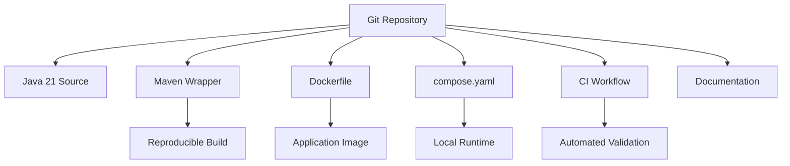

# Day 1 — Development Environment and Project Repository

## 1. Public source material

Publicly visible curriculum item:

- **Day 1:** Set up development environment using Docker, Git, and VS Code, then create the project repository.
- **Visible output:** A configured development environment with all required tools and an initialized repository.

Source: [Hands-On Distributed Systems curriculum](https://sdcourse.substack.com/p/hands-on-distributed-systems-with).

No subscriber-only article text is reproduced below. The remainder is an original standalone lesson.

---

## 2. Original lesson

## Why this matters

Distributed systems fail in confusing ways when local environments differ. A reproducible toolchain is therefore part of the architecture, not an administrative detail. Every contributor should be able to clone the repository, run one command, and obtain the same Java version, dependency graph, ports, and supporting services.

## First principles

A development environment must provide four guarantees:

1. **Repeatability** — the same inputs produce the same build.
2. **Isolation** — project dependencies do not pollute the host machine.
3. **Inspectability** — logs, health endpoints, and process state are easy to observe.
4. **Automation** — setup is encoded, not remembered manually.

## Terminology

- **JDK:** Compiler, runtime, and developer tools for Java.
- **Build tool:** Maven or Gradle resolves dependencies and executes builds.
- **Container image:** Immutable filesystem plus process configuration.
- **Container:** Running instance of an image.
- **Repository:** Version-controlled source of truth.
- **Branch:** Independent line of development.
- **Commit:** Immutable snapshot of tracked changes.

## Requirements

Use:

- Java 21
- Spring Boot 3.x
- Maven Wrapper
- Docker and Docker Compose
- Git
- VS Code or IntelliJ IDEA
- GitHub Actions for continuous verification

## Repository architecture



## Recommended layout

```text
log-platform/
├── .github/workflows/ci.yml
├── docs/
├── src/main/java/
├── src/main/resources/
├── src/test/java/
├── .editorconfig
├── .gitignore
├── compose.yaml
├── Dockerfile
├── mvnw
├── mvnw.cmd
├── pom.xml
└── README.md
```

## Component responsibilities

- **Maven Wrapper:** Pins the Maven distribution used by every machine and CI runner.
- **Dockerfile:** Defines the deployable application image.
- **Compose file:** Starts the application and future dependencies consistently.
- **CI workflow:** Rejects code that does not compile or pass tests.
- **README:** Defines the shortest supported path from clone to running system.

## Spring Boot bootstrap

Generate a project with Java 21 and these initial dependencies:

```xml
<dependencies>
    <dependency>
        <groupId>org.springframework.boot</groupId>
        <artifactId>spring-boot-starter-web</artifactId>
    </dependency>
    <dependency>
        <groupId>org.springframework.boot</groupId>
        <artifactId>spring-boot-starter-actuator</artifactId>
    </dependency>
    <dependency>
        <groupId>org.springframework.boot</groupId>
        <artifactId>spring-boot-starter-test</artifactId>
        <scope>test</scope>
    </dependency>
</dependencies>
```

Main class:

```java
@SpringBootApplication
public class LogPlatformApplication {
    public static void main(String[] args) {
        SpringApplication.run(LogPlatformApplication.class, args);
    }
}
```

Configuration:

```yaml
spring:
  application:
    name: log-platform
management:
  endpoints:
    web:
      exposure:
        include: health,info,metrics
```

## Containerization

Use a multi-stage build:

```dockerfile
FROM eclipse-temurin:21-jdk AS build
WORKDIR /workspace
COPY . .
RUN ./mvnw -B clean package -DskipTests

FROM eclipse-temurin:21-jre
WORKDIR /app
COPY --from=build /workspace/target/*.jar app.jar
EXPOSE 8080
ENTRYPOINT ["java", "-jar", "/app/app.jar"]
```

## End-to-end flow

1. Developer clones the repository.
2. Maven Wrapper resolves the pinned build tool.
3. Java compiles and tests the application.
4. Docker packages the artifact.
5. Compose starts the service.
6. Actuator health confirms startup.
7. CI repeats the same verification after every push.

## Contracts and configuration model

Treat environment variables as a public runtime contract:

```text
SERVER_PORT=8080
SPRING_PROFILES_ACTIVE=local
LOG_LEVEL_ROOT=INFO
```

Do not place passwords, tokens, or certificates in Git. Commit only examples such as `.env.example`.

## Concurrency and consistency

Day 1 contains no distributed state yet, but choices made now affect later concurrency work. Pin Java 21, avoid machine-specific paths, and configure deterministic tests. A build that behaves differently across machines makes race conditions nearly impossible to reproduce.

## Acknowledgement and idempotency boundaries

The current acknowledgement boundary is the build itself: a successful command means compilation and tests completed. Repository initialization should also be idempotent; running setup twice must not corrupt files or create duplicate configuration.

## Retries and recovery

Dependency downloads may fail transiently. CI may retry network setup, but compilation or test failures must not be retried blindly. Recovery should be explicit:

```bash
./mvnw clean verify
docker compose down -v
docker compose up --build
```

## Scaling and backpressure

No runtime scaling is required yet. However, the project should already externalize ports, memory limits, thread counts, and profiles so multiple instances can later run without code changes.

## Observability

At minimum expose:

- `/actuator/health`
- `/actuator/info`
- build and Git commit metadata
- structured startup logs

## Security

- Keep secrets outside the repository.
- Pin base-image versions.
- Run dependency and container scans in CI.
- Prefer a non-root runtime user for production images.
- Protect the default branch with pull requests and required checks.

## Trade-offs

Docker improves reproducibility but adds local complexity. IDE-specific launch files improve convenience but must not become the only supported way to run the project. Maven is verbose but predictable and widely supported.

## Practical exercise

1. Create the Spring Boot project.
2. Add Maven Wrapper, Dockerfile, Compose, and CI.
3. Run tests locally.
4. Build the container.
5. Confirm the health endpoint.
6. Clone into a second directory and verify the same commands work.

## Test strategy

- **Smoke test:** Application context starts.
- **Container test:** Image starts and health becomes `UP`.
- **Reproducibility test:** Fresh clone builds without global Maven.
- **CI test:** Pull request runs `./mvnw verify`.
- **Security test:** Secret scanning finds no credentials.

## Connection to adjacent lessons

Day 1 establishes the reproducible foundation. Day 2 uses it to build a configurable log generator. Every later lesson depends on this repository, build, runtime, and observability baseline.