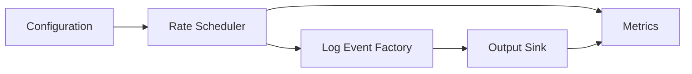

# Day 2 — Configurable Log Generator

## 1. Public source material

Publicly visible curriculum item:

- **Day 2:** Implement a basic log generator that produces sample logs at configurable rates.
- **Visible output:** A working generator that creates timestamped events with configurable throughput.

Source: [Hands-On Distributed Systems curriculum](https://sdcourse.substack.com/p/hands-on-distributed-systems-with).

No subscriber-only text is reproduced. The remainder is original.

---

## 2. Original lesson

## Why this matters

A log pipeline cannot be tested reliably without a controlled source of events. A generator lets engineers reproduce low, normal, burst, and overload traffic while keeping payload shape and rate deterministic.

## First principles

A generator converts a target rate into timed event creation. If the target is `R` events/second, the ideal interval is `1/R` seconds. Real systems cannot sleep with perfect precision, so measure actual emitted throughput rather than assuming requested throughput.

## Terminology

- **Offered load:** Events attempted by the generator.
- **Achieved throughput:** Events actually emitted per second.
- **Burst:** Short interval above steady-state rate.
- **Jitter:** Timing variation around the target interval.
- **Sequence number:** Monotonic identifier useful for detecting gaps and duplicates.

## Requirements

The generator should support:

- configurable events per second
- deterministic or random payloads
- timestamps and sequence numbers
- graceful shutdown
- bounded memory
- metrics for generated, failed, and delayed events

## Architecture



## Data contract

```java
public record LogEvent(
        long sequence,
        Instant occurredAt,
        String level,
        String service,
        String message,
        Map<String, String> attributes) {}
```

Use UTC timestamps and preserve the original occurrence time throughout the future pipeline.

## Java 21 implementation

```java
@Component
public final class ConfigurableLogGenerator {
    private final ScheduledExecutorService scheduler =
            Executors.newSingleThreadScheduledExecutor(Thread.ofPlatform().name("log-generator-").factory());
    private final AtomicLong sequence = new AtomicLong();
    private final LogSink sink;

    public ConfigurableLogGenerator(LogSink sink) {
        this.sink = sink;
    }

    public void start(long eventsPerSecond) {
        if (eventsPerSecond <= 0) throw new IllegalArgumentException("rate must be positive");
        long periodNanos = Math.max(1, 1_000_000_000L / eventsPerSecond);
        scheduler.scheduleAtFixedRate(this::emitSafely, 0, periodNanos, TimeUnit.NANOSECONDS);
    }

    private void emitSafely() {
        try {
            long id = sequence.incrementAndGet();
            sink.accept(new LogEvent(id, Instant.now(), "INFO", "demo-service",
                    "generated event " + id, Map.of("source", "day-02")));
        } catch (Exception ex) {
            // increment failure metric; never kill the scheduler thread
        }
    }
}
```

For very high rates, generate batches per scheduler tick instead of scheduling one task per event.

## Spring Boot configuration

```yaml
log-generator:
  enabled: true
  events-per-second: 100
  burst-size: 1
  service-name: demo-service
```

Bind with `@ConfigurationProperties` and validate using Jakarta Validation.

## Component responsibilities

- **Rate scheduler:** Determines when production is allowed.
- **Event factory:** Creates valid events.
- **Sink:** Writes to console or file today; network transport later.
- **Metrics:** Measures actual behavior independently of logs.

## End-to-end flow

1. Spring loads and validates configuration.
2. Scheduler calculates emission cadence.
3. Factory creates an immutable event.
4. Sink serializes and writes it.
5. Metrics record success, failure, and scheduling delay.
6. Shutdown stops scheduling and drains accepted work.

## Concurrency and consistency

Use `AtomicLong` for unique sequence allocation inside one process. A single scheduler simplifies ordering. Multiple workers increase throughput but can reorder events. Decide whether ordering or throughput is the stronger requirement.

## Acknowledgement and idempotency boundaries

The generator considers an event emitted only after the sink accepts it. This is not yet durable delivery. Sequence numbers form the future idempotency key, while the tuple `(generatorInstanceId, sequence)` prevents collisions across processes.

## Retries and recovery

Console or local-file failures may be retried with bounded exponential backoff. Do not retry forever in the scheduler thread. Place failed events into a bounded retry queue and expose dropped-event metrics when the queue is full.

## Scaling and backpressure

At high rates, a slow sink creates backlog. Use a bounded queue:

```java
BlockingQueue<LogEvent> queue = new ArrayBlockingQueue<>(10_000);
```

When full, choose explicitly: block, drop newest, drop oldest, or reduce offered rate. Silent unbounded buffering is unsafe.

## Observability

Track:

- `logs_generated_total`
- `logs_generation_failed_total`
- `generator_queue_depth`
- `generator_schedule_lag_seconds`
- requested versus achieved events/second

## Security

Generated payloads must not contain real credentials or customer data. Mark synthetic traffic with an attribute and prevent accidental routing to production analytics.

## Trade-offs

`ScheduledExecutorService` is simple but imprecise at very high frequency. Token-bucket pacing handles bursts better. Virtual threads help blocking sinks but do not solve unlimited downstream capacity.

## Exercises

1. Add configurable log levels and message sizes.
2. Add deterministic random generation using a seed.
3. Add burst mode.
4. Add a maximum event count.
5. Compare fixed-rate and token-bucket pacing.

## Test strategy

- Verify configuration validation.
- Generate exactly N events in bounded mode.
- Assert unique sequence numbers under concurrency.
- Test shutdown without lost accepted events.
- Test full-queue behavior.
- Measure achieved throughput with tolerance rather than exact nanosecond timing.

## Lesson connections

Day 1 supplied the reproducible project. Day 2 creates the source workload. Day 3 will collect new lines from local log files.