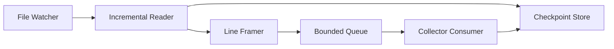

# Day 3 — Local Log File Collector

## 1. Public source material

Publicly visible curriculum item:

- **Day 3:** Create a simple log collector service that reads local log files.
- **Visible output:** A service that watches log files and detects new entries.

Source: [Hands-On Distributed Systems curriculum](https://sdcourse.substack.com/p/hands-on-distributed-systems-with).

The lesson below is original and does not reproduce subscriber-only text.

---

## 2. Original lesson

## Why this matters

Most production logs begin as append-only files. A collector must tail them continuously, remember progress, survive restarts, and handle rotation without duplicating or losing lines.

## First principles

A file collector is a state machine over `(file identity, byte offset)`. File name alone is insufficient because rotation may replace the file while preserving the same path.

## Terminology

- **Tail:** Read newly appended bytes.
- **Checkpoint:** Durable last-processed position.
- **File identity:** Stable identifier such as file key/inode plus path metadata.
- **Rotation:** Rename or replace a log file after size/time thresholds.
- **Truncation:** File length becomes smaller than the stored offset.

## Requirements

- detect appended content
- support partial lines
- persist checkpoints
- recover after restart
- detect rotation/truncation
- avoid unbounded buffering
- expose lag and error metrics

## Architecture



## Contracts

```java
public record FileCheckpoint(String fileId, Path path, long offset, Instant updatedAt) {}
public record RawLogLine(String fileId, long startOffset, Instant collectedAt, String text) {}
```

The natural idempotency key is `(fileId, startOffset)`.

## Java 21 guidance

Use `WatchService` for hints, but also poll because filesystem notifications can be coalesced or missed.

```java
try (FileChannel channel = FileChannel.open(path, StandardOpenOption.READ)) {
    channel.position(checkpoint.offset());
    ByteBuffer buffer = ByteBuffer.allocateDirect(64 * 1024);
    while (channel.read(buffer) > 0) {
        buffer.flip();
        // decode bytes incrementally and frame complete lines
        buffer.compact();
    }
}
```

Use a `CharsetDecoder` so UTF-8 characters split across reads are preserved.

## Component responsibilities

- **Watcher:** Discovers files and change hints.
- **Reader:** Reads only bytes after the checkpoint.
- **Framer:** Converts arbitrary chunks into complete lines.
- **Checkpoint store:** Persists progress atomically.
- **Queue:** Decouples disk reading from downstream processing.

## End-to-end data flow

1. Discover a matching path.
2. Resolve file identity.
3. Load checkpoint.
4. Seek to stored offset.
5. Read bytes and emit complete lines.
6. Process or store each line.
7. Advance checkpoint only after accepted processing.
8. On rotation, finish the old identity and start the new one.

## Concurrency and consistency

Assign one active reader per file identity. Concurrent readers for the same file can duplicate lines and race checkpoint updates. Checkpoint writes should use compare-and-set semantics or a single owner.

## Acknowledgement and idempotency boundaries

Do not advance the checkpoint merely because bytes were read. Advance it after the downstream component accepts the line or batch. If a crash occurs after processing but before checkpointing, replay may happen; downstream deduplication by `(fileId, offset)` provides exactly-once effect.

## Retries and recovery

Retry transient `IOException`s with capped exponential backoff. On restart, resume from the durable checkpoint. If the file is shorter than the checkpoint, classify it as truncation and restart from offset zero under a new generation identity.

## Scaling and backpressure

Use bounded queues and pause reading when downstream is slow. For many files, shard ownership by normalized path hash. Avoid one platform thread per mostly idle file; a small scheduler or virtual-thread readers with explicit bounds is more efficient.

## Observability

Track bytes read, lines emitted, checkpoint offset, file lag, queue depth, rotations, truncations, decoding failures, and retry counts.

## Security

Restrict allowed directories, reject path traversal and symlink escapes, run with least filesystem privilege, and redact secrets before forwarding.

## Trade-offs

Polling is portable but adds latency and I/O. Watch notifications are efficient but not a complete correctness mechanism. Per-line checkpoints minimize replay but increase disk writes; batched checkpoints improve performance with a larger replay window.

## Exercises

1. Handle a line split across two reads.
2. Persist checkpoints in a local JSON file using atomic rename.
3. Simulate rename-based rotation.
4. Simulate copy-truncate rotation.
5. Add a configurable multiline stack-trace framer.

## Test strategy

Test append detection, Unicode boundaries, partial lines, restart recovery, rotation, truncation, duplicate watcher events, permission failures, queue saturation, and crash timing around checkpoint updates.

## Lesson connections

Day 2 generates files to consume. Day 3 reliably tails them. Day 4 converts raw text into structured fields.