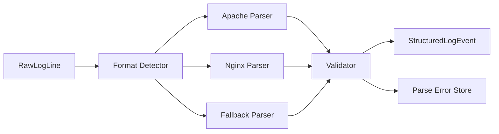

# Day 4 — Log Parsing and Structured Fields

## 1. Public source material

Publicly visible curriculum item:

- **Day 4:** Implement log parsing for common formats.
- **Visible output:** A parser for Apache/Nginx logs extracting timestamp, IP address, status code, and related fields.

Source: [Hands-On Distributed Systems curriculum](https://sdcourse.substack.com/p/hands-on-distributed-systems-with).

The remainder is original.

---

## 2. Original lesson

## Why this matters

Raw text is difficult to search, aggregate, validate, and route. Parsing converts a line into a typed contract so later components can reason about event time, source, severity, status, latency, and identity.

## First principles

Parsing is a boundary operation: untrusted bytes enter, a validated domain object leaves. A parser must distinguish malformed data from valid data with missing optional fields.

## Terminology

- **Grammar:** Rules defining a log format.
- **Tokenizer:** Splits input into meaningful pieces.
- **Parser:** Converts tokens into a structured model.
- **Schema:** Field names, types, and constraints.
- **Dead-letter record:** Preserved input that could not be parsed.

## Requirements

- support multiple named formats
- produce typed fields
- preserve original line
- return explicit parse errors
- handle timestamps and time zones correctly
- remain thread-safe and bounded

## Architecture



## Data model

```java
public record StructuredLogEvent(
        String eventId,
        Instant occurredAt,
        Instant collectedAt,
        String sourceIp,
        String method,
        String path,
        int statusCode,
        long responseBytes,
        String originalLine) {}

public sealed interface ParseResult permits ParseSuccess, ParseFailure {}
public record ParseSuccess(StructuredLogEvent event) implements ParseResult {}
public record ParseFailure(String reason, String originalLine) implements ParseResult {}
```

## Java 21 implementation guidance

Precompile patterns and keep parsers stateless:

```java
private static final Pattern COMBINED = Pattern.compile(
    "^(?<ip>\\S+) \\S+ \\S+ \\[(?<time>[^]]+)] \"(?<method>\\S+) (?<path>\\S+) [^\"]+\" (?<status>\\d{3}) (?<bytes>\\S+).*$");
```

Avoid catastrophic regex backtracking. For high throughput, a hand-written scanner can outperform complex regexes and allocate less memory.

## Component responsibilities

- **Detector:** Selects parser by configuration or reliable signature.
- **Parser:** Extracts syntax-level fields.
- **Validator:** Applies domain constraints.
- **Error store:** Preserves failures for diagnosis and replay.

## End-to-end flow

1. Receive `RawLogLine` from Day 3.
2. Determine configured format.
3. Parse fields without mutating shared state.
4. Convert timestamp to `Instant`.
5. Validate status range and numeric values.
6. Produce success or explicit failure.
7. Acknowledge the raw line only after either valid storage or durable error capture.

## Concurrency and consistency

Stateless parsers can be shared across threads. Keep date formatters immutable; `DateTimeFormatter` is thread-safe. Do not use mutable `SimpleDateFormat` as a singleton.

## Acknowledgement and idempotency boundaries

Parsing itself is deterministic and should not create a new delivery boundary. Preserve the upstream identity `(fileId, offset)` as `eventId`. The collector checkpoint may advance after the structured event or parse failure is durably accepted.

## Retries and recovery

Syntax errors are usually non-retryable until parser configuration changes. Infrastructure failures while writing results are retryable. Store parser version so failed records can be replayed after grammar improvements.

## Scaling and backpressure

Use a bounded worker pool. CPU-heavy parsing should not consume unlimited virtual threads. Batch lines to reduce queue overhead, but cap batch bytes to avoid one giant line monopolizing memory.

## Observability

Measure parse successes, failures by reason and format, parse latency, line length, unknown format count, and timestamp skew between occurrence and collection.

## Security

Set maximum line length, sanitize control characters, avoid logging entire sensitive lines on errors, and protect against regex denial-of-service.

## Trade-offs

Regex is concise and maintainable for stable formats. Token scanners are faster and safer for very high throughput. Auto-detection is convenient but can misclassify; explicit source configuration is more reliable.

## Exercises

1. Parse Apache combined format.
2. Add Nginx custom format through configuration.
3. Return typed failures rather than exceptions.
4. Add parser version metadata.
5. Benchmark regex versus manual scanning.

## Test strategy

Use golden examples, malformed inputs, empty fields, unusual IPv6 addresses, timezone transitions, huge lines, concurrent parsing, and property-based tests that ensure malformed input never crashes the process.

## Lesson connections

Day 3 supplies raw lines. Day 4 creates structured records. Day 5 stores them with rotation.