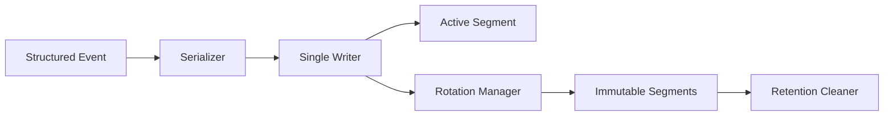

# Day 5 — Flat-File Storage and Rotation

## 1. Public source material

Publicly visible curriculum item:

- **Day 5:** Build a basic log storage mechanism using flat files with rotation policies.
- **Visible output:** Configurable rotation based on file size or time.

Source: [Hands-On Distributed Systems curriculum](https://sdcourse.substack.com/p/hands-on-distributed-systems-with).

The remainder is original.

---

## 2. Original lesson

## Why this matters

Append-only files are simple, fast, inspectable, and an excellent first storage engine. Rotation prevents one unbounded file from exhausting disk or becoming impossible to manage.

## First principles

Storage correctness requires a clear commit point. An event is durable only after its bytes are written and, for stronger guarantees, flushed to stable storage. Rotation must switch files atomically without losing or interleaving records.

## Terminology

- **Segment:** One immutable or appendable log file.
- **Rotation:** Closing the active segment and opening a new one.
- **Flush:** Moving buffered bytes toward the operating system.
- **fsync:** Requesting persistence to stable storage.
- **Retention:** Rules for deleting old segments.

## Requirements

- append structured events
- size- and time-based rotation
- deterministic file names
- atomic close/open transition
- configurable flush policy
- retention and disk-space safeguards
- crash recovery

## Architecture



## Contracts

```java
public record StoredRecord(String eventId, Instant occurredAt, String payload) {}
public record SegmentMetadata(Path path, long firstSequence, long lastSequence,
                              Instant openedAt, Instant closedAt, long bytes) {}
```

Use newline-delimited JSON or a length-prefixed binary record. Length prefixes are safer when payloads may contain newlines.

## Java 21 guidance

Keep one writer per active segment:

```java
try (FileChannel channel = FileChannel.open(path,
        StandardOpenOption.CREATE, StandardOpenOption.WRITE, StandardOpenOption.APPEND)) {
    channel.write(StandardCharsets.UTF_8.encode(serialized + "\n"));
    channel.force(false); // configurable durability policy
}
```

Rotate when either the projected next write exceeds the byte threshold or the segment age exceeds the time threshold.

## Component responsibilities

- **Serializer:** Stable on-disk representation.
- **Writer:** Owns append ordering and commit position.
- **Rotation manager:** Closes and names segments safely.
- **Retention cleaner:** Deletes only closed segments.
- **Recovery scanner:** Detects incomplete final records after crashes.

## End-to-end flow

1. Receive a parsed event.
2. Serialize it.
3. Check whether rotation is needed before append.
4. Append bytes to the active segment.
5. Flush according to policy.
6. Acknowledge only after the selected durability boundary.
7. Rotate and publish metadata when thresholds are reached.

## Concurrency and consistency

A single writer preserves order and simplifies rotation. Producers enqueue to a bounded queue. Multiple file writers may be used only when partitioning by a stable key such as source or date.

## Acknowledgement and idempotency boundaries

The storage acknowledgement boundary is configurable: buffer accepted, OS write completed, or `fsync` completed. Stronger durability costs latency. Persist `eventId`; recovery and replay can deduplicate against an index or recent-ID cache.

## Retries and recovery

Retry transient filesystem errors, but stop accepting new data when disk is full. On startup, scan the last segment, truncate incomplete trailing bytes, and resume only if metadata matches.

## Scaling and backpressure

Bound the write queue. When disk throughput is lower than input throughput, block or reject upstream rather than consume unlimited heap. Partitioning improves parallelism but complicates queries and retention.

## Observability

Track append latency, flush latency, queue depth, active segment bytes, rotations, disk usage, retention deletions, write failures, and recovery truncations.

## Security

Restrict directory permissions, encrypt disks where required, sanitize file names, prevent symlink traversal, and avoid storing credentials in plaintext logs.

## Trade-offs

Frequent fsync gives stronger durability but lower throughput. Larger segments improve sequential I/O but slow recovery and deletion. Time-based rotation improves operational predictability; size-based rotation protects disk bounds.

## Exercises

1. Implement size rotation.
2. Add hourly rotation.
3. Add atomic metadata files.
4. Simulate a crash during append.
5. Add retention by age and maximum disk usage.

## Test strategy

Test concurrent producers, boundary-size writes, midnight/hour rollover, disk-full behavior, restart recovery, incomplete records, retention safety, and acknowledgement timing.

## Lesson connections

Day 4 produces structured events. Day 5 stores them durably. Day 6 queries the resulting segments.