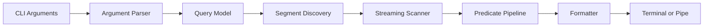

# Day 6 — CLI Query and Filter Tool

## 1. Public source material

Publicly visible curriculum item:

- **Day 6:** Create a simple CLI tool to query and filter collected logs.
- **Visible output:** A command-line utility that searches and filters logs using basic patterns.

Source: [Hands-On Distributed Systems curriculum](https://sdcourse.substack.com/p/hands-on-distributed-systems-with).

The remainder is original.

---

## 2. Original lesson

## Why this matters

Storage is useful only when operators can retrieve relevant events quickly. A CLI is the smallest complete query surface and forces the system to define clear query semantics, error handling, output contracts, and performance limits.

## First principles

A query engine performs three stages: discover candidate segments, scan records, then apply predicates. Correctness requires deterministic filtering and explicit handling of malformed records.

## Terminology

- **Predicate:** Boolean condition applied to a record.
- **Projection:** Fields selected for output.
- **Time range:** Inclusive or exclusive event-time boundaries.
- **Pagination:** Bounded result retrieval.
- **Exit code:** Machine-readable command outcome.

## Requirements

Support:

- time range
- level, service, status, and text filters
- maximum result count
- human-readable and JSON output
- stdin/stdout composition
- stable exit codes
- cancellation

## Architecture



## Query contract

```java
public record LogQuery(
        Instant from,
        Instant to,
        Set<String> levels,
        Optional<String> service,
        Optional<String> contains,
        int limit) {}
```

## Java 21 guidance

Keep scanning streaming rather than loading complete files:

```java
try (Stream<String> lines = Files.lines(segment, StandardCharsets.UTF_8)) {
    lines.map(codec::decode)
         .filter(event -> predicate.test(event))
         .limit(query.limit())
         .forEach(formatter::write);
}
```

For production-sized segments, use buffered readers and stop immediately after the result limit.

## Component responsibilities

- **Argument parser:** Validates user input.
- **Planner:** Selects candidate segments using time metadata.
- **Scanner:** Streams records safely.
- **Predicate evaluator:** Applies typed conditions.
- **Formatter:** Produces table, plain text, or JSON.

## End-to-end flow

1. Parse CLI arguments.
2. Validate time range and limits.
3. Discover segments overlapping the range.
4. Stream each record.
5. Decode and evaluate predicates.
6. Emit selected records.
7. Return exit code `0`, usage error, or execution error.

## Concurrency and consistency

Closed segments are immutable and safe for parallel scanning. The active segment may be read concurrently, but tolerate a partial final record. Preserve deterministic output by merging parallel results by event time and sequence.

## Acknowledgement and idempotency boundaries

Queries are read-only, so there is no processing acknowledgement. For automation, stdout is the result contract and the exit code acknowledges command completion. Re-running the same query against immutable segments is idempotent.

## Retries and recovery

Retrying local reads rarely helps except for transient file locks. Continue or fail-fast based on a flag when one segment is corrupt. Emit errors to stderr so stdout remains machine-readable.

## Scaling and backpressure

Streaming naturally applies backpressure from terminal or pipe writes. Bound parallel segment scans and result buffers. Never collect all matches before formatting unless the query explicitly requires global sorting.

## Observability

Expose scanned segments, scanned bytes, matched records, skipped malformed records, query duration, and cancellation count. A `--stats` flag can print these to stderr.

## Security

Restrict query roots, prevent arbitrary path traversal, cap regex complexity and result count, redact sensitive fields, and avoid shell interpolation when invoking the CLI.

## Trade-offs

Plain substring search is predictable but limited. Regex is expressive but can be expensive. Parallel scans reduce latency but increase disk contention. JSON output is automation-friendly; table output is operator-friendly.

## Exercises

1. Add `--from`, `--to`, `--level`, and `--contains`.
2. Add NDJSON output.
3. Add cancellation on Ctrl+C.
4. Add segment pruning using metadata.
5. Compare sequential and parallel scans.

## Test strategy

Test invalid arguments, empty results, partial active records, corrupt segments, large result sets, deterministic ordering, Unicode searches, broken output pipes, and cancellation.

## Lesson connections

Day 5 created rotated segments. Day 6 queries them. Day 7 integrates generator, collector, parser, storage, and CLI into one local pipeline.