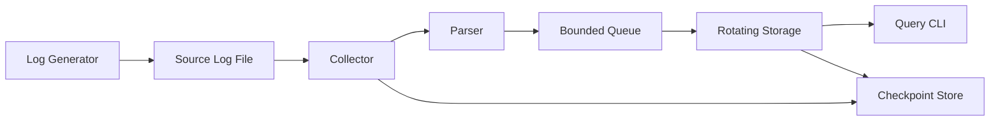

# Day 7 — Local End-to-End Log Pipeline

## 1. Public source material

Publicly visible curriculum item:

- **Day 7:** Integrate the components into a simple local log-processing pipeline.
- **Visible output:** An end-to-end system generating, collecting, storing, and querying logs on one machine.

Source: [Hands-On Distributed Systems curriculum](https://sdcourse.substack.com/p/hands-on-distributed-systems-with).

The remainder is original.

---

## 2. Original lesson

## Why this matters

Individual components can appear correct while their integration loses data, duplicates records, deadlocks, or violates ownership boundaries. Day 7 establishes the first complete vertical slice and makes delivery semantics explicit.

## First principles

A pipeline is a sequence of stages connected by contracts and acknowledgement boundaries. Reliability depends less on each stage alone than on when ownership transfers from one stage to the next.

## Architecture



## Requirements

- one-command startup
- explicit stage contracts
- bounded queues
- graceful shutdown
- replay after restart
- end-to-end identity propagation
- health and metrics
- reproducible integration tests

## Core contract

```java
public record PipelineEvent(
        String eventId,
        long sourceOffset,
        Instant occurredAt,
        Instant collectedAt,
        Map<String, Object> fields,
        String raw) {}
```

The `eventId` should remain stable from collection through storage.

## Component responsibilities

- **Generator:** Produces controlled source traffic.
- **Collector:** Owns file offset and line framing.
- **Parser:** Converts raw lines to typed fields.
- **Queue:** Decouples read and write rates.
- **Storage:** Defines durable commit.
- **Checkpoint store:** Advances only after durable acceptance.
- **CLI:** Verifies persisted results.

## End-to-end data flow

1. Generator appends a line.
2. Collector detects new bytes and frames the line.
3. Parser returns a structured event or durable parse failure.
4. Event enters a bounded queue.
5. Storage appends and flushes according to policy.
6. Storage returns an acknowledgement.
7. Collector checkpoint advances.
8. CLI retrieves the event from rotated segments.

## Java 21/Spring Boot guidance

Use interfaces at stage boundaries:

```java
public interface EventSource { Optional<RawLogLine> poll(); }
public interface LogParser { ParseResult parse(RawLogLine line); }
public interface LogStore { StoreReceipt append(StructuredLogEvent event); }
```

Wire implementations through Spring configuration rather than direct construction. Use lifecycle hooks to start and stop workers cleanly.

## Concurrency and consistency

A practical first design uses one collector thread and one storage writer with a bounded queue between them. This preserves source ordering. When adding parallel parsing, attach sequence numbers and reorder only if strict output order is required.

## Acknowledgement and idempotency boundaries

The key boundary is storage durability. Reading and parsing do not justify advancing the source checkpoint. If storage succeeds but checkpointing fails, the event may replay. Therefore storage must tolerate duplicate `eventId`s or the query layer must expose duplicates clearly.

## Retries and recovery

- Retry transient storage errors with bounded backoff.
- Persist checkpoints atomically.
- On restart, replay from the last durable checkpoint.
- Quarantine non-retryable parse failures.
- Stop ingestion when disk is full rather than acknowledging data that cannot be stored.

## Scaling and backpressure

Each queue must be bounded. Queue saturation should pause upstream collection. Measure stage throughput separately to locate the bottleneck. Do not add threads until profiling shows where capacity is missing.

## Observability

Track generated, collected, parsed, stored, duplicated, failed, and queried counts. Add end-to-end latency from `occurredAt` to durable storage. Correlate all logs with `eventId`.

## Security

Apply least-privilege filesystem access, sanitize raw content, protect local management endpoints, and never include secrets in sample payloads.

## Trade-offs

Synchronous acknowledgement is simple and durable but lowers throughput. Asynchronous queues improve throughput but require shutdown draining, retry state, and lag monitoring. Exactly-once transport is unnecessary when at-least-once delivery and idempotent storage provide exactly-once effect.

## Practical exercise

Create a Compose profile that starts the application, generates 10,000 logs, waits for storage, queries the count, restarts the collector, and confirms no missing events.

## Test strategy

- happy-path end-to-end test
- crash after storage before checkpoint
- parser failure
- queue saturation
- disk-full simulation
- rotation during ingestion
- graceful shutdown with queued events
- restart and replay

## Lesson connections

Days 1–6 built the local stages. Day 7 integrates them. Day 8 moves ingestion across a TCP network boundary.