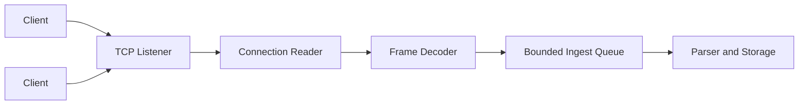

# Day 8 — TCP Log Server

## 1. Public source material

Publicly visible curriculum item:

- **Day 8:** Implement a TCP server to receive logs over the network.
- **Visible output:** A server accepting TCP connections carrying log data.

Source: [Hands-On Distributed Systems curriculum](https://sdcourse.substack.com/p/hands-on-distributed-systems-with).

The remainder is original.

---

## 2. Original lesson

## Why this matters

A network collector separates producers from storage and introduces real distributed-systems concerns: framing, partial reads, connection lifecycle, backpressure, authentication, and failure ambiguity.

## First principles

TCP provides an ordered byte stream, not messages. One write on the client may arrive as many reads, and many writes may arrive in one read. The application must define framing.

## Terminology

- **Connection:** Stateful TCP session.
- **Frame:** One application message extracted from the byte stream.
- **Length prefix:** Header declaring payload size.
- **Half-open connection:** One side is no longer reachable while the other has not detected it.
- **Socket backlog:** Pending connections waiting for acceptance.

## Requirements

- multiple concurrent clients
- explicit framing
- maximum frame size
- idle timeout
- bounded connection and work limits
- graceful shutdown
- metrics and structured errors

## Architecture



## Wire contract

Use a 4-byte big-endian length followed by UTF-8 payload:

```text
[length: int32][payload bytes]
```

```java
public record NetworkFrame(String connectionId, long sequence, byte[] payload) {}
```

## Java 21/Spring Boot guidance

A simple blocking server can use virtual threads while still enforcing limits:

```java
try (var server = new ServerSocket(port);
     var executor = Executors.newVirtualThreadPerTaskExecutor()) {
    while (!Thread.currentThread().isInterrupted()) {
        Socket socket = server.accept();
        if (!connectionLimiter.tryAcquire()) {
            socket.close();
            continue;
        }
        executor.submit(() -> handle(socket));
    }
}
```

Inside `handle`, use `DataInputStream.readInt()` and `readNBytes(length)`, reject negative or oversized lengths, and release the connection permit in `finally`.

## Component responsibilities

- **Listener:** Accepts connections and enforces admission limits.
- **Connection handler:** Owns socket lifecycle.
- **Frame decoder:** Reconstructs complete messages.
- **Ingest queue:** Protects downstream capacity.
- **Pipeline adapter:** Converts frames into existing local pipeline events.

## End-to-end flow

1. Client connects.
2. Server authenticates or identifies the peer.
3. Decoder reads a complete length prefix.
4. Decoder validates frame size.
5. Payload is read completely.
6. Frame enters the bounded ingest queue.
7. Existing parsing and storage stages process it.
8. Connection remains open for additional frames.

## Concurrency and consistency

One handler should own reads for one socket. Frames within a connection are ordered by TCP. Across connections there is no global ordering. Preserve client ID and sequence number if later ordering or deduplication is required.

## Acknowledgement and idempotency boundaries

TCP acknowledgement only confirms byte transport to the remote network stack. It does not confirm parsing or durable storage. Day 8 may initially be fire-and-forget, but the protocol should reserve sequence IDs for future application acknowledgements and duplicate detection.

## Retries and recovery

The server retries no client payload automatically. On connection loss, discard incomplete frames. Clients must reconnect and decide what to resend. The server should survive malformed frames by closing only the offending connection, not the process.

## Scaling and backpressure

Limit concurrent connections, frame size, per-connection read rate, and ingest queue depth. When downstream is full, stop reading temporarily or close/reject clients according to policy. Unlimited virtual threads do not provide unlimited CPU, memory, file descriptors, or storage throughput.

## Observability

Track active connections, accepted/rejected connections, bytes, frames, decode failures, oversized frames, idle timeouts, queue depth, and per-stage latency.

## Security

Bind only required interfaces, validate every length, configure idle/read timeouts, restrict clients by network or authentication, and prepare for TLS in Day 13.

## Trade-offs

Blocking sockets with virtual threads are easy to understand. NIO/Netty can provide tighter resource control at very high connection counts but adds complexity. Delimiter framing is readable but ambiguous when payloads contain delimiters; length-prefix framing is robust.

## Exercises

1. Implement a length-prefixed TCP server.
2. Add maximum frame size.
3. Add idle timeout and connection limits.
4. Send frames split across multiple client writes.
5. Send multiple frames in one write.

## Test strategy

Test partial headers, partial payloads, malformed lengths, oversized frames, many clients, abrupt disconnects, slow clients, queue saturation, and graceful server shutdown.

## Lesson connections

Day 7 completed the local pipeline. Day 8 introduces network ingestion. Day 9 builds the shipping client.