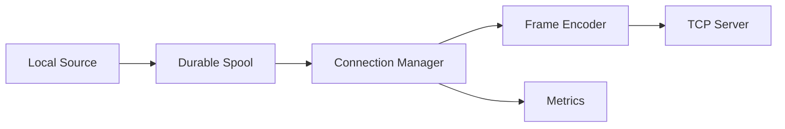

# Day 9 — TCP Log Shipping Client

## 1. Public source material

Publicly visible curriculum item:

- **Day 9:** Create a log-shipping client that forwards logs to the TCP server.
- **Visible output:** A client sending logs from one machine to another over TCP.

Source: [Hands-On Distributed Systems curriculum](https://sdcourse.substack.com/p/hands-on-distributed-systems-with).

The remainder is original.

---

## 2. Original lesson

## Why this matters

The shipper moves ownership of logs from a source machine to a remote collector. It must survive temporary disconnections, avoid unlimited memory growth, preserve event identity, and make failure visible.

## First principles

A successful socket write does not prove remote durability. The shipper must separate local acceptance, network transmission, and future application acknowledgement into distinct states.

## Terminology

- **Spool:** Durable local buffer for unsent records.
- **Reconnect loop:** Controlled process for restoring a broken connection.
- **In-flight record:** Sent but not yet known to be durably processed.
- **Delivery attempt:** One transmission of a logical event.

## Requirements

- discover/read source records
- preserve event IDs and ordering per source
- frame messages according to Day 8
- reconnect with exponential backoff and jitter
- bound memory and disk spool
- graceful shutdown and metrics

## Architecture



## Contracts

```java
public record Shipment(
        String producerId,
        long sequence,
        Instant occurredAt,
        byte[] payload) {}

public enum ShipmentState { PENDING, SENT, ACKNOWLEDGED, DEAD }
```

Even before application ACKs exist, persist `producerId` and `sequence` so retries can later be deduplicated.

## Java 21/Spring Boot guidance

```java
public final class TcpLogClient implements AutoCloseable {
    private final Socket socket;
    private final DataOutputStream out;

    public synchronized void send(byte[] payload) throws IOException {
        out.writeInt(payload.length);
        out.write(payload);
        out.flush();
    }
}
```

A single writer per connection avoids interleaved frames. Producers should submit to a bounded queue rather than writing directly.

## Component responsibilities

- **Source adapter:** Reads local events.
- **Spool:** Persists records until the chosen completion boundary.
- **Connection manager:** Opens, validates, and reconnects sockets.
- **Encoder:** Produces the length-prefixed wire frame.
- **Sender:** Serializes writes and updates shipment state.

## End-to-end flow

1. Read a local event.
2. Assign stable producer and sequence identity.
3. Persist it to the spool.
4. Establish TCP connection.
5. Encode and write the frame.
6. Mark `SENT`, but do not claim remote durability.
7. On disconnect, retain uncertain records for retry.
8. Remove records only at the configured acknowledgement boundary.

## Concurrency and consistency

Use one ordered sending loop per connection. Multiple producer threads can enqueue concurrently. If multiple connections are used for throughput, ordering is preserved only within each partition; choose a stable partition key.

## Acknowledgement and idempotency boundaries

Without application ACKs, deletion after `flush()` risks loss, while retaining forever causes duplicates. The safe model is at-least-once: retain uncertain records and make the receiver idempotent using `(producerId, sequence)`.

## Retries and recovery

Reconnect using capped exponential backoff with jitter. Do not reset retry delay on a connection that fails immediately. On restart, scan the durable spool and resume pending or uncertain shipments.

## Scaling and backpressure

Bound the in-memory queue and spool bytes. When full, choose a documented policy: block source ingestion, pause file checkpoint advancement, or reject/drop according to business priority. Never silently overwrite unsent logs.

## Observability

Track spool depth/bytes, connection state, reconnect count, send latency, bytes sent, oldest pending age, dropped records, and uncertain deliveries.

## Security

Validate target host configuration, protect spool files, avoid logging payload secrets, restrict outbound destinations, and prepare certificates for Day 13.

## Trade-offs

A disk spool improves durability but adds I/O and cleanup complexity. One persistent connection is efficient and ordered but can become a bottleneck. Multiple connections increase throughput but weaken global ordering.

## Exercises

1. Implement persistent reconnecting TCP transport.
2. Add a disk-backed spool.
3. Kill the server and verify queued recovery.
4. Restart the client and resume pending events.
5. Add a maximum spool policy.

## Test strategy

Test server unavailable at startup, mid-frame disconnect, slow server, reconnect storms, spool corruption, process restart, concurrent producers, queue saturation, and duplicate resend behavior.

## Lesson connections

Day 8 receives framed TCP logs. Day 9 ships them. Day 10 adds UDP as a lower-overhead, weaker-delivery alternative.