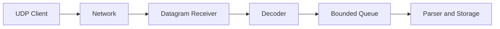

# Day 10 — UDP Log Shipping

## 1. Public source material

Publicly visible curriculum item:

- **Day 10:** Add UDP support for high-throughput log shipping.
- **Visible output:** Server and client handling log transmission over UDP.

Source: [Hands-On Distributed Systems curriculum](https://sdcourse.substack.com/p/hands-on-distributed-systems-with).

The remainder is original.

---

## 2. Original lesson

## Why this matters

UDP removes connection setup and stream management, making it attractive for low-latency telemetry. The trade-off is that packets may be lost, duplicated, reordered, or fragmented.

## First principles

UDP sends independent datagrams. Each datagram preserves message boundaries, but delivery is best effort. Reliability must either be unnecessary or implemented by the application.

## Terminology

- **Datagram:** One UDP message.
- **MTU:** Maximum transmission unit before IP fragmentation.
- **Packet loss:** Datagram never arrives.
- **Reordering:** Datagram arrival order differs from send order.
- **Amplification:** Small request triggers larger response, creating abuse risk.

## Requirements

- bounded datagram size
- producer and sequence identity
- loss/duplicate measurement
- non-blocking or bounded receive loop
- overload policy
- no unauthenticated response amplification

## Architecture



## Wire contract

```java
public record UdpEnvelope(
        UUID producerId,
        long sequence,
        Instant occurredAt,
        byte version,
        byte[] payload) {}
```

Keep each encoded datagram comfortably below the network MTU, commonly around 1,200 bytes for portable internet-safe payloads.

## Java 21 guidance

```java
try (DatagramSocket socket = new DatagramSocket(port)) {
    byte[] buffer = new byte[2048];
    while (!Thread.currentThread().isInterrupted()) {
        DatagramPacket packet = new DatagramPacket(buffer, buffer.length);
        socket.receive(packet);
        byte[] data = Arrays.copyOf(packet.getData(), packet.getLength());
        // validate and enqueue
    }
}
```

For higher throughput, use `DatagramChannel` and a fixed pool of reusable direct buffers.

## Component responsibilities

- **Client encoder:** Fits one complete event or compact batch into one datagram.
- **Receiver:** Reads datagrams without blocking downstream work.
- **Decoder:** Validates version, length, and checksum if used.
- **Deduplicator:** Optionally detects repeated `(producerId, sequence)`.
- **Queue:** Protects parser/storage capacity.

## End-to-end flow

1. Client serializes an envelope.
2. Client checks encoded size.
3. Datagram is sent once.
4. Receiver obtains zero or one copy, possibly out of order.
5. Decoder validates and enqueues it.
6. Storage persists accepted records.
7. Sequence gaps are measured, not automatically repaired.

## Concurrency and consistency

Multiple receiver workers can process datagrams concurrently, so global ordering is unavailable. If per-producer order matters, partition by producer ID and reorder within a small bounded window.

## Acknowledgement and idempotency boundaries

Plain UDP has no transport acknowledgement. The sender cannot know whether the event arrived. If application ACKs and retries are added, duplicate delivery becomes possible, so receiver idempotency remains necessary.

## Retries and recovery

Blind retries can multiply traffic during congestion. For best-effort telemetry, do not retry. For important events, use TCP or a reliable protocol. Recovery is based on metrics and gap detection rather than replay unless a spool and ACK protocol are deliberately added.

## Scaling and backpressure

UDP cannot naturally push back on senders. The receiver must use bounded buffers and drop explicitly under overload. Track kernel receive-buffer drops and application queue drops separately.

## Observability

Measure datagrams received, invalid, duplicated, out of order, dropped by queue, estimated sequence gaps, bytes per second, and kernel socket errors.

## Security

Restrict bind interfaces and source networks, cap packet size, avoid sending large responses, validate every field, and consider DTLS or an authenticated payload when traffic crosses untrusted networks.

## Trade-offs

UDP offers low overhead and message boundaries but weak delivery. TCP offers ordered reliable bytes but requires framing and connection state. Choose based on loss tolerance, not only benchmark throughput.

## Exercises

1. Implement UDP client/server envelopes.
2. Add sequence-gap metrics.
3. Simulate 1% packet loss and reordering.
4. Add duplicate detection.
5. Compare TCP and UDP latency under load.

## Test strategy

Test oversized datagrams, malformed envelopes, concurrent senders, packet duplication, reordering, queue saturation, receiver restart, and no-response behavior against spoofed source addresses.

## Lesson connections

Day 9 delivered over TCP. Day 10 introduces a best-effort transport. Day 11 improves network efficiency through batching.