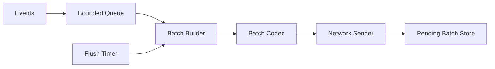

# Day 11 — Batching in the Log Shipper

## 1. Public source material

Publicly visible curriculum item:

- **Day 11:** Implement batching in the log shipper to optimize network usage.
- **Visible output:** A client that batches logs using configurable batch size and flush interval.

Source: [Hands-On Distributed Systems curriculum](https://sdcourse.substack.com/p/hands-on-distributed-systems-with).

The remainder is an original standalone lesson.

---

## 2. Original lesson

## Why this matters

Sending one network frame per event wastes CPU, system calls, protocol headers, and TLS overhead. Batching amortizes those costs, improving throughput, but it also increases waiting time, memory usage, and retry scope.

## First principles

A batch closes when one boundary is reached: maximum event count, maximum encoded bytes, maximum wait time, explicit flush, or shutdown. Byte limits matter more than count because event sizes vary.

## Terminology

- **Batch:** Ordered group sent as one application unit.
- **Flush interval:** Maximum time the oldest event waits.
- **Fill ratio:** Actual bytes divided by configured maximum bytes.
- **Retry amplification:** Re-sending already processed records because a batch outcome is uncertain.

## Requirements

Support count, byte, and time thresholds; stable batch IDs; bounded memory; graceful shutdown; retained event IDs; retry state; and latency/throughput metrics.

## Architecture



## Contract

```java
public record BatchEnvelope(
        UUID batchId,
        String producerId,
        long firstSequence,
        long lastSequence,
        Instant createdAt,
        List<Shipment> events) {}
```

Keep individual event IDs so receiver deduplication remains possible after a batch retry.

## Java 21/Spring Boot guidance

Use one owner for each batch builder. It polls a bounded queue, starts a deadline when the first event arrives, appends records until count or byte limits are reached, and flushes when the deadline expires. Multiple builders may run only across stable partitions.

```java
Shipment first = queue.poll(flushInterval.toMillis(), TimeUnit.MILLISECONDS);
if (first != null) {
    List<Shipment> batch = new ArrayList<>(maxCount);
    batch.add(first);
    int bytes = encodedSize(first);
    long deadline = System.nanoTime() + flushInterval.toNanos();

    while (batch.size() < maxCount && bytes < maxBytes) {
        long remaining = deadline - System.nanoTime();
        if (remaining <= 0) break;
        Shipment next = queue.poll(remaining, TimeUnit.NANOSECONDS);
        if (next == null || bytes + encodedSize(next) > maxBytes) break;
        batch.add(next);
        bytes += encodedSize(next);
    }
    sender.send(codec.encode(batch));
}
```

## Component responsibilities

The queue decouples producers. The builder owns thresholds. The timer bounds latency. The codec serializes metadata and records. The sender transmits one frame. The pending store retains uncertain batches.

## End-to-end flow

1. Event enters the bounded queue.
2. First event opens a batch.
3. Additional events are appended while limits permit.
4. Codec creates one payload.
5. Sender transmits it.
6. Batch remains pending until the selected acknowledgement boundary.
7. A retry uses the same batch and event IDs.

## Concurrency and consistency

Avoid multiple threads mutating one batch. One owner removes locking and duplicate-inclusion races. With several partitioned builders, ordering is guaranteed only inside each partition.

## Acknowledgement and idempotency boundaries

A socket write confirms only a transmission attempt. Application acknowledgement should identify the batch and, if partial acceptance is possible, individual records. The receiver should treat repeated `batchId` and event IDs idempotently.

## Retries and recovery

Persist important batches before first send. Retry transient failures with capped exponential backoff and jitter. Never assign a new ID to a retry of the same logical batch. Reload pending batches after restart.

## Scaling and backpressure

Bound the event queue, open-batch bytes, pending-batch count, and spool size. Adaptive batching may tune normal sizes, but hard limits must remain. When storage or network throughput falls, pause upstream collection rather than allocate without limit.

## Observability

Track batches sent, events and bytes per batch, fill ratio, oldest-event wait, send latency, retries, pending batches, queue depth, and shutdown flush duration.

## Security

The receiver must validate declared count and byte length independently. Limit batch size before allocation and protect local pending-batch storage.

## Trade-offs

Large batches improve throughput but increase latency and retry cost. Small batches are responsive but inefficient. Time-based flushing protects low-volume traffic; byte-based flushing protects memory and transport limits.

## Exercises

Implement count, byte, and time flushes; graceful shutdown; oversized-event handling; persistent pending batches; and a benchmark comparing throughput with p95 event wait time.

## Test strategy

Test threshold boundaries, timer flush, concurrent producers, shutdown, failed sends, duplicate retries, restart recovery, oversized events, and bounded-memory behavior.

## Lesson connections

Day 10 introduced TCP and UDP choices. Day 11 makes transport more efficient. Day 12 compresses each batch payload.