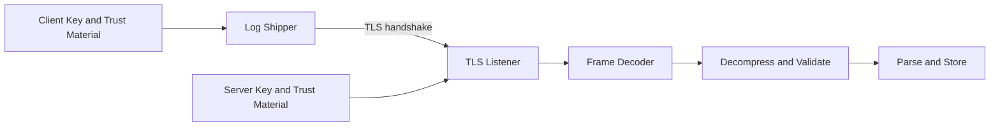

# Day 13 — TLS for Secure Log Transmission

## 1. Public source material

Publicly visible curriculum item:

- **Day 13:** Implement TLS encryption for secure log transmission.
- **Visible output:** Encrypted log transmission with certificate management.

Source: [Hands-On Distributed Systems curriculum](https://sdcourse.substack.com/p/hands-on-distributed-systems-with).

The remainder is an original standalone lesson.

---

## 2. Original lesson

## Why this matters

Logs often contain operational details, identifiers, stack traces, and security-sensitive context. Plain TCP exposes those records to interception and allows clients to connect without proving collector identity. TLS provides confidentiality, integrity, and peer authentication.

## First principles

TLS protects a transport channel. It does not make malformed payloads safe, guarantee durable storage, prevent duplicate delivery, or authorize every authenticated client to send every type of event.

## Terminology

- **Certificate:** Signed binding between a public key and an identity.
- **Certificate authority:** Trusted signer used to validate certificates.
- **Trust store:** Certificates or authorities the application trusts.
- **Key store:** Private key and certificate chain used to prove identity.
- **Handshake:** Protocol negotiation and identity verification before application data.
- **mTLS:** Both server and client present certificates.
- **Hostname verification:** Confirms the server certificate matches the configured host.

## Requirements

- TLS 1.3 where supported
- server certificate validation
- hostname verification
- optional or required client certificates
- certificate rotation without code changes
- secure secret storage
- handshake and certificate metrics
- no plaintext fallback unless explicitly configured for local development

## Architecture



## Security contract

The runtime configuration should define:

```text
transport.protocol=tls
transport.server-name=collector.internal.example
transport.trust-store=/run/secrets/client-truststore.p12
transport.key-store=/run/secrets/client-keystore.p12
transport.client-auth=required
```

Certificate subject or SAN identity should map to an application producer identity. Do not trust a producer ID supplied only inside the payload when mTLS is available.

## Java 21 implementation guidance

For a basic server:

```java
SSLContext context = buildSslContext(keyManagers, trustManagers);
SSLServerSocketFactory factory = context.getServerSocketFactory();
try (SSLServerSocket server = (SSLServerSocket) factory.createServerSocket(port)) {
    server.setEnabledProtocols(new String[] {"TLSv1.3"});
    server.setNeedClientAuth(true);
    while (!Thread.currentThread().isInterrupted()) {
        SSLSocket socket = (SSLSocket) server.accept();
        socket.startHandshake();
        executor.submit(() -> handle(socket));
    }
}
```

For Spring Boot-managed servers, bind certificate locations and passwords through external secrets and `@ConfigurationProperties`. Prefer well-supported PKCS#12 stores. Never hard-code passwords in source control.

## Component responsibilities

- **Certificate loader:** Reads key and trust material securely.
- **TLS context factory:** Configures protocols, trust managers, and key managers.
- **Connection authenticator:** Extracts and validates peer identity.
- **Authorization policy:** Decides which producer may submit which sources.
- **Frame pipeline:** Processes only after a successful handshake.
- **Rotation manager:** Reloads renewed certificates safely.

## End-to-end flow

1. Shipper opens a TCP connection.
2. Client and server negotiate TLS parameters.
3. Client validates the server certificate chain and hostname.
4. With mTLS, server validates the client certificate.
5. Authenticated identity is attached to the connection context.
6. Existing length-prefixed compressed batches flow inside the encrypted channel.
7. Receiver authorizes, validates, decompresses, parses, and stores events.
8. Application acknowledgement, when implemented, returns through the same TLS channel.

## Concurrency and consistency

TLS handshakes are CPU-expensive compared with ordinary reads, so reuse persistent connections and bound simultaneous handshakes. Keep certificate configuration immutable per accepted connection. New connections may use rotated material while existing connections complete using the old context until drained.

## Acknowledgement and idempotency boundaries

A successful TLS handshake acknowledges peer identity and cryptographic channel establishment only. A successful encrypted write still does not acknowledge durable application processing. Preserve `(authenticatedProducerId, eventSequence)` as the receiver idempotency key.

## Retries and recovery

Classify failures:

- expired or untrusted certificate: configuration error, do not retry rapidly
- transient network failure: reconnect with exponential backoff and jitter
- handshake timeout: retry within bounded policy
- hostname mismatch: fail closed
- rotated certificate: reload material and reconnect

The shipper spool from Day 9 retains events while secure connectivity is unavailable.

## Scaling and backpressure

Use connection reuse, session resumption where supported, bounded handshake concurrency, and admission control. TLS does not remove downstream backpressure: the server must still limit queues, frame sizes, batches, and decompressed bytes.

## Observability

Track active TLS connections, handshake latency, handshake failures by reason, peer certificate expiry, protocol and cipher distribution, authentication failures, reconnects, and oldest spooled-event age. Alert before certificates expire.

## Security

- Require hostname verification.
- Disable obsolete TLS versions and weak cipher suites.
- Protect private keys with filesystem permissions and a secret manager.
- Rotate certificates regularly.
- Use mTLS for machine identity where operationally feasible.
- Authorize after authentication.
- Do not expose certificate passwords in logs or command arguments.
- Keep payload validation, size limits, and decompression protections from earlier lessons.

## Trade-offs

One-way TLS is simpler and protects confidentiality, but the server still needs another client-authentication mechanism. mTLS provides strong machine identity but increases certificate lifecycle complexity. Long-lived connections reduce handshake cost but make certificate rotation and stale authorization slower to take effect.

## Practical exercises

1. Create a local CA and issue separate server/client certificates.
2. Configure one-way TLS and verify hostname validation.
3. Require mTLS and reject an unknown client certificate.
4. Rotate the server certificate without changing application code.
5. Measure handshake cost versus a reused connection.
6. Confirm packet inspection cannot reveal log payloads.

## Test strategy

Test valid one-way TLS, valid mTLS, expired certificate, unknown CA, hostname mismatch, missing client certificate, revoked/rotated credentials, handshake timeout, many simultaneous handshakes, reconnect with pending spool data, and secure shutdown. Integration tests should use generated short-lived test certificates rather than production secrets.

## Lesson connections

Day 12 reduced bandwidth with compression. Day 13 encrypts and authenticates the transport. Day 14 uses the complete pipeline to generate controlled load and measure throughput, latency, loss, retries, and resource saturation.