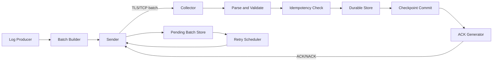

# Day 14 — Application-Level Acknowledgements for Reliable Log Delivery

## Course position

- Previous: Day 13 — TLS encryption for secure log transmission
- Current: Day 14 — Application-level acknowledgements
- Next: Durable buffering and disconnected-client recovery

## 1. Public source material

The publicly visible SDCourse curriculum places this lesson in the network-based log collection sequence after transport security. The visible curriculum context establishes the progression from TCP/UDP transport, batching, compression, and TLS toward stronger delivery guarantees.

No subscriber-only article text is reproduced here. This note uses only the publicly visible curriculum position and provides an original standalone lesson.

Source: https://sdcourse.substack.com

---

## 2. Original standalone lesson

## Why application acknowledgements matter

TCP confirms that bytes reached the peer's networking stack. It does not confirm that the collector parsed the batch, validated it, persisted it durably, committed its checkpoint, or made the log records queryable.

A production log shipper therefore needs a business-level acknowledgement boundary:

> The sender may forget a batch only after the receiver confirms that the batch crossed the agreed durable processing boundary.

Without this boundary, a collector can accept bytes, crash before storage, and still cause permanent data loss even though the sender observed a successful TCP write.

## Terminology

- **ACK**: Positive acknowledgement that processing reached the agreed commit point.
- **NACK**: Negative acknowledgement that the batch was rejected or could not be processed.
- **Pending batch**: Sent batch for which no final ACK has been received.
- **Commit point**: The exact operation after which the receiver considers the batch durable.
- **At-least-once delivery**: The sender retries until acknowledged, so duplicates are possible.
- **Idempotency**: Reprocessing the same logical batch does not create duplicate effects.
- **Exactly-once effect**: Usually achieved through at-least-once delivery plus idempotent processing.

## Requirements

The system should:

1. Assign every batch a stable unique identifier.
2. Retain the batch until a final ACK arrives.
3. Acknowledge only after durable processing.
4. Retry when the result is unknown.
5. Detect duplicate batch delivery.
6. Survive sender and collector restarts.
7. Bound outstanding work to prevent memory exhaustion.
8. Expose acknowledgement latency, retries, duplicates, and failures.

## Architecture



## Component responsibilities

### Producer

Creates log events and hands them to the batching layer. It should not know transport retry details.

### Batch builder

Groups events, assigns a stable `batchId`, records event count and payload checksum, then creates an immutable batch.

### Sender

Transmits batches and records them as pending before or atomically with transmission. It removes a batch only after a valid final ACK.

### Pending batch store

Persists outstanding batches so a process restart does not lose retry state.

### Collector

Authenticates the client, parses the request, validates the contract, performs idempotency checks, stores the events, advances the durable checkpoint, and emits an ACK.

### Idempotency store

Tracks completed batch IDs. A duplicate batch returns the original success outcome without inserting events again.

### Retry scheduler

Finds expired pending batches and retransmits them using exponential backoff with jitter.

## Contracts and data models

```java
public record LogBatch(
        UUID batchId,
        String sourceId,
        Instant createdAt,
        int eventCount,
        String payloadSha256,
        List<LogEvent> events
) {}

public record LogEvent(
        UUID eventId,
        Instant occurredAt,
        String level,
        String message,
        Map<String, String> attributes
) {}

public record BatchAcknowledgement(
        UUID batchId,
        AckStatus status,
        Instant acknowledgedAt,
        String errorCode,
        String message
) {}

public enum AckStatus {
    SUCCESS,
    DUPLICATE,
    RETRYABLE_FAILURE,
    REJECTED
}
```

Recommended semantics:

- `SUCCESS`: Durable commit completed.
- `DUPLICATE`: Batch was already committed; sender may remove it.
- `RETRYABLE_FAILURE`: Temporary failure; sender should retry.
- `REJECTED`: Permanent contract/security failure; sender should stop automatic retries and surface the batch for operator action.

## End-to-end data flow

1. The batch builder creates an immutable batch and stable `batchId`.
2. The sender writes the batch into the pending store.
3. The sender transmits the batch over the authenticated TLS connection.
4. The collector authenticates the source and validates size, schema, checksum, and event count.
5. The collector checks whether `batchId` is already completed.
6. For a new batch, it stores the events and the idempotency record within one transaction where possible.
7. The collector commits its checkpoint.
8. Only after the commit succeeds does it return `SUCCESS`.
9. The sender validates the ACK and deletes the pending batch.
10. If the ACK is lost, the sender retries; the collector detects the duplicate and returns `DUPLICATE`.

## Java 21 and Spring Boot guidance

Use Spring Boot MVC for a blocking JDBC implementation or WebFlux only when the complete processing chain is non-blocking. Avoid mixing reactive request handling with blocking database calls on event-loop threads.

### Controller

```java
@RestController
@RequestMapping("/api/v1/log-batches")
final class LogBatchController {

    private final BatchIngestionService ingestionService;

    LogBatchController(BatchIngestionService ingestionService) {
        this.ingestionService = ingestionService;
    }

    @PostMapping
    ResponseEntity<BatchAcknowledgement> ingest(
            @RequestBody @Valid LogBatch batch,
            Principal principal) {

        BatchAcknowledgement ack = ingestionService.ingest(principal.getName(), batch);

        return switch (ack.status()) {
            case SUCCESS, DUPLICATE -> ResponseEntity.ok(ack);
            case RETRYABLE_FAILURE -> ResponseEntity.status(503).body(ack);
            case REJECTED -> ResponseEntity.badRequest().body(ack);
        };
    }
}
```

### Transactional ingestion boundary

```java
@Service
final class BatchIngestionService {

    private final ProcessedBatchRepository processedBatchRepository;
    private final LogEventRepository logEventRepository;

    BatchIngestionService(
            ProcessedBatchRepository processedBatchRepository,
            LogEventRepository logEventRepository) {
        this.processedBatchRepository = processedBatchRepository;
        this.logEventRepository = logEventRepository;
    }

    @Transactional
    public BatchAcknowledgement ingest(String sourceId, LogBatch batch) {
        if (!sourceId.equals(batch.sourceId())) {
            return rejected(batch.batchId(), "SOURCE_MISMATCH");
        }

        if (processedBatchRepository.existsBySourceIdAndBatchId(sourceId, batch.batchId())) {
            return duplicate(batch.batchId());
        }

        validateChecksumAndCount(batch);
        logEventRepository.insertAll(batch.events(), batch.batchId(), sourceId);
        processedBatchRepository.insert(sourceId, batch.batchId(), Instant.now());

        return success(batch.batchId());
    }
}
```

Create a unique database constraint on `(source_id, batch_id)`. This is the final concurrency guard even when two duplicate requests race through separate collector instances.

## Concurrency and consistency

Multiple sender threads may receive ACKs and timeout callbacks concurrently. Model pending-batch updates as explicit state transitions:

```text
PENDING -> SENT -> ACKNOWLEDGED
              \-> RETRY_SCHEDULED -> SENT
              \-> PERMANENT_FAILURE
```

Use optimistic locking or compare-and-set updates so a late timeout cannot move an already acknowledged batch back into retry state.

Receiver consistency should prefer one atomic transaction containing:

- event inserts;
- processed-batch/idempotency insert;
- checkpoint update.

When the event store and idempotency store are different technologies, use an outbox or another recoverable state machine. Never ACK based only on an in-memory marker.

## Acknowledgement and idempotency boundaries

The ACK boundary must be documented precisely. Common choices are:

- after the collector writes to a durable local queue;
- after the broker confirms persistence;
- after the final database transaction commits.

Earlier acknowledgement gives lower latency but transfers recovery responsibility to the receiver. Later acknowledgement gives a stronger sender-visible guarantee but increases latency and pending capacity requirements.

The receiver, not the sender, owns duplicate suppression. The sender must retry the same `batchId` and payload, not manufacture a new ID for each attempt.

## Retries and recovery

Retry only when the outcome is unknown or explicitly retryable.

A practical schedule is exponential backoff with jitter:

```text
nextDelay = min(maxDelay, baseDelay * 2^attempt) + randomJitter
```

Persist:

- batch payload or durable payload reference;
- attempt count;
- next-attempt time;
- first-sent time;
- last error;
- current state.

On sender restart, scan pending records and resume transmission. On collector restart, the unique idempotency key protects against replay.

Malformed input, unauthorized source IDs, invalid checksums, and unsupported schema versions should be permanent rejections rather than endless retries.

## Scaling and backpressure

Limit the number and total bytes of in-flight batches. When limits are reached, choose an explicit policy:

- pause producers;
- block the batch queue;
- spill to a disk-backed queue;
- reject low-priority events;
- apply sampling only when the business permits data loss.

Collectors scale horizontally because idempotency state is shared in a durable store. A unique database key remains necessary because load balancers can route duplicate retries to different instances.

ACK responses can be individual or cumulative. Individual ACKs are simple. Cumulative ACKs reduce protocol overhead but require ordered sequence numbers and careful gap handling.

## Observability

Recommended metrics:

- `log_batches_sent_total`
- `log_batches_acknowledged_total`
- `log_batches_retried_total`
- `log_batches_duplicate_total`
- `log_batches_rejected_total`
- `log_batches_pending`
- `log_batch_ack_latency_seconds`
- `log_batch_oldest_pending_age_seconds`
- `log_batch_retry_attempts`

Add structured fields to logs:

- `batchId`
- `sourceId`
- `attempt`
- `ackStatus`
- `correlationId`
- `payloadSha256`

Trace the batch across sender, collector, durable store, and ACK generation. Alert on increasing oldest-pending age, retry storms, duplicate spikes, and sustained rejection rates.

## Security

- Use mutual TLS or signed service credentials.
- Bind `sourceId` to the authenticated principal.
- Validate payload size before parsing large bodies.
- Validate schema version and checksum.
- Protect ACK responses with the same authenticated channel.
- Do not trust an ACK containing only a batch ID from an unauthenticated source.
- Rate-limit abusive senders and cap pending storage per tenant.

## Trade-offs

### ACK after receipt

Low latency, but unsafe unless receipt means durable queue persistence.

### ACK after durable local queue

Good balance. The collector can process asynchronously, but now owns queue recovery and replay.

### ACK after final storage

Strongest direct guarantee, but highest latency and lowest throughput under slow storage.

### In-memory pending batches

Simple, but sender restart loses delivery state.

### Durable pending batches

More I/O and operational complexity, but supports crash recovery.

## Practical example

A sender transmits batch `B-100`. The collector stores all events and commits the processed-batch record, but the network drops before the ACK reaches the sender. The sender times out and retries `B-100`. Another collector instance receives it, sees the unique processed record, skips inserts, and returns `DUPLICATE`. The sender then deletes the pending record. Delivery was at least once, while the storage effect occurred once.

## Exercises

1. Implement `PendingBatchRepository` using PostgreSQL.
2. Add optimistic locking so late timeout callbacks cannot retry acknowledged batches.
3. Add a unique `(source_id, batch_id)` constraint and test two concurrent duplicate requests.
4. Simulate an ACK lost after commit and verify exactly one set of events exists.
5. Add exponential backoff with jitter and a maximum-attempt dead-letter state.
6. Add Micrometer metrics and a dashboard for ACK latency and oldest pending age.

## Test strategy

### Unit tests

- state transition rules;
- timeout calculation;
- retry classification;
- checksum validation;
- ACK status mapping;
- duplicate ACK handling.

### Integration tests

Use Testcontainers for the database and verify:

- new batch commit;
- duplicate replay;
- concurrent duplicate requests;
- transaction rollback before ACK;
- restart recovery from persisted pending records.

### Failure-injection tests

- drop the ACK after commit;
- kill the collector before commit;
- kill the collector after commit;
- delay storage beyond sender timeout;
- return retryable database failures;
- corrupt payload checksum;
- restart the sender with pending records.

### Load tests

Measure throughput, ACK latency percentiles, pending-store growth, duplicate rate, retry amplification, database contention, and behavior when collectors slow down.

## Connection to the previous lesson

Day 13 protects confidentiality and identity in transit using TLS. Day 14 defines when delivery is considered successful. TLS secures the channel; application ACKs secure the processing semantics.

## Connection to the next lesson

Once ACK tracking exists, the sender can identify exactly which batches remain unconfirmed. The next step is durable offline buffering and disconnected-client recovery so those pending batches survive long network outages without exhausting memory or losing logs.
