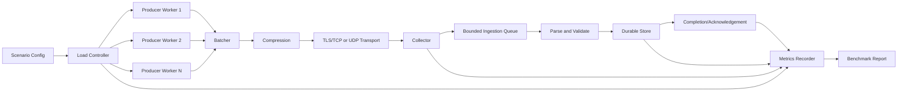

# Day 14 — Build a Load Generator and Measure System Throughput

## Course position

- Module 1: Foundations of Log Processing
- Week 2: Network-Based Log Collection
- Previous: Day 13 — TLS encryption for secure log transmission
- Current: Day 14 — Load generation and throughput benchmarking
- Next: Day 15 — JSON support for structured log data

---

# 1. Public source material

## What was actually visible

The public SDCourse curriculum lists Day 14 as:

> Build a simple load generator and measure throughput of the system.

The visible expected output is:

> Benchmark report showing logs/second processing capability.

The same public curriculum places Day 14 at the end of Week 2, after TCP, UDP, batching, compression, and TLS. It also names a weekly integration project that combines Days 8–14 into a Docker-based distributed logging platform with load testing.

Public source:

- https://sdcourse.substack.com/p/hands-on-distributed-systems-with

No subscriber-only Day 14 implementation text, code, or diagrams are reproduced here. The lesson below is an original Java 21 and Spring Boot implementation guide based only on the publicly visible curriculum objective.

---

# 2. Original standalone lesson

## 2.1 Why load testing is part of system design

A system that works for one request is not necessarily a working distributed system.

The network pipeline built in Days 8–13 now includes:

```text
Producer -> Batch -> Compression -> TLS -> Collector -> Parse -> Store
```

Every stage has a finite service rate. Under load, the slowest stage determines sustainable throughput, while queues hide overload only temporarily.

The purpose of Day 14 is not to generate the largest possible number. It is to determine:

- sustainable throughput;
- latency under increasing load;
- the first saturated component;
- behavior after saturation;
- whether backpressure protects the system;
- whether retries amplify overload;
- whether data remains correct during failures.

A useful benchmark answers four questions:

1. How much traffic can the system accept?
2. How much traffic can it complete durably?
3. How long does completion take?
4. What happens when offered load exceeds capacity?

## 2.2 First principles

### Offered load

The rate generated by the load tool, for example 20,000 events per second.

### Accepted throughput

The rate successfully accepted by the collector transport.

### Durable throughput

The rate that crosses the documented durability boundary, such as a committed database write or durable queue append.

### End-to-end latency

Time from event creation at the producer to durable completion at the receiver.

### Saturation

The point at which adding load no longer increases completed throughput and instead increases queues, latency, errors, or drops.

### Coordinated omission

A measurement error where the load generator waits for slow responses and therefore stops generating requests during the worst slowdown. This under-reports latency. An open-loop generator avoids this by scheduling work independently of response completion.

### Warm-up

A non-measured period allowing JIT compilation, connection pools, caches, TLS sessions, file handles, and database buffers to reach steady behavior.

### Percentiles

Latency distributions must be reported using p50, p95, p99, and maximum. Averages hide tail latency.

## 2.3 Requirements

The load generator should support:

- configurable event rate;
- configurable duration and warm-up;
- TCP and UDP modes;
- TLS on or off;
- configurable producer concurrency;
- configurable event and batch sizes;
- fixed-rate and maximum-throughput modes;
- deterministic event identifiers;
- counters for sent, acknowledged, failed, retried, and dropped events;
- latency histograms;
- graceful shutdown;
- machine-readable benchmark output.

The system benchmark should measure:

- generated events per second;
- transmitted bytes per second;
- accepted and durable events per second;
- p50, p95, p99, and maximum latency;
- queue depth and oldest queued event age;
- retries and duplicate rate;
- CPU, memory, GC, disk, and network utilization;
- error and rejection rates;
- correctness totals.

## 2.4 Architecture



## 2.5 Component responsibilities

### Scenario configuration

Defines the experiment and makes it reproducible: protocol, rate, duration, concurrency, payload size, batch size, compression, TLS, and failure injection.

### Load controller

Starts warm-up, schedules events, changes load by phase, stops the run, and records scenario timestamps.

### Producer workers

Create deterministic events and submit them without sharing mutable event state.

### Rate limiter

Controls offered load. It must distinguish fixed-rate tests from closed-loop tests.

### Batcher and transport

Reuse the implementation from Days 11–13 so the benchmark exercises the real pipeline rather than a simplified path.

### Collector instrumentation

Measures accepted traffic separately from completed durable traffic.

### Metrics recorder

Collects counters and histograms without becoming the benchmark bottleneck.

### Report generator

Produces a structured summary containing scenario settings, throughput, latency, resource use, errors, and correctness checks.

## 2.6 Contracts and data models

```java
public record LoadScenario(
        String scenarioId,
        TransportMode transport,
        boolean tlsEnabled,
        boolean compressionEnabled,
        int producerConcurrency,
        long targetEventsPerSecond,
        int eventPayloadBytes,
        int batchSize,
        Duration warmup,
        Duration duration
) {}

public enum TransportMode {
    TCP,
    UDP
}

public record GeneratedLogEvent(
        UUID eventId,
        String scenarioId,
        long sequence,
        Instant generatedAt,
        String level,
        String service,
        String message,
        Map<String, String> attributes
) {}

public record BenchmarkResult(
        LoadScenario scenario,
        long generated,
        long transmitted,
        long acknowledged,
        long failed,
        long retried,
        long duplicates,
        double generatedPerSecond,
        double durablePerSecond,
        LatencySummary latency,
        ResourceSummary resources,
        Instant startedAt,
        Instant completedAt
) {}

public record LatencySummary(
        Duration p50,
        Duration p95,
        Duration p99,
        Duration maximum
) {}
```

Every event should contain `scenarioId`, `sequence`, and `generatedAt`. These fields support correctness reconciliation and end-to-end latency measurement.

## 2.7 End-to-end data flow

1. Load the scenario and validate safe bounds.
2. Start metrics and allow the system to warm up.
3. The rate limiter emits permits independently of response completion.
4. Producer workers create immutable events with deterministic IDs.
5. Events pass through the real batching, compression, TLS, and transport path.
6. The collector records acceptance, validates events, and writes them to durable storage.
7. Completion metrics are recorded only after the chosen durability boundary.
8. The generator stops producing at the configured duration.
9. In-flight work drains for a bounded period.
10. Generated, transmitted, accepted, durable, duplicate, and failed totals are reconciled.
11. The benchmark report is written as JSON and Markdown.

## 2.8 Java 21 and Spring Boot implementation guidance

Use Java 21 virtual threads for blocking socket clients when each worker spends most of its time waiting on I/O. Do not assume virtual threads remove downstream capacity limits.

```java
@Configuration
class LoadExecutorConfiguration {

    @Bean(destroyMethod = "close")
    ExecutorService loadExecutor() {
        return Executors.newVirtualThreadPerTaskExecutor();
    }
}
```

Use an explicit rate scheduler rather than `Thread.sleep()` inside each producer because independent sleeping workers create uneven bursts.

```java
@Component
final class FixedRateLoadController {

    private final ScheduledExecutorService scheduler =
            Executors.newSingleThreadScheduledExecutor();
    private final ExecutorService workers;
    private final EventFactory eventFactory;
    private final LogTransport transport;

    FixedRateLoadController(
            ExecutorService workers,
            EventFactory eventFactory,
            LogTransport transport) {
        this.workers = workers;
        this.eventFactory = eventFactory;
        this.transport = transport;
    }

    ScheduledFuture<?> start(LoadScenario scenario) {
        long periodNanos = Math.max(
                1L,
                1_000_000_000L / scenario.targetEventsPerSecond());

        AtomicLong sequence = new AtomicLong();

        return scheduler.scheduleAtFixedRate(() -> {
            long current = sequence.getAndIncrement();
            workers.submit(() -> transport.send(
                    eventFactory.create(scenario, current)));
        }, 0, periodNanos, TimeUnit.NANOSECONDS);
    }
}
```

For very high rates, schedule groups of permits per tick rather than one scheduled task per event. For example, generate 1,000 events every 10 milliseconds to target 100,000 events per second, while measuring burst effects explicitly.

Use Micrometer counters and timers:

```java
@Component
final class LoadMetrics {

    private final Counter generated;
    private final Counter acknowledged;
    private final Timer endToEndLatency;

    LoadMetrics(MeterRegistry registry) {
        this.generated = registry.counter("load_events_generated_total");
        this.acknowledged = registry.counter("load_events_acknowledged_total");
        this.endToEndLatency = Timer.builder("load_event_end_to_end_latency")
                .publishPercentileHistogram()
                .register(registry);
    }
}
```

Avoid recording one high-cardinality metric tag per event, source ID, or sequence number. Keep identifiers in structured logs or traces, not metric labels.

## 2.9 Concurrency and consistency

The generator must be concurrency-safe without serializing all workers through one global lock.

Recommended rules:

- use `AtomicLong` for monotonic sequence allocation;
- create immutable event records;
- use thread-safe bounded queues;
- maintain counters with `LongAdder` under high contention;
- ensure each scheduled event is submitted exactly once by the generator;
- distinguish generator duplicates from receiver retries;
- measure completion using the receiver's durability boundary.

The benchmark must not claim completed throughput based only on client socket writes. Client-side send success is not equal to durable ingestion.

For TCP, acknowledgements or receiver-side durable counters can establish completion. For UDP, where delivery is intentionally unreliable, report sent, received, and durable counts separately.

## 2.10 Acknowledgement and idempotency boundaries

Benchmark correctness depends on stable event identity.

```text
eventId = hash(scenarioId + producerId + sequence)
```

If a TCP sender retries after an unknown outcome, it must resend the same event or batch ID. The receiver should count duplicate arrivals but avoid duplicate durable inserts.

Record at least these boundaries:

1. generated;
2. queued by producer;
3. handed to the socket;
4. accepted by collector;
5. durably committed;
6. acknowledged to sender.

This prevents misleading statements such as “100,000 logs/second processed” when only 100,000 logs/second were placed into an in-memory client queue.

## 2.11 Retries and recovery

Retries can create a positive feedback loop during overload:

```text
slow collector -> timeout -> retry -> more load -> slower collector
```

Benchmark retry policy as part of the system, not as background noise.

Use:

- exponential backoff;
- jitter;
- retry budgets;
- maximum attempts;
- circuit breaking where appropriate;
- retry metrics separated from original traffic.

After a load-generator crash, do not silently continue the same scenario unless the result model supports recovery. Usually mark the run incomplete and start a new scenario ID.

After a collector restart, verify that:

- pending TCP batches recover;
- duplicates are suppressed;
- UDP loss is measured honestly;
- durable counts remain reconcilable.

## 2.12 Scaling and backpressure

A throughput test should increase load in controlled steps:

```text
1k/s -> 5k/s -> 10k/s -> 20k/s -> 40k/s
```

At each step, hold long enough to reach steady state.

Signs of saturation include:

- durable throughput stops increasing;
- p99 latency rises sharply;
- queue depth grows continuously;
- oldest queued event age increases;
- timeout and retry rates rise;
- CPU reaches sustained saturation;
- disk latency or database pool wait time increases;
- UDP receive drops appear.

Backpressure is working when overload remains bounded and upstream producers slow or reject traffic according to policy. A system that accepts unlimited work into memory is not handling load; it is delaying failure.

Scale dimensions independently:

- producer workers;
- transport connections;
- collector replicas;
- parser workers;
- storage writers;
- database pool size.

Changing all dimensions simultaneously makes bottleneck attribution impossible.

## 2.13 Observability

### Load-generator metrics

- `load_events_generated_total`
- `load_events_transmitted_total`
- `load_events_failed_total`
- `load_events_retried_total`
- `load_generator_queue_depth`
- `load_generator_schedule_lag_seconds`
- `load_batch_size`

### Collector metrics

- active TCP/TLS connections;
- UDP datagrams received and dropped;
- bytes received;
- queue depth and capacity;
- parse and validation failures;
- storage latency;
- durable events per second;
- duplicate events;
- rejected events.

### Runtime metrics

- process CPU;
- heap and native memory;
- allocation rate;
- GC pause duration;
- virtual and platform thread counts;
- file descriptors;
- disk throughput and latency;
- network throughput and retransmits;
- database connection-pool active, idle, and pending counts.

Use synchronized clocks where possible. If producer and collector clocks differ, event timestamps can produce invalid end-to-end latency. For same-process tests use `System.nanoTime()` for elapsed durations; for cross-machine tests use clock synchronization and record uncertainty.

## 2.14 Security

A load generator can behave like a denial-of-service tool. Protect its use:

- run only against authorized environments;
- require explicit target allowlists;
- prevent production targets by default;
- cap maximum rate, connections, payload, and duration;
- protect TLS private keys and trust stores;
- avoid real customer or credential data in generated logs;
- authenticate the generator as a test client;
- rate-limit control endpoints;
- preserve an audit trail of who started each run.

Never disable TLS verification merely to simplify load testing. Certificate validation and handshake behavior are part of the system being tested.

## 2.15 Trade-offs

### Open-loop load

Generates traffic at a configured rate independent of responses. It exposes queueing and avoids coordinated omission, but can overload the target aggressively.

### Closed-loop load

Each worker sends the next request after the previous one completes. It models a fixed user population but under-reports latency collapse when responses slow.

### Synthetic payloads

Easy to reproduce, but may compress and parse differently from real logs.

### Production-shaped samples

More realistic, but require privacy controls and stable anonymization.

### Maximum-throughput tests

Find the upper limit, but do not represent normal operation.

### Soak tests

Reveal leaks, queue drift, and resource exhaustion over hours, but take longer to run.

## 2.16 Practical benchmark plan

Run these scenarios independently:

1. TCP without TLS, batching, or compression.
2. TCP with batching.
3. TCP with batching and compression.
4. TCP with batching, compression, and TLS.
5. UDP with the same payload and rate.
6. TLS connection reuse versus reconnect-per-batch.
7. Small versus large batches.
8. One collector versus multiple replicas.
9. Storage healthy versus intentionally slowed.
10. Thirty-minute soak at 70% of observed saturation throughput.

For every run, report:

- exact commit and configuration;
- machine/container resources;
- warm-up and measurement duration;
- offered, accepted, and durable rates;
- latency percentiles;
- resource utilization;
- errors, retries, duplicates, and drops;
- pass/fail criteria.

## 2.17 Exercises

1. Build a fixed-rate TCP load generator with deterministic event IDs.
2. Add phased load: 1k/s, 5k/s, 10k/s, and 20k/s.
3. Compare p99 latency with and without batching.
4. Measure compression ratio and CPU cost for 256-byte, 1-KB, and 4-KB events.
5. Compare TLS connection reuse with reconnect-per-batch.
6. Slow storage deliberately and verify bounded queue behavior.
7. Run a UDP test and reconcile sent, received, durable, and dropped counts.
8. Produce `benchmark-result.json` and a Markdown summary from the same result object.
9. Add a correctness assertion that each durable event ID is unique.
10. Run a soak test and check memory, threads, file descriptors, and queue age for drift.

## 2.18 Test strategy

### Unit tests

- deterministic ID creation;
- scenario validation;
- rate calculation;
- payload-size generation;
- result aggregation;
- percentile calculation;
- phase transitions;
- retry classification.

### Integration tests

Use Testcontainers or Docker Compose to start the real collector and storage dependencies. Verify:

- generated events reach durable storage;
- TLS configuration is exercised;
- compression and batching use production code paths;
- duplicate retries do not create duplicate rows;
- collector metrics match stored counts.

### Performance tests

Run warm-up followed by multiple measured iterations. Record median results across iterations and retain raw results. Do not compare builds from different hardware or container limits without stating the difference.

### Failure tests

Inject:

- collector restart;
- network latency and packet loss;
- closed connection;
- slow disk or database;
- exhausted connection pool;
- invalid TLS certificate;
- full bounded queues.

Verify that overload remains bounded, retry traffic is visible, and counts reconcile after recovery.

## 2.19 Definition of done

Day 14 is complete when:

- the load generator can reproduce a configured event rate;
- the full TCP/UDP, batching, compression, and TLS pipeline is exercised;
- accepted and durable throughput are measured separately;
- latency percentiles are available;
- backpressure behavior is demonstrated;
- retries, duplicates, drops, and failures are visible;
- a benchmark report is generated;
- correctness totals reconcile;
- the system's first saturation point is identified.

## 2.20 Connection to Day 13

Day 13 secured the network path with TLS. Day 14 measures the cost and operational behavior of the complete Week 2 transport stack, including handshake overhead, encrypted throughput, batching efficiency, compression savings, and backpressure.

## 2.21 Connection to Day 15

Day 15 adds JSON support with schema validation. The benchmark framework from Day 14 should be preserved so JSON parsing cost, validation failures, payload-size growth, and structured-log throughput can be compared against the existing text-log baseline.
