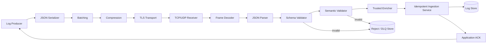

# Day 15 — JSON Support for Structured Log Processing

## Course position

- Module 1: Foundations of Log Processing
- Week 3: Data Serialization and Formats
- Previous: Day 14 — Load generation and throughput benchmarking
- Current: Day 15 — JSON support for structured log data
- Next: Day 16 — Protocol Buffers for efficient binary serialization

---

# 1. Public source material

## What was actually visible

The public SDCourse curriculum lists Day 15 as:

> Add JSON support for structured log data.

The visible expected output is:

> End-to-end JSON log processing with schema validation.

A publicly visible preview of the Day 15 article describes JSON as the interchange format between services and identifies schema validation as the quality boundary before logs enter downstream processing. The preview also states that the architecture adds a JSON processing layer between the existing TCP/UDP receivers and storage. That layer deserializes incoming JSON, validates it against schemas, enriches valid data, forwards accepted logs, and rejects invalid input.

Visible public material also included a project-setup example with separate processor, schema-validator, server, client, enricher, test, and schema files. The preview did not expose the complete paid implementation.

Public sources:

- https://sdcourse.substack.com/p/hands-on-distributed-systems-with
- https://sdcourse.substack.com/p/day-15-json-support-for-structured

No subscriber-only prose, implementation, or hidden diagrams are reproduced. Everything below is an original Java 21 and Spring Boot lesson based on the public topic and visible preview.

---

# 2. Original standalone lesson

## 2.1 Why structured logs matter

A plain-text log is primarily written for a human:

```text
2026-08-01 10:15:32 ERROR Payment failed for order ORD-42
```

A machine can search this text, but it must guess where each field begins and ends. A structured event carries explicit names and types:

```json
{
  "schemaVersion": "1.0",
  "eventId": "018f41d6-6d8a-7e60-b5df-c920ec77e98e",
  "occurredAt": "2026-08-01T10:15:32.417Z",
  "level": "ERROR",
  "service": "payment-service",
  "eventType": "payment.failed",
  "message": "Payment authorization failed",
  "traceId": "d84f04d8c26743c4b42b64f0e83de4a9",
  "attributes": {
    "orderId": "ORD-42",
    "provider": "bank-x",
    "errorCode": "AUTH_TIMEOUT"
  }
}
```

The second representation supports deterministic filtering, aggregation, validation, routing, alerting, retention, and analytics.

JSON is not merely formatting. It establishes an explicit contract between producers and consumers.

## 2.2 First principles

A distributed message crosses several boundaries:

1. An in-memory Java object must become bytes.
2. Those bytes cross a process or network boundary.
3. A receiver reconstructs a logical object.
4. The receiver verifies that the object follows an agreed contract.
5. Only validated data is allowed into durable storage or downstream processing.

This gives the pipeline:

```text
Domain event
  -> JSON serialization
  -> framing and transport
  -> JSON deserialization
  -> schema and semantic validation
  -> enrichment
  -> durable processing
```

Serialization answers: **How is the data represented?**

Schema validation answers: **Is the represented data structurally acceptable?**

Semantic validation answers: **Does the data make sense for the business and operational context?**

These are separate responsibilities.

## 2.3 Key terminology

- **Serialization:** Converting an object into bytes or text suitable for transport or storage.
- **Deserialization:** Reconstructing an object from serialized data.
- **Schema:** A machine-readable definition of required fields, types, formats, ranges, and allowed values.
- **Structural validation:** Checking shape and types, such as whether `occurredAt` is a timestamp.
- **Semantic validation:** Checking meaning, such as forbidding `level=INFO` for a mandatory failure event.
- **Canonical model:** The internal representation used after input-specific data is normalized.
- **Envelope:** Common metadata surrounding the event-specific payload.
- **Unknown field:** A property not recognized by the current consumer contract.
- **Backward compatibility:** New consumers can read old producer messages.
- **Forward compatibility:** Old consumers can tolerate newer producer messages.
- **Poison message:** Input that repeatedly fails parsing or validation.
- **Dead-letter record:** A rejected message retained with failure metadata for diagnosis and controlled replay.

## 2.4 Requirements

### Functional requirements

The system must:

- accept JSON over the existing secured transport;
- preserve batch, compression, TLS, and load-test behavior from Days 11–14;
- deserialize UTF-8 JSON safely;
- validate envelope and payload fields;
- normalize accepted messages into a canonical Java model;
- enrich records with trusted server-side metadata;
- reject malformed or invalid input with stable error codes;
- persist valid events without losing their original identity;
- retain enough rejected-message context for diagnosis without exposing secrets;
- support versioned schemas.

### Non-functional requirements

The implementation must provide:

- bounded payload and nesting depth;
- deterministic validation behavior;
- predictable CPU and memory usage;
- at-least-once delivery with idempotent effects;
- horizontal scalability;
- observable acceptance, rejection, latency, and queue metrics;
- safe schema evolution;
- protection against sensitive-data leakage.

## 2.5 Architecture



The JSON layer is deliberately placed after transport decoding and before storage. Transport code should not contain business validation, and storage code should never receive unvalidated input.

## 2.6 Component responsibilities

### Producer

Creates typed events, assigns stable identity, selects a schema version, and serializes with a configured `ObjectMapper`.

### Frame decoder

Separates transport frames or batches. JSON parsers must never guess message boundaries from a raw TCP byte stream.

### JSON parser

Converts bytes into a syntax tree or strongly typed DTO. It owns syntax errors, encoding errors, maximum-depth enforcement, and duplicate-property policy.

### Schema validator

Checks required fields, types, formats, enumerations, lengths, and additional-property rules.

### Semantic validator

Checks rules that JSON Schema alone cannot reliably express, such as relationships between fields and tenant-specific constraints.

### Enricher

Adds server-trusted values such as receive time, authenticated producer identity, source address, environment, and ingestion node. It must not trust a client-supplied value when the server can derive it securely.

### Idempotent ingestion service

Atomically establishes whether the event is new, stores it once, and returns the existing outcome for duplicates.

### Rejection store

Captures the event ID when available, a payload hash, schema version, rejection stage, error code, safe diagnostic details, and receive timestamp.

### Acknowledgement service

Returns success only after the selected durability boundary has completed.

## 2.7 Contracts and data models

Use an envelope that separates universal metadata from event-specific attributes:

```java
package com.example.logs.contract;

import com.fasterxml.jackson.databind.JsonNode;
import java.time.Instant;
import java.util.Map;
import java.util.UUID;

public record JsonLogEnvelope(
        String schemaVersion,
        UUID eventId,
        Instant occurredAt,
        LogLevel level,
        String service,
        String eventType,
        String message,
        String traceId,
        String spanId,
        Map<String, String> resource,
        JsonNode attributes
) {}
```

Prefer a flexible `JsonNode` only at the external boundary. Convert known event types into strongly typed payloads before business processing:

```java
public record PaymentFailedAttributes(
        String orderId,
        String provider,
        String errorCode,
        Integer attempt
) {}
```

Canonical internal model:

```java
public record CanonicalLogEvent(
        UUID eventId,
        Instant occurredAt,
        Instant receivedAt,
        LogLevel level,
        String service,
        String eventType,
        String message,
        TraceContext trace,
        SourceIdentity source,
        Map<String, String> resource,
        Map<String, Object> attributes,
        String schemaVersion,
        String payloadHash
) {}
```

Stable acknowledgement contract:

```java
public record IngestionAck(
        UUID eventId,
        AckStatus status,
        Instant processedAt,
        String errorCode,
        boolean duplicate
) {}
```

Do not return internal exception text as a public contract.

## 2.8 JSON Schema example

A simplified schema might be:

```json
{
  "$schema": "https://json-schema.org/draft/2020-12/schema",
  "$id": "urn:sdcourse:log-envelope:1.0",
  "type": "object",
  "required": [
    "schemaVersion",
    "eventId",
    "occurredAt",
    "level",
    "service",
    "eventType",
    "message"
  ],
  "properties": {
    "schemaVersion": { "const": "1.0" },
    "eventId": { "type": "string", "format": "uuid" },
    "occurredAt": { "type": "string", "format": "date-time" },
    "level": {
      "type": "string",
      "enum": ["TRACE", "DEBUG", "INFO", "WARN", "ERROR"]
    },
    "service": {
      "type": "string",
      "minLength": 1,
      "maxLength": 100,
      "pattern": "^[a-z0-9][a-z0-9-]*$"
    },
    "eventType": { "type": "string", "minLength": 1, "maxLength": 150 },
    "message": { "type": "string", "maxLength": 8192 },
    "traceId": { "type": "string", "pattern": "^[0-9a-f]{32}$" },
    "attributes": { "type": "object", "maxProperties": 100 }
  },
  "additionalProperties": false
}
```

`additionalProperties: false` catches producer mistakes but makes evolution stricter. A more compatibility-friendly design may permit unknown top-level fields while enforcing strictness inside versioned payloads.

## 2.9 Java 21 and Spring Boot implementation

### Dependencies

Typical dependencies include:

- `spring-boot-starter-web` or the existing socket transport module;
- Jackson Databind and Java Time support;
- a JSON Schema validator library;
- Spring Boot Validation;
- Micrometer and Actuator;
- persistence technology already chosen by the pipeline.

Use a supported JSON Schema implementation and pin its version. Schema behavior is part of your system contract.

### ObjectMapper configuration

```java
@Configuration
public class JacksonConfiguration {

    @Bean
    ObjectMapper logObjectMapper() {
        return JsonMapper.builder()
                .addModule(new JavaTimeModule())
                .disable(SerializationFeature.WRITE_DATES_AS_TIMESTAMPS)
                .enable(DeserializationFeature.FAIL_ON_TRAILING_TOKENS)
                .enable(JsonParser.Feature.STRICT_DUPLICATE_DETECTION)
                .disable(DeserializationFeature.ACCEPT_FLOAT_AS_INT)
                .build();
    }
}
```

Decide unknown-field behavior intentionally. Avoid globally enabling permissive coercions that turn malformed producer data into apparently valid values.

### Processing result

Do not use exceptions for ordinary validation outcomes:

```java
public sealed interface ProcessingResult
        permits AcceptedLog, RejectedLog {
}

public record AcceptedLog(CanonicalLogEvent event)
        implements ProcessingResult {
}

public record RejectedLog(
        String stage,
        String code,
        String safeMessage,
        String payloadHash
) implements ProcessingResult {
}
```

### Processing service

```java
@Service
public final class JsonLogProcessor {

    private final ObjectMapper mapper;
    private final LogSchemaValidator schemaValidator;
    private final LogSemanticValidator semanticValidator;
    private final LogEnricher enricher;

    public ProcessingResult process(byte[] payload, SourceIdentity source) {
        if (payload.length == 0 || payload.length > 256 * 1024) {
            return new RejectedLog(
                    "PRE_PARSE", "PAYLOAD_SIZE_INVALID",
                    "Payload size is outside the accepted range",
                    sha256(payload));
        }

        final JsonNode root;
        try {
            root = mapper.readTree(payload);
        } catch (JsonProcessingException ex) {
            return new RejectedLog(
                    "PARSE", "MALFORMED_JSON",
                    "Payload is not valid JSON",
                    sha256(payload));
        }

        var schemaErrors = schemaValidator.validate(root);
        if (!schemaErrors.isEmpty()) {
            return new RejectedLog(
                    "SCHEMA", "SCHEMA_VALIDATION_FAILED",
                    schemaErrors.toSafeSummary(),
                    sha256(payload));
        }

        final JsonLogEnvelope envelope;
        try {
            envelope = mapper.treeToValue(root, JsonLogEnvelope.class);
        } catch (JsonProcessingException ex) {
            return new RejectedLog(
                    "MAPPING", "TYPE_MAPPING_FAILED",
                    "Validated JSON could not be mapped",
                    sha256(payload));
        }

        var semanticError = semanticValidator.validate(envelope, source);
        if (semanticError.isPresent()) {
            return semanticError.get();
        }

        return new AcceptedLog(enricher.toCanonical(envelope, source));
    }

    private static String sha256(byte[] payload) {
        // Return a lowercase hexadecimal SHA-256 digest.
        throw new UnsupportedOperationException("Implement with MessageDigest");
    }
}
```

The parser and validator should be stateless and thread-safe. Load immutable compiled schemas once at startup rather than recompiling them per message.

## 2.10 End-to-end data flow

1. The producer creates an immutable Java event.
2. It assigns `eventId` before serialization.
3. Jackson serializes the event to canonical UTF-8 JSON.
4. Day 11 batching groups events.
5. Day 12 compression compresses the serialized batch.
6. Day 13 TLS encrypts the transport.
7. The receiver decrypts, decompresses, and separates frames.
8. The JSON processor enforces size and syntax limits.
9. The correct schema version is selected.
10. Structural and semantic validation run.
11. Trusted server metadata is added.
12. The idempotency boundary checks `eventId`.
13. The event and deduplication marker are durably committed.
14. An application ACK is sent.
15. Invalid input is rejected or routed to a controlled rejection store.

## 2.11 Concurrency and consistency

### Stateless parsing

A singleton parser service can serve many threads if its collaborators are immutable and thread-safe. Jackson's configured `ObjectMapper` is thread-safe after configuration.

### Ordering

Parallel parsing may reorder events. Define the required ordering scope:

- no ordering for independent logs;
- per source;
- per trace;
- per aggregate or entity.

When ordering matters, partition by the ordering key and process each partition serially. Global ordering usually creates an unnecessary bottleneck.

### Atomic persistence

For idempotent storage, the event insert and deduplication claim should be in the same atomic boundary where possible:

```sql
insert into processed_event(event_id, processed_at)
values (?, now())
on conflict do nothing;
```

Only the transaction that successfully claims the ID should insert the event. With a document database, use a deterministic document key such as `log::<eventId>` and an insert-only operation.

### Schema consistency

All nodes must use a controlled schema version. Package immutable schemas with the application for this lesson, or distribute them through a versioned registry in Day 19. Never silently replace a schema under the same version identifier.

## 2.12 Acknowledgement and idempotency boundaries

Transport success is not processing success.

Possible acknowledgement levels are:

- `RECEIVED`: frame reached application memory;
- `VALIDATED`: JSON passed parsing and validation;
- `DURABLE`: accepted event reached durable storage;
- `REPLICATED`: configured replicas confirmed storage.

Choose one explicit contract. For a reliable log pipeline, acknowledge `DURABLE` unless the system requires stronger replication guarantees.

A lost ACK can cause the sender to retry an already stored event. Therefore:

```text
at-least-once delivery + eventId deduplication = exactly-once observable effect
```

The idempotency key must represent the logical event, not a transport attempt. Never generate a new event ID during a retry.

For batches, preserve both `batchId` and every `eventId`. Batch deduplication is an optimization; event-level deduplication is the correctness boundary because partial batch persistence can occur.

## 2.13 Retries and recovery

### Retryable failures

- temporary database unavailability;
- transient network failure;
- saturated downstream worker pool when retry guidance is available;
- temporary schema service unavailability in a future registry-based design.

### Non-retryable failures

- malformed JSON;
- unsupported schema version;
- missing required field;
- forbidden field value;
- payload too large;
- authentication or authorization failure.

Return stable rejection codes so the producer does not retry permanent failures endlessly.

Use exponential backoff with jitter and a retry budget. Persist pending outbound data before retrying when loss is unacceptable. Rejected records should be replayed only after the cause is corrected and through the same validation path.

## 2.14 Scaling and backpressure

JSON parsing and schema validation consume CPU and allocate objects. Scaling requires separating stages with bounded queues:

```text
network receiver -> bounded parse queue -> validation workers
                 -> bounded persistence queue -> storage workers
```

When a queue is full, choose a deliberate policy:

- apply TCP read backpressure;
- reject with a retryable overload response;
- pause the producer using the existing ACK window;
- spill to a durable local queue;
- drop only explicitly expendable log classes.

UDP cannot propagate reliable backpressure. During overload, packets may be dropped before application processing. Use UDP only where this loss model is acceptable.

Scale horizontally by a stable key such as producer ID or service. Keep validation stateless and schemas locally cached. Measure before increasing worker counts; excessive parallelism can increase allocation pressure and storage contention.

## 2.15 Observability

Expose at least:

- JSON payloads received;
- accepted and rejected events;
- rejection count by stage and error code;
- unknown schema versions;
- parse, validation, enrichment, and persistence latency;
- payload-size distribution;
- queue depth and saturation;
- duplicates detected;
- ACK latency;
- retry count;
- schema version distribution;
- processor CPU and allocation rate.

Example Micrometer instrumentation:

```java
Counter.builder("logs.ingestion.rejected")
        .tag("stage", rejected.stage())
        .tag("code", rejected.code())
        .register(meterRegistry)
        .increment();
```

Do not tag metrics with event IDs, trace IDs, user IDs, or raw error messages because they create unbounded cardinality.

Add correlation IDs to operational logs, but never recursively send internal pipeline logs back through the same failing path without safeguards.

## 2.16 Security

JSON parsers process untrusted input. Enforce:

- maximum compressed and decompressed size;
- maximum JSON depth;
- maximum string length and attribute count;
- strict UTF-8 handling;
- duplicate-key rejection;
- a restricted polymorphic-deserialization policy;
- authentication of the producer through TLS or mTLS;
- authorization for allowed service names and event types;
- field-level redaction or rejection for secrets and personal data;
- retention controls for rejected payloads.

Never enable unrestricted Jackson default typing for untrusted JSON. Bind only to known DTOs or inspect `JsonNode` explicitly.

TLS protects data in transit, not data inside storage, metrics, exception traces, or dead-letter records. Apply encryption and access control at those boundaries separately.

## 2.17 Trade-offs

### JSON advantages

- human-readable;
- widely supported;
- easy debugging;
- flexible attributes;
- strong ecosystem for validation and transformation.

### JSON disadvantages

- verbose payloads;
- higher parsing CPU and allocation than compact binary formats;
- number-type ambiguity;
- schema enforcement is external rather than inherent;
- easy for producers to drift without governance.

### Strict versus tolerant consumers

Strict validation catches defects early but can reject harmless producer additions. Tolerant validation improves evolution but can hide mistakes. A practical design is strict for required semantics and tolerant for explicitly designated extension areas.

### Tree model versus typed DTO

`JsonNode` supports dynamic inspection and version routing. Typed DTOs improve compile-time safety. Use a tree at the untrusted boundary and map validated content to typed internal records.

## 2.18 Practical example

A producer sends:

```json
{
  "schemaVersion": "1.0",
  "eventId": "018f41d6-6d8a-7e60-b5df-c920ec77e98e",
  "occurredAt": "2026-08-01T10:15:32.417Z",
  "level": "ERROR",
  "service": "payment-service",
  "eventType": "payment.failed",
  "message": "Authorization timed out",
  "traceId": "d84f04d8c26743c4b42b64f0e83de4a9",
  "attributes": {
    "orderId": "ORD-42",
    "provider": "bank-x",
    "errorCode": "AUTH_TIMEOUT",
    "attempt": 2
  }
}
```

The receiver:

1. authenticates `payment-service` through mTLS;
2. validates schema `1.0`;
3. checks that the authenticated identity may publish `payment.failed`;
4. rejects any client-supplied `receivedAt` field;
5. adds its own receive time and ingestion node;
6. claims the event ID atomically;
7. stores the canonical event;
8. returns a durable success ACK.

If the ACK is lost, the retry receives a duplicate-success ACK without writing a second record.

## 2.19 Exercises

1. Implement the envelope, canonical model, and stable error contract.
2. Configure Jackson with duplicate detection, Java time support, and strict coercion behavior.
3. Add schema `1.0` and compile it once at startup.
4. Implement syntax, structural, semantic, and authorization validation as separate components.
5. Create an event-type mapper for `payment.failed`.
6. Add a deterministic event-ID uniqueness constraint.
7. Implement a rejection store containing only safe diagnostics and a payload hash.
8. Add metrics for validation outcome, latency, schema version, and duplicate rate.
9. Extend the Day 14 load generator to send valid, malformed, oversized, duplicate, and unsupported-version payloads.
10. Compare throughput and allocation rate between plain text parsing and JSON processing.

## 2.20 Test strategy

### Unit tests

Test:

- valid envelope mapping;
- malformed JSON;
- duplicate keys;
- trailing tokens;
- absent required fields;
- invalid UUID and timestamp formats;
- enum and length violations;
- unknown schema versions;
- semantic-rule failures;
- trusted metadata overriding spoofed input;
- stable rejection codes.

### Contract tests

Maintain producer and consumer fixtures for each supported schema version. Verify that compatible additions remain accepted and breaking changes fail intentionally.

### Integration tests

Run the complete path:

```text
producer -> batch -> compress -> TLS -> receive -> validate -> store -> ACK
```

Verify successful persistence, rejection behavior, durable ACK timing, and duplicate replay.

### Concurrency tests

Send the same event ID concurrently from many clients. Assert that exactly one durable record exists and every caller receives a consistent outcome.

### Failure tests

Inject:

- database failure after validation;
- receiver restart before ACK;
- lost ACK after durable commit;
- queue saturation;
- corrupted compressed data;
- expired TLS credentials;
- schema-loading failure.

### Performance tests

Use Day 14's load generator to measure:

- accepted events per second;
- p50, p95, and p99 end-to-end latency;
- CPU and allocation per event;
- throughput by payload size;
- cost of schema validation;
- effect of batching and compression;
- overload behavior and recovery time.

## 2.21 Connection to Day 14

Day 14 established a repeatable way to measure offered load, accepted throughput, durable throughput, latency, retries, and saturation. Day 15 changes the workload from largely opaque text to validated structured events.

Re-run the Day 14 benchmark because JSON parsing and schema validation add CPU and allocation cost. The benchmark now becomes evidence for selecting worker count, queue capacity, payload limits, and batch size.

## 2.22 Connection to Day 16

Day 16 introduces Protocol Buffers. The logical envelope, identity, acknowledgement boundary, idempotency strategy, validation stages, and observability requirements remain relevant.

Protocol Buffers will change the serialization contract from human-readable JSON to a compact binary schema. Day 15 therefore establishes the baseline against which Day 16 can measure payload size, serialization latency, throughput, compatibility behavior, and operational complexity.
