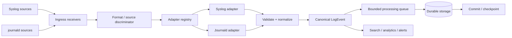

# Day 20 — Compatibility Layer for Syslog and Journald

## 1. Public source material

Public SDCourse curriculum: **Day 20: Build compatibility layer for common logging formats (syslog, journald)**. Public output: **Adapters for ingesting logs from system services**.

The publicly visible Day 20 preview describes a compatibility layer as a translation hub. It explicitly identifies three responsibilities: a **Format Detector**, an **Adapter Factory**, and a **Unified Output Formatter**. It says syslog and journald should be translated into the platform's unified format and emphasizes extensibility: new formats should be added as adapters without changing the core pipeline.

Sources:
- https://sdcourse.substack.com/p/hands-on-distributed-systems-with
- https://sdcourse.substack.com/p/day-20-building-universal-log-language

No subscriber-only implementation text is reproduced here. Everything below is an original lesson derived from the public topic.

---

## 2. Original standalone lesson

## Goal

A production logging platform cannot require every machine and application to emit your canonical JSON/Avro contract. Linux hosts may emit RFC-style syslog; systemd services expose structured journald entries; appliances may emit legacy syslog variants. Day 20 therefore adds an **anti-corruption/compatibility boundary** between external logging dialects and the canonical `LogEvent` built in Days 15–19.

The key rule is:

> Parse external formats at the edge; keep the core pipeline format-independent.



## First principles and terminology

A **wire/source format** describes how an external system represents a log. A **canonical model** is the representation owned by our platform. An **adapter** understands one external contract and maps it into that model. A **format detector** chooses an adapter when the transport does not already identify the format. An **anti-corruption layer** prevents external conventions from leaking through the domain.

Syslog is fundamentally a message protocol with concepts such as facility, severity, timestamp, hostname, application/process identity and message body. Real deployments contain multiple RFC generations and vendor deviations, so parsing must be defensive rather than based on a single `split(" ")` expression.

Journald is different. Its records are already structured key/value entries and may include systemd metadata such as unit, PID, executable and host identity. Preserve useful source metadata, but translate it into names owned by the canonical platform rather than making every downstream component understand journald field names.

## Requirements

The compatibility layer should accept explicitly typed syslog/journald input, support safe auto-detection only where unavoidable, normalize timestamps and severity, preserve raw input or a safe diagnostic reference, distinguish malformed input from transient infrastructure failures, generate or preserve a stable event identity, bound memory usage, expose per-adapter metrics, and allow a new adapter to be added without modifying storage/search/analytics code.

## Canonical contract

Use a serialization-neutral domain record:

```java
public record LogEvent(
        UUID eventId,
        Instant occurredAt,
        Instant ingestedAt,
        String sourceType,
        String host,
        String application,
        LogSeverity severity,
        String message,
        Map<String, String> attributes
) {
    public LogEvent {
        attributes = Map.copyOf(attributes);
    }
}
```

Do not put `SyslogMessage`, journald DTOs, Avro generated classes or Protobuf generated classes into the domain model. Those belong at integration boundaries.

A useful parser result separates source parsing from normalization:

```java
public record ParsedExternalLog(
        Instant occurredAt,
        String host,
        String application,
        Integer sourceSeverity,
        String message,
        Map<String, String> sourceAttributes,
        String sourceIdentity
) {}
```

## Adapter contract

```java
public interface LogFormatAdapter {
    SourceFormat format();
    boolean supports(InboundLog input);
    ParsedExternalLog parse(InboundLog input) throws MalformedLogException;
}
```

Keep normalization separate:

```java
public interface LogNormalizer {
    LogEvent normalize(SourceFormat format, ParsedExternalLog parsed,
                       Instant ingestedAt);
}
```

This avoids four adapters implementing four subtly different definitions of severity, host naming or event IDs.

## Spring Boot component responsibilities

`SyslogIngress` owns the TCP/UDP transport and framing rules. `JournaldIngress` owns the mechanism used to obtain journal records. `AdapterRegistry` resolves the correct adapter. `SyslogAdapter` parses syslog-specific fields. `JournaldAdapter` translates journal fields. `CanonicalNormalizer` applies shared rules. `ValidationService` rejects invalid canonical events. `LogRepository` durably stores accepted events. `IngestionCoordinator` controls the acknowledgement/checkpoint boundary.

A registry is cleaner than conditionals:

```java
@Component
public final class AdapterRegistry {
    private final Map<SourceFormat, LogFormatAdapter> adapters;

    public AdapterRegistry(List<LogFormatAdapter> adapters) {
        this.adapters = adapters.stream().collect(
            java.util.stream.Collectors.toUnmodifiableMap(
                LogFormatAdapter::format,
                java.util.function.Function.identity()));
    }

    public LogFormatAdapter require(SourceFormat format) {
        var adapter = adapters.get(format);
        if (adapter == null) throw new UnsupportedFormatException(format.name());
        return adapter;
    }
}
```

Prefer explicit source metadata over content sniffing. If a listener is configured as syslog, use the syslog adapter. Detection by payload heuristics is ambiguous and can become a security and correctness problem.

## End-to-end data flow

For syslog over TCP: receive a framed message, attach connection/source metadata, select `SYSLOG`, parse priority/header/body, normalize time/host/application/severity, validate the canonical event, compute/preserve event identity, persist, commit, then acknowledge according to the transport contract.

For journald: read a journal entry, capture a stable cursor/source identity when available, map structured fields, normalize, validate, persist, then advance the durable cursor/checkpoint. The cursor must not advance before persistence succeeds or a crash can create data loss.

## Acknowledgement boundary

ACK semantics depend on the source. UDP syslog has no end-to-end ACK, so the receiver cannot promise delivery to the sender. TCP can confirm application-level receipt only if you define such a protocol; a TCP write succeeding is not equivalent to durable processing. Journald collection commonly has a local progress cursor/checkpoint.

The platform's internal success boundary should be:

```text
receive -> parse -> normalize -> validate -> durable persist -> commit/checkpoint
```

If a queue is durably written before downstream storage, the ACK boundary may instead be that durable queue append. Document which guarantee you provide: accepted-to-memory, accepted-to-durable-buffer, or persisted-to-final-store.

## Idempotency boundary

At-least-once recovery creates duplicates. Prefer a stable source identity: journald cursor/boot identity plus host, or a producer-supplied syslog message ID when available. If none exists, derive a fingerprint from stable fields such as source, normalized timestamp, host, application and raw-message hash, understanding that hash-based deduplication is heuristic.

Persist `eventId` under a uniqueness constraint or use an atomic idempotency store. Only mark an event processed in the same durable boundary as its accepted persistence; a separate "seen" write before storage can lose events after a crash.

## Concurrency and ordering

Parsing can run concurrently because adapters should be stateless. Ordering is more subtle. Global ordering is unnecessary and expensive. If ordering matters, define it per source stream, host, file/journal cursor or connection. Route the same ordering key to one serial lane/partition while allowing unrelated sources to process in parallel.

Do not share mutable parser buffers between worker threads. Java 21 records and immutable maps make canonical handoff safer. Use bounded executors rather than unbounded async submission.

## Consistency

Normalization must be deterministic. The same source record and normalization policy version should produce the same canonical meaning. Store source format and, when useful, normalization version so historical behavior can be explained after mapping rules evolve.

Never silently reinterpret invalid timestamps or severity. Define fallback rules explicitly, e.g. missing event time may use ingestion time while setting `timestamp_inferred=true`; malformed timestamps may be rejected/quarantined depending on policy.

## Retries and recovery

Retry transient failures: database timeout, temporary durable-queue outage, network interruption to a remote sink. Do not repeatedly retry deterministic parse failures. Quarantine malformed records with reason, source metadata and a safely bounded/redacted raw representation.

Use exponential backoff with jitter and a maximum attempt/time budget. A poison record must not block an entire ordered source forever; after the policy is exhausted, move it to quarantine and advance in a controlled/auditable way.

On restart, resume from the last durable journald checkpoint. For TCP senders, reconnect/replay behavior belongs to the sender contract. For UDP, acknowledge that packet loss cannot be recovered by this receiver alone.

## Scaling and backpressure

Scale adapters horizontally when sources can be partitioned. Keep ingestion nodes stateless except for explicit durable checkpoints. Backpressure must propagate from storage toward ingress:

```text
storage slow -> bounded persist queue fills -> parser slows -> receiver throttles/pauses
```

For TCP this naturally reduces socket reads and eventually producer send capacity. For journald, stop advancing the reader/checkpoint until capacity returns. UDP cannot be reliably backpressured; under overload packets may drop, so expose drop/socket-buffer metrics and provision capacity accordingly.

Separate queues by workload only when needed. A single noisy syslog source should not starve journald ingestion; per-source quotas or weighted queues can protect fairness.

## Observability

Measure `logs_received_total{format}`, `logs_normalized_total{format}`, `parse_failures_total{format,reason}`, `quarantined_total`, `duplicate_total`, `adapter_latency`, `normalization_latency`, `persist_latency`, queue depth/capacity, journald checkpoint lag and UDP drops where observable.

Trace IDs should be propagated when the source already contains them, not fabricated as if they represented a distributed trace. Operational logs should include adapter, source identity, correlation/event ID and error category, but should not dump unrestricted log payloads.

## Security

Treat logs as untrusted input. Limit frame and field sizes, cap attribute counts, reject malformed encodings, protect parsers from catastrophic regex behavior, sanitize control characters before displaying logs, and prevent log-forging/newline injection in your own operational logs. Redact credentials/tokens/PII before diagnostic storage where policy requires it.

Authenticate remote ingestion where possible, retain TLS from Day 13, and apply network allowlists/rate limits. A compatibility adapter is an internet-facing parser in many deployments; fuzz testing is therefore a security control, not only a correctness test.

## Trade-offs

Auto-detection is convenient but less deterministic than explicit configuration. Preserving every source field improves forensic fidelity but increases cardinality and storage cost. Strict parsing produces cleaner data but can reject valuable legacy logs; permissive parsing improves acceptance but risks inconsistent semantics. A practical design has strict canonical invariants plus a quarantine path and preserves selected raw/source metadata for diagnosis.

Centralizing all adapters in one service simplifies governance initially, while separate collectors can isolate failure domains at large scale. Keep the adapter contract stable so deployment topology can evolve without changing the canonical pipeline.

## Practical example

A Linux host emits syslog with facility/severity and application identity. The adapter maps severity to `LogSeverity.ERROR`, host to canonical `host`, application to `application`, retains facility in attributes, normalizes the timestamp to UTC and produces `LogEvent`. A systemd service record goes through `JournaldAdapter`, which maps unit/process fields into canonical attributes. Search, storage and alerting receive indistinguishable canonical contracts and never need `if (syslog)` branches.

## Exercises

1. Implement `SyslogAdapter` for two common syslog header variants and create a corpus of malformed examples.
2. Implement `JournaldAdapter` from a map-like journal DTO and map unit, PID, executable and host fields.
3. Add an `AdapterRegistry` and prove a third adapter can be added without changing `IngestionCoordinator`.
4. Define a deterministic severity mapping and timestamp fallback policy.
5. Add quarantine storage with bounded/redacted raw input.
6. Simulate storage slowdown and prove all queues remain bounded.
7. Crash the journald collector after persistence but before checkpoint update; prove replay is deduplicated.
8. Benchmark parse/normalize throughput separately from persistence throughput.

## Test strategy

Unit tests should cover valid and malformed samples, boundary sizes, timestamp variants, severity mapping, missing optional fields and deterministic normalization. Property/fuzz tests should feed arbitrary bytes/strings into parsers and assert bounded execution and no process crash.

Contract tests should verify every adapter produces the same canonical invariants. Integration tests should exercise receiver -> adapter -> normalization -> persistence -> checkpoint. Idempotency tests should replay identical source records. Concurrency tests should prove independent sources process in parallel while configured ordering keys remain ordered. Backpressure tests should deliberately slow storage and verify bounded memory. Recovery tests should crash at each boundary: before parse, after normalize, before persist, after persist and before checkpoint.

Security tests should include oversized messages, control characters, newline/log injection, malformed encodings and high-cardinality attribute attacks.

## Connection to Day 19

Day 19 centralized schema management. Day 20 uses that foundation where structured formats need schema resolution, but adds a broader edge concern: legacy and operating-system formats that do not naturally arrive as the canonical schema. The adapter layer translates those external dialects before the core pipeline.

## Connection to Day 21

The public curriculum lists Day 21 as **Implement a simple log enrichment pipeline adding metadata to raw logs**, producing a service that augments logs with context such as hostname and environment. Once Day 20 guarantees a canonical event regardless of source format, Day 21 can enrich one consistent model instead of implementing enrichment separately for syslog, journald, JSON, Protobuf and Avro.
