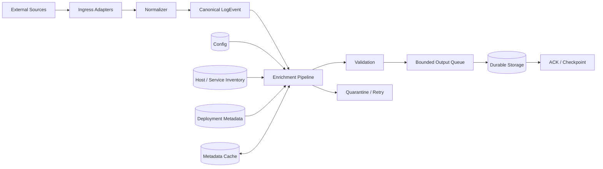

# Day 21 — Log Enrichment Pipeline

## 1. Public source material and what was actually visible

The public SDCourse curriculum lists Day 21 as **“Implement a simple log enrichment pipeline adding metadata to raw logs”** with the output **“Service that augments logs with additional context (hostname, environment, etc.)”**. It places this as the final daily lesson of Week 3, followed by a Week 3 integrated project whose public output is an end-to-end pipeline: **Input → Normalization → Enrichment → Output**. The next numbered lesson, Day 22, begins Week 4 (Distributed Log Storage): **“Set up a multi-node storage cluster using simple file replication”** with an output of logs distributed across multiple nodes with basic replication.

Only those publicly visible curriculum statements are used to establish scope and sequence. Everything below is original teaching material; it does not reproduce subscriber-only lesson text or code.

## 2. Original standalone lesson

## Goal

Day 20 taught the ingress boundary: syslog, journald, JSON, Protobuf, Avro, and other external dialects are adapted and normalized into a canonical event. Day 21 answers the next question: **once an event has a stable shape, what context should the platform add so that downstream users can actually reason about it?**

A raw message such as `database connection failed` is weak by itself. The same message enriched with `service=orders`, `environment=prod`, `hostname=orders-17`, `region=me-central-1`, `deploymentVersion=2026.08.09`, `traceId=...`, and trustworthy source metadata becomes searchable, correlatable, routable, and useful for alerts.

Enrichment is therefore not decorative transformation. It is a controlled join between an incoming event and contextual data known elsewhere in the system.

## First principles

Normalization answers **“what does this event mean structurally?”** Enrichment answers **“what context surrounds this event?”** Keep those responsibilities separate. A normalizer should not call a CMDB, DNS server, Kubernetes API, or deployment service merely to parse a message. Likewise, an enricher should operate on a canonical event instead of learning every external wire format.

The conceptual transformation is:

```text
CanonicalLogEvent + EnrichmentContext -> EnrichedLogEvent
```

The transformation should be deterministic for a stated context snapshot, bounded in latency, observable, and explicit about which source wins when two sources provide the same field.

## Terminology

**Intrinsic fields** originate in the event itself: event ID, source timestamp, level, message, logger, trace ID supplied by the application.

**Derived fields** are computed from existing values: normalized severity, event age, message fingerprint, parsed error category.

**Static enrichment** comes from configuration that changes slowly: environment, application ownership, business domain.

**Dynamic enrichment** comes from changing external state: host labels, Kubernetes pod metadata, deployment version, cloud region, tenant metadata.

**Authoritative source** is the system allowed to define a field. For example, a trusted collector may be authoritative for `receivedAt`; an untrusted producer must not overwrite it.

**Provenance** records where an enriched value came from and, when useful, which version/snapshot supplied it.

## Requirements

A production enrichment stage should preserve the immutable event identity and raw/canonical meaning; support multiple independent enrichers; define field precedence; avoid unbounded external calls; tolerate temporarily unavailable metadata providers; distinguish required from optional enrichment; cache safely; expose enrichment provenance; remain idempotent; apply bounded concurrency and backpressure; and prevent untrusted input from forging trusted metadata.

## Architecture



The critical design decision is that metadata systems are **not allowed to become an uncontrolled synchronous dependency for every log event**. Cache and prefetch wherever possible.

## Component responsibilities

`CanonicalLogEvent` represents the normalized event before contextual augmentation. `Enricher` is a small component that owns one enrichment concern. `EnrichmentPipeline` orders enrichers and applies policy. `MetadataProvider` retrieves contextual information. `MetadataCache` keeps hot metadata off the event hot path. `EnrichmentPolicy` defines required/optional enrichments, precedence, timeout and failure behavior. `EnrichedLogEvent` is the downstream contract. `QuarantineRepository` captures events that cannot satisfy required policy without silently losing them.

Do not build one 2,000-line `EnrichmentService`. Independent enrichers make ownership, tests, latency budgets and failure behavior visible.

## Contracts and data models

Java 21 records work well for immutable pipeline contracts:

```java
public record CanonicalLogEvent(
        UUID eventId,
        Instant occurredAt,
        Instant receivedAt,
        String source,
        Severity severity,
        String message,
        Map<String, String> attributes
) {}

public record EnrichmentContext(
        String hostname,
        String environment,
        String service,
        String region,
        String deploymentVersion,
        Map<String, String> labels,
        Map<String, String> provenance
) {}

public record EnrichedLogEvent(
        CanonicalLogEvent event,
        EnrichmentContext context,
        Instant enrichedAt,
        int enrichmentVersion
) {}
```

Prefer typed fields for dimensions with stable semantics and use an attribute map for genuinely extensible metadata. If everything is a `Map<String,String>`, contracts become typo-prone and compatibility becomes difficult.

An enricher contract can be deliberately small:

```java
public interface LogEnricher {
    String name();
    int order();
    EnrichmentDelta enrich(CanonicalLogEvent event, EnrichmentSnapshot snapshot);
}
```

`EnrichmentDelta` should contain only additions/changes plus provenance, rather than allowing each enricher to mutate the whole event.

## Field ownership and precedence

Suppose the producer sends `environment=dev` while the trusted collector knows the connection came through the production collector. Which value wins? Never leave this accidental.

One reasonable policy is:

```text
platform-authoritative metadata
        > trusted collector metadata
        > authenticated producer metadata
        > parsed/untrusted payload metadata
```

For conflicting values, preserve the original where forensic value matters, for example `reported.environment=dev`, while canonical `environment=prod` comes from the authoritative source. Emit a conflict metric rather than silently hiding disagreement.

## End-to-end data flow

1. The Day 20 adapter receives syslog/journald/other input.
2. Normalization produces `CanonicalLogEvent` and preserves `eventId`.
3. The enrichment coordinator obtains a metadata snapshot, normally from local cache.
4. Pure/cheap enrichers run: normalized service identity, message fingerprint, static environment.
5. Cached dynamic enrichers add host, deployment, region or ownership context.
6. Policy validates required context and resolves conflicts.
7. The platform creates an immutable `EnrichedLogEvent` with enrichment version/provenance.
8. The enriched event is durably persisted or handed to a durable next stage.
9. Only then is the source-specific acknowledgement/checkpoint advanced when this service owns that durability boundary.

## Spring Boot / Java 21 implementation guidance

Spring can discover ordered enrichment plugins without coupling the coordinator to concrete classes:

```java
@Component
public final class EnrichmentPipeline {
    private final List<LogEnricher> enrichers;

    public EnrichmentPipeline(List<LogEnricher> enrichers) {
        this.enrichers = enrichers.stream()
                .sorted(Comparator.comparingInt(LogEnricher::order))
                .toList();
    }

    public EnrichedLogEvent enrich(CanonicalLogEvent event,
                                   EnrichmentSnapshot snapshot) {
        var builder = EnrichmentAccumulator.forEvent(event);
        for (var enricher : enrichers) {
            builder.apply(enricher.name(), enricher.enrich(event, snapshot));
        }
        return builder.build();
    }
}
```

Keep ordinary enrichment code synchronous and pure when the metadata is already local. Do not add `CompletableFuture` merely because the system is distributed. Concurrency belongs around independent I/O or across events, not inside every trivial field transformation.

For external metadata, prefer an asynchronously refreshed cache. A scheduled refresh can build an immutable `EnrichmentSnapshot` and atomically swap the reference. Event workers then perform only memory lookups.

```java
private final AtomicReference<EnrichmentSnapshot> current =
        new AtomicReference<>(EnrichmentSnapshot.empty());
```

This gives readers a consistent snapshot without locking every event.

## Concurrency and consistency

Events can usually be enriched independently, so horizontal and worker-level parallelism is natural. Avoid shared mutable event maps. Use immutable input/output records and immutable metadata snapshots.

There are two notions of consistency. **Event consistency** means all enrichers processing one event should ideally observe one metadata snapshot/version. **World consistency** is impossible in the strict sense: deployments and host metadata can change while an event travels through the pipeline. Capture a snapshot/version and make the result explainable instead of pretending all external state changed atomically.

Ordering is normally required only within a source/partition if downstream semantics depend on it. Global ordering destroys scalability and is unnecessary for enrichment itself.

## Acknowledgement boundary

Transport receipt is not processing success. A TCP read, UDP receive, or journald cursor observation only means bytes arrived.

If the enrichment service is responsible for durable acceptance, the safe boundary is:

```text
receive
 -> normalize
 -> enrich / apply required policy
 -> durable persist (or durable handoff)
 -> commit
 -> ACK / advance checkpoint
```

Optional enrichment failure need not block acknowledgement if policy explicitly permits a degraded event and records that degradation. Required enrichment failure must not be reported as successful merely to improve throughput metrics.

For UDP, no true sender acknowledgement exists; the platform can only record local receive/process outcomes. For journald, advance the durable cursor only after the chosen durability boundary.

## Idempotency boundary

Enrichment must not generate a new event identity on retry. `eventId` belongs to the logical event and survives normalization, enrichment and storage.

If the same event is retried after metadata changed, choose and document semantics. For an ingestion pipeline, a common rule is **first durable result wins**: persistence enforces uniqueness on `eventId`, making retries harmless. If later metadata correction is required, model it as a deliberate re-enrichment/versioning workflow rather than accidental duplicate ingestion.

Do not use `enrichedAt` as an idempotency key; it necessarily changes on retries.

## Retries and recovery

Classify failures.

Retry transient failures such as metadata-provider timeout, temporary database unavailability, connection reset, or cache refresh failure. Do not blindly retry malformed canonical events, prohibited metadata, impossible field types, or deterministic policy violations.

Use exponential backoff with jitter and a maximum attempt/time budget. A required metadata provider that remains unavailable should lead to a durable retry/quarantine path rather than an unbounded in-memory queue.

On restart, events that crossed the durable boundary are recovered by idempotent replay. Events that did not cross it must remain available from the upstream durable source or local spool. This is why acknowledgement placement matters more than the retry loop itself.

## Scaling and backpressure

Scale across events, not by making one event infinitely parallel. Partition by a stable key when ordering matters; otherwise distribute events across stateless enrichment workers.

Use bounded ingress and output queues. If downstream persistence slows, stop draining upstream as quickly. For pull-based sources, pause/slow consumption. For TCP, bounded reads and connection-level flow control eventually push pressure to the sender. For UDP, the system cannot reliably push back; overload becomes packet loss, so capacity planning and drop metrics are essential.

External metadata lookup can create a fan-out catastrophe: 50,000 events/sec must not become 50,000 CMDB requests/sec. Use cache-aside for occasional misses, proactive refresh for hot dimensions, request coalescing so concurrent misses for the same key produce one lookup, strict timeouts, and circuit breaking where appropriate.

## Observability

Measure the enrichment stage independently from the rest of ingestion. Useful metrics include `events_enriched_total`, `enrichment_failures_total{enricher=...}`, `enrichment_degraded_total`, `enrichment_conflicts_total{field=...}`, per-enricher latency, end-to-end enrichment latency, metadata cache hit/miss ratio, cache age, provider latency/errors, retry queue depth, output queue utilization and event age at enrichment.

Trace external metadata calls but avoid creating a heavyweight trace span for every cheap in-memory field addition. Structured operational logs should include event/correlation ID, enricher name, metadata snapshot version and failure class without dumping sensitive event content.

## Security

Enrichment creates a trust boundary. Never let raw log attributes overwrite platform-controlled `tenantId`, `environment`, authorization labels, source identity or trusted timestamps without explicit policy. Authenticate metadata providers, use TLS for remote lookups, apply least-privilege service credentials, bound attribute counts and lengths, sanitize control characters, redact secrets/PII, and treat user-controlled values as data rather than metric label names to avoid cardinality attacks.

Metadata itself may be sensitive. Hostnames, account identifiers, topology and ownership information should follow access-control and retention rules just like the original logs.

## Trade-offs

**Synchronous lookup per event** gives fresh metadata but couples latency and availability to every provider. **Cached enrichment** is fast and resilient but can be temporarily stale. **Enrichment at query time** uses fresh context and reduces ingestion work but makes queries slower and historical results can change. **Enrichment at ingestion time** makes search fast and preserves what was known then, at the cost of storage duplication and possible stale context.

A practical log platform usually enriches high-value, commonly queried dimensions at ingestion and leaves expensive/rare relationships for query-time joins.

## Practical example

A canonical event arrives:

```json
{
  "eventId": "4e9...",
  "occurredAt": "2026-08-09T03:59:12Z",
  "source": "10.20.4.17",
  "severity": "ERROR",
  "message": "payment authorization timed out"
}
```

Trusted collector metadata maps the source to `hostname=payments-17`; service inventory maps that host to `service=payment-api` and `team=payments`; deployment cache adds `version=8.14.2`; platform configuration adds `environment=prod` and `region=me-central-1`. The stored event now supports queries such as “ERRORs for payment-api in prod after deployment 8.14.2” without parsing the message text.

## Exercises

1. Implement `StaticEnvironmentEnricher`, `HostnameEnricher`, `DeploymentEnricher`, and `MessageFingerprintEnricher` behind the same interface.
2. Add explicit precedence rules and a conflict metric. Test a producer attempting to forge `environment`.
3. Implement an immutable metadata snapshot refreshed every 30 seconds and measure event latency versus synchronous lookup.
4. Simulate 10,000 events for the same hostname after cache expiry and implement request coalescing so only one provider call occurs.
5. Mark deployment metadata optional and environment metadata required. Demonstrate different failure behavior.
6. Crash the service after durable event persistence but before upstream acknowledgement. Replay and prove that `eventId` uniqueness prevents a duplicate.
7. Load-test until the output queue saturates and verify memory remains bounded.

## Test strategy

**Unit tests:** each enricher in isolation, precedence rules, immutable input behavior, deterministic mapping, missing metadata, conflict handling, security/field ownership rules.

**Contract tests:** metadata-provider response compatibility and canonical/enriched event schema compatibility.

**Integration tests:** normalization → enrichment → persistence, cached provider failure, optional degradation, required-enrichment retry, duplicate replay, checkpoint behavior.

**Concurrency tests:** thousands of parallel events, snapshot replacement during processing, concurrent cache misses, uniqueness enforcement under duplicate delivery.

**Performance tests:** events/sec, p50/p95/p99 enrichment latency, allocations/event, cache hit ratio, provider request amplification and queue utilization.

**Failure/chaos tests:** provider outage, slow provider, stale cache, storage outage, process crash around the durability boundary and downstream saturation.

**Security tests:** metadata spoofing, oversized attributes, newline/control-character injection, secret leakage and high-cardinality attacks.

## Connection to Day 20

Day 20 established the compatibility boundary:

```text
syslog / journald / other formats
 -> adapters
 -> canonical LogEvent
```

Day 21 deliberately begins only after that boundary. Enrichers no longer care whether an event originally came from syslog, journald, JSON, Avro or Protobuf.

## Connection to the Week 3 integrated project

The public curriculum now has all the pieces for its Week 3 integration goal:

```text
Input
  -> Format Detection / Adapters
  -> Deserialization
  -> Normalization
  -> Enrichment
  -> Validation
  -> Output / Storage
```

A useful integration acceptance test is to send semantically equivalent events in text, JSON, Protobuf, Avro, syslog and journald forms and assert that they converge to the same canonical/enriched meaning, apart from source-specific provenance.

## Connection to Day 22

Day 22 changes the nature of the problem. Up through Day 21, one durable storage target can still be a single point of failure. The public Day 22 curriculum starts **distributed log storage** by creating a multi-node storage cluster with file replication. The enriched event contract built today becomes the data that must be placed, replicated, acknowledged and recovered correctly across those nodes.

That transition introduces replication factor, node identity, write coordination, failure detection, durability versus latency, replica lag, recovery and eventually partitioning/consistent hashing—the next layer of distributed-systems reasoning.