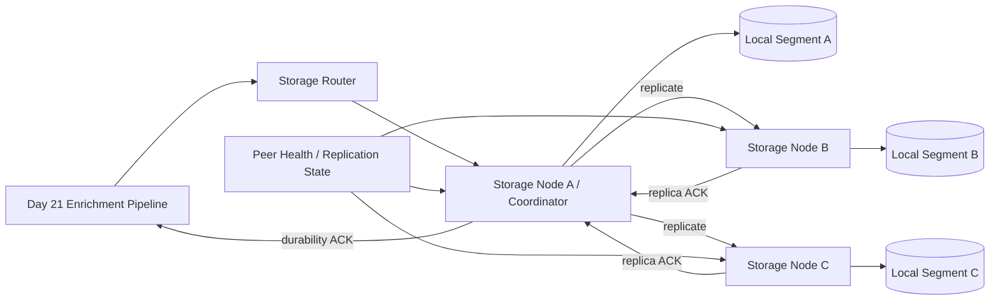
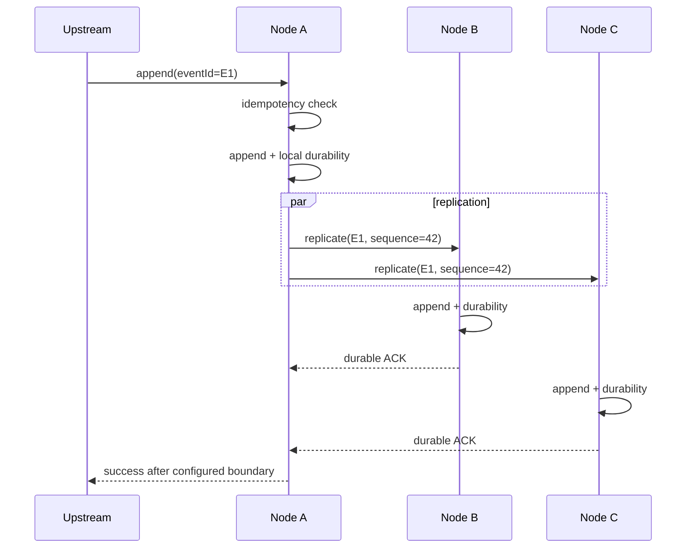

# Day 22 — Multi-Node Storage Cluster with File Replication

## 1. Public source material actually visible

The public SDCourse curriculum lists Day 22 as setting up a multi-node storage cluster using simple file replication, with the expected output being log storage distributed across multiple nodes with basic replication. A publicly readable Day 22 preview describes the motivation as removing the single storage-node failure point after the enrichment pipeline. It publicly identifies storage nodes, a replication manager, and health monitoring as core components, and describes a flow in which an enriched log is written to a primary node, replication is triggered to secondary nodes, replication state is checked, and durability is acknowledged. The public preview also discusses availability, scalability, durability, node failure, replication, and recovery. This lesson uses only those publicly visible ideas as source scope; everything below is original instructional material.

Public sources:
- SDCourse 254-lesson curriculum: https://sdcourse.substack.com/p/hands-on-distributed-systems-with
- Public Day 22 preview: https://sdcourse.substack.com/p/day-22-multi-node-storage-cluster
- Another publicly indexed Day 22 preview: https://sdcourse.substack.com/p/day-22-building-your-first-multi

## 2. Original standalone lesson

## Goal

Day 21 produced enriched canonical events. Until now, durable storage could still be one machine. Day 22 removes that single point of failure by storing each accepted log record on multiple storage nodes.

The important lesson is not merely copying files. It is defining precisely what a successful distributed write means when machines, disks, processes, and networks can fail independently.

## First principles

A single durable disk is not a distributed durability guarantee. If one node owns the only copy of an event, that node is simultaneously a capacity limit and a failure domain.

Replication creates redundant copies:

```text
Event E
  ├── Node A
  ├── Node B
  └── Node C
```

If the replication factor is 3, three nodes are intended to hold the event. This does not automatically mean every write must wait for all three copies. The acknowledgement policy determines the actual durability/latency trade-off.

## Why this matters

Suppose the Day 21 pipeline accepts an enriched event, writes it only to Node A, returns success, and Node A loses its disk. The upstream system was told the event was durable even though no surviving copy exists.

A distributed storage contract must answer:

- how many replicas should exist?
- which node coordinates a write?
- when is a write acknowledged?
- what happens when one replica is unavailable?
- how are missed replicas repaired?
- how do retries avoid duplicate logical records?
- how is overload propagated upstream?

## Terminology

**Storage node** — process/machine owning local append-only log segments.

**Coordinator/primary** — node handling a particular client write and coordinating replicas. This is a request role; do not confuse it with the stronger cluster-wide leadership problem introduced later in Day 25.

**Replica** — another node storing a copy of the same logical record.

**Replication factor (RF)** — intended number of copies, e.g. RF=3.

**Write acknowledgement** — statement that the configured durability boundary has been reached.

**Commit index / durable offset** — local or replicated position known to be safely committed under the chosen policy.

**Replica lag** — difference between coordinator progress and replica progress.

**Repair** — copying missing records/segments after a node recovers.

**Failure domain** — infrastructure that can fail together, such as one process, host, rack, or availability zone.

## Requirements

For this learning implementation:

1. Run three independent Spring Boot storage nodes.
2. Store events in append-only segment files.
3. Replicate records to two peer nodes (RF=3).
4. Give every event a stable `eventId`.
5. Use explicit request IDs/offsets for retry safety.
6. Support configurable acknowledgement policies.
7. Bound replication queues and network concurrency.
8. Detect unhealthy peers.
9. Persist enough replication metadata to recover after restart.
10. Expose replication lag and under-replication metrics.

We intentionally do not solve every later-week problem today. Day 23 adds partitioning, Day 24 consistent hashing, Day 25 leader election, Day 26 membership/health, Day 28 quorums, and Day 29 anti-entropy. Today builds the simplest correct replication foundation those lessons can evolve.

## Architecture



## Component responsibilities

### Storage API

Receives canonical enriched events or batches. It validates envelope limits but should not redo Day 21 enrichment.

### Storage coordinator

Chooses the replica set, appends locally, issues replication requests, tracks acknowledgements, applies the configured durability policy, and returns success/failure upstream.

### Segment store

Owns local append-only files, checksums, fsync policy, segment rotation, and recovery scanning.

### Replication client

Sends deterministic replication records to peers with bounded connections, deadlines, retry policy, and request identity.

### Replica endpoint

Accepts a replicated record, verifies identity/checksum, performs an idempotent local append, reaches its local durability boundary, and returns a replica acknowledgement.

### Replication state store

Tracks which replicas have confirmed each committed range and which ranges remain under-replicated.

### Repair worker

Retries missing replicas outside the synchronous request path. Day 29 will make this much stronger with anti-entropy.

## Contracts and data models

Keep the domain event distinct from the replication envelope.

```java
public record EnrichedLogEvent(
        UUID eventId,
        Instant occurredAt,
        String service,
        String environment,
        String hostname,
        String level,
        String message,
        Map<String, String> attributes
) {}
```

Replication needs additional storage metadata:

```java
public record ReplicationRecord(
        UUID requestId,
        UUID eventId,
        String streamId,
        long sequence,
        byte[] payload,
        int payloadCrc32c
) {}
```

A replica acknowledgement should state exactly what was made durable:

```java
public record ReplicaAck(
        UUID requestId,
        UUID eventId,
        String nodeId,
        long sequence,
        AckStatus status
) {}

public enum AckStatus {
    DURABLE,
    DUPLICATE_ALREADY_DURABLE,
    REJECTED,
    RETRYABLE_FAILURE
}
```

Do not make an HTTP 200 alone the durability contract. The application-level acknowledgement must mean something precise.

## Local file layout

A simple layout is:

```text
data/
  stream-001/
    00000000000000000000.seg
    00000000000000100000.seg
    index.meta
```

Each record can be framed as:

```text
[length][version][sequence][eventId][payload][checksum]
```

Length framing supports scanning. A version allows format evolution. Sequence gives deterministic ordering within a stream. Event ID supports logical idempotency. Checksum detects torn/corrupt records.

## End-to-end write flow

For RF=3 with a policy requiring two durable copies:



The coordinator may continue repairing a missing third replica after returning success if the configured policy allows success with two copies.

## Acknowledgement boundaries

Three policies illustrate the trade-off.

### Local-only ACK

```text
local append + fsync -> ACK
```

Lowest latency, but coordinator loss before replication can lose an acknowledged event.

### Two-copy durable ACK

```text
local durable + >=1 remote durable -> ACK
```

For RF=3 this survives one copy failure at the moment of acknowledgement and is a useful learning default.

### All-replica ACK

```text
A durable + B durable + C durable -> ACK
```

Strongest immediate replication but highest tail latency and lowest availability during a replica outage.

Never describe asynchronous replication as lossless unless the acknowledgement contract actually guarantees an adequate number of durable copies.

## Java 21 / Spring Boot implementation guidance

Use virtual threads carefully for blocking network/file coordination if the stack is predominantly blocking:

```java
@Bean
ExecutorService replicationExecutor() {
    return Executors.newVirtualThreadPerTaskExecutor();
}
```

Virtual threads make blocking cheaper; they do not make unbounded work safe. Put a semaphore or bounded admission controller in front of replication so the service cannot create unlimited outstanding requests.

A coordinator skeleton:

```java
@Service
public final class ReplicatedStorageService {
    private final SegmentStore segmentStore;
    private final ReplicaClient replicaClient;
    private final IdempotencyStore idempotencyStore;
    private final ReplicationPolicy policy;

    public WriteResult append(EnrichedLogEvent event) {
        var existing = idempotencyStore.find(event.eventId());
        if (existing.isPresent()) {
            return existing.get();
        }

        var local = segmentStore.appendDurably(event);
        var acknowledgements = replicaClient.replicate(local);
        var result = policy.evaluate(local, acknowledgements);

        if (result.durable()) {
            idempotencyStore.record(event.eventId(), result);
        }
        return result;
    }
}
```

This is conceptual. In a real implementation the event append and idempotency marker must share a crash-safe atomic/recoverable boundary; otherwise a crash between them can create ambiguous state.

## Crash consistency

File storage must handle a process dying midway through a write. A practical append path is:

```text
encode complete frame
 -> append frame
 -> flush userspace buffers
 -> fsync according to durability policy
 -> update recoverable metadata
 -> expose durable ACK
```

On startup, scan the tail of the active segment. If the final frame is incomplete or checksum-invalid, truncate to the last valid frame before accepting traffic.

Metadata should either be derivable from segment contents or updated using an atomic replacement pattern (`write temp -> fsync -> atomic rename`) so metadata itself does not become the weakest durability point.

## Concurrency and ordering

Do not use one global lock for all logs. That destroys throughput.

Instead define ordering where it is actually required, for example per stream/partition:

```text
stream A: 40 -> 41 -> 42
stream B: 91 -> 92 -> 93
```

Different streams can append concurrently. Within one stream, a single writer or ordered sequencer makes file offsets and replica ordering deterministic.

If replica requests arrive out of order, the replica can buffer only a small bounded gap or reject with `expectedSequence`, allowing the coordinator to resend the missing range. Unbounded reordering buffers are dangerous.

## Idempotency boundary

Network timeouts create ambiguity:

```text
A -> B: replicate E1
B writes E1
B -> A: ACK
network drops ACK
A retries E1
```

Without idempotency, B stores E1 twice.

Replica writes therefore need a stable identity. A simple contract is uniqueness on `(streamId, eventId)` or `(streamId, sequence, eventId)`.

A duplicate request must return `DUPLICATE_ALREADY_DURABLE`, not append another logical event.

Idempotency state must be durable or reconstructible from the segment/index. An in-memory `ConcurrentHashMap` alone is insufficient after restart.

## Consistency model

Today's simple cluster should explicitly promise less than a mature database.

A reasonable contract is:

- successful writes satisfy the configured replica durability boundary;
- reads from the coordinator can provide read-your-write behavior;
- lagging replicas may temporarily be stale;
- background repair converges missing copies;
- global ordering is not guaranteed.

Do not claim linearizability yet. Later lessons introduce the mechanisms needed to reason about stronger guarantees.

## Retries

Retry transient failures such as connect timeout, connection reset, temporary 5xx, or a peer restart. Use exponential backoff with jitter and a retry budget.

Do not blindly retry deterministic failures such as invalid checksum, unsupported record version, oversized payload, or conflicting event identity. Quarantine/alert those because repeated retries only amplify load.

A replication retry should resend the same `requestId`, `eventId`, stream, sequence, and payload. A retry must not become a new logical write.

## Recovery scenarios

### Replica fails before ACK

If the durability policy is already met, return success and mark the range under-replicated. Otherwise keep within the bounded retry/deadline policy and fail the upstream write if the durability contract cannot be reached.

### Coordinator crashes after remote replica persisted but before upstream ACK

The upstream retries. Stable event identity lets the cluster recognize the write and return the previously established result rather than duplicating it.

### Replica restarts

It loads local segment state, reports its last durable sequence/checkpoint, and the repair process copies the missing range.

### Corrupt segment

Checksum validation identifies bad frames. Never silently accept corrupt bytes. Isolate the segment/node and recover from a healthy replica when possible.

## Scaling

Replication multiplies work. At RF=3, one logical byte produces approximately three stored bytes plus network and metadata overhead.

Capacity planning must therefore consider:

```text
logical ingress × replication factor
```

as well as peak repair traffic. A cluster operating at 95% normal network/disk capacity has no room to recover a failed replica.

Day 23 will distribute data into partitions so every node need not coordinate every stream. Day 24 then improves placement using consistent hashing.

## Backpressure

Replication queues must be bounded.

```text
ingress
  ↓
admission limit
  ↓
local append
  ↓
bounded replication work
  ↓
peer connections
```

When replicas slow down, do not accumulate unlimited `CompletableFuture`s or byte arrays. Stop admitting new work, reduce batch size, return overload (`429/503` depending on API semantics), or let upstream durable queues retain the events.

Backpressure is part of correctness: crashing from memory exhaustion can destroy availability more severely than temporarily rejecting load.

## Batching

Replication can batch consecutive records:

```text
[seq 100..199] -> one replica request
```

This reduces syscalls and network overhead but increases acknowledgement latency because an event may wait for its batch. Bound batches by both count/bytes and maximum delay.

## Health and failure detection

Today use simple peer health as an operational hint, not as proof of correctness. A successful heartbeat means only that the peer answered recently; it does not prove every replica is current.

Track separately:

- node reachable/unreachable;
- last successful replication;
- durable sequence per stream;
- replication lag;
- under-replicated bytes/records.

Day 26 will turn this into a dedicated membership and health system.

## Observability

Useful Micrometer metrics include:

```text
storage_write_total{result}
storage_write_latency_seconds
segment_fsync_latency_seconds
replication_request_total{peer,result}
replication_latency_seconds{peer}
replication_lag_records{peer,stream}
under_replicated_records
replication_queue_depth
repair_bytes_total
idempotent_duplicate_total
checksum_failure_total
```

Be careful with metric cardinality. `eventId` must never be a metric label. `stream` labels should also be bounded or aggregated when stream counts are large.

Logs should carry request ID, event ID, stream, sequence, coordinator node, replica node, durability policy, and failure class. Distributed traces can span upstream ingestion -> coordinator -> replica calls, but sampling is necessary at high volume.

## Security

Replication traffic is privileged internal data movement. Protect it with TLS; production systems commonly add mTLS/service identity. Authorize replica endpoints so arbitrary clients cannot inject replica records.

Validate record length before allocating buffers. Verify checksums, format version, event identity, and allowed stream. Apply per-peer rate limits. Never trust a peer merely because it is on an internal network.

Encrypt storage at rest when logs may contain sensitive data, and restrict file permissions to the service identity. Avoid placing secrets or PII into diagnostic replication logs.

## Trade-offs

### Synchronous replication

Pros: acknowledged data has multiple durable copies; recovery point is clearer.

Cons: write latency follows slower replicas; replica outages can reduce write availability.

### Asynchronous replication

Pros: fast client acknowledgement and looser coupling.

Cons: acknowledged data can be lost if the only durable copy fails before replication; lag and repair become central operational risks.

### RF=2 versus RF=3

RF=2 costs less storage/network but provides fewer choices when one copy is unavailable. RF=3 costs more but is a much better foundation for later quorum and failure-tolerance lessons.

The correct choice depends on explicit durability and availability objectives, not on a universal rule.

## Practical example

Assume enriched baggage-platform operational logs arrive at 20,000 events/sec. RF=3 means the storage layer plans for roughly 60,000 replica-appends/sec across the cluster, plus repair headroom.

For event `E123`:

```text
Ingress -> Node A
Node A durable: yes
Node B durable: yes
Node C timeout
```

With a two-copy policy, A can acknowledge the upstream event and record C as under-replicated. The repair worker later retries C using the same event identity and sequence. With an all-replica policy, the write cannot yet be acknowledged successfully.

This is why the acknowledgement policy is part of the external API contract.

## Exercises

1. Run three Spring Boot storage nodes on different ports/directories.
2. Implement append-only framed segment files with CRC32C.
3. Add RF=3 replication over HTTP or TCP.
4. Implement `LOCAL`, `TWO_COPIES`, and `ALL_REPLICAS` acknowledgement policies.
5. Kill one replica during writes and compare latency/availability under each policy.
6. Drop replica ACK responses after persistence and prove retries do not duplicate events.
7. Restart a replica and repair its missing sequence range.
8. Corrupt the final segment frame and implement startup tail truncation.
9. Saturate one replica and verify bounded backpressure instead of unbounded heap growth.
10. Benchmark RF=1 versus RF=3 and explain the throughput/latency difference.

## Test strategy

### Unit tests

Test record framing, checksums, acknowledgement-policy evaluation, replica selection, retry classification, duplicate detection, segment rotation, and recovery scanning.

### Contract tests

Verify that every replica implementation interprets `ReplicationRecord` and `ReplicaAck` identically, including duplicate and conflict behavior.

### Integration tests

Start three real node processes with isolated data directories. Write events, stop nodes, restart them, and verify byte/logical-event equivalence after repair.

### Concurrency tests

Write many streams concurrently while preserving monotonically increasing per-stream sequence. Verify there is no global serialization bottleneck and no duplicate logical events.

### Crash-consistency tests

Terminate processes at deliberately chosen points: before append, after append before fsync, after fsync before replica ACK, after remote durability before coordinator ACK, and during metadata update. Restart and verify the documented durability contract.

### Performance tests

Measure p50/p95/p99 write latency, events/sec, bytes/sec, fsync latency, replication queue depth, CPU, heap, disk bandwidth, and network bandwidth for RF=1/2/3 and different acknowledgement policies.

### Chaos tests

Inject peer latency, packet loss, connection resets, disk-full, read-only filesystem, process kill, corrupted frames, and slow repair. Assert bounded memory, deterministic ACK semantics, and eventual restoration of the target replica count when failures heal.

## Connection to Day 21

Day 21 completed the logical event-processing pipeline:

```text
Input -> Normalization -> Enrichment -> Output
```

Day 22 makes that output distributed and failure-aware. The enriched canonical event remains the business payload; replication metadata belongs to the storage layer and must not leak back into the enrichment model.

## Connection to Day 23

The public curriculum identifies Day 23 as implementing a partitioning strategy based on source or time, with partitioned storage demonstrating improved query performance.

Replication answers **how many copies should survive**. Partitioning answers **where a particular event belongs** and **how the total dataset is divided so storage and queries scale**.

Day 23 will therefore evolve today's replicated cluster from "copy records to peers" into a storage topology with explicit partitions, partition keys, routing, local partition files, and query pruning.