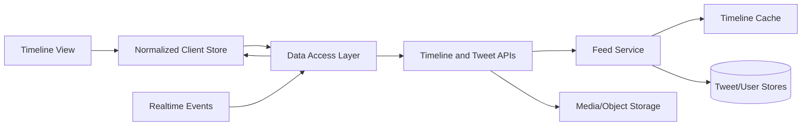
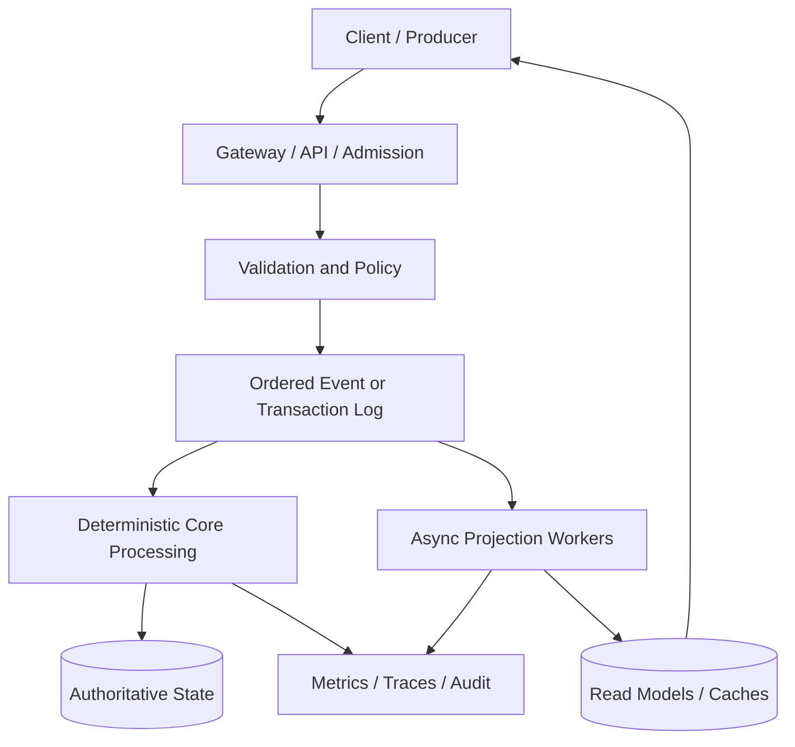

# System Design One — 19 Case Studies (Public Recovery)

## Source

- Substack Note: https://substack.com/@systemdesignone/note/c-300843367
- Recovered public list: 19 system-design case studies
- Recovery mode: public web only; authenticated/paid sections intentionally not copied

## Recovery Status

| No. | Case study | Public URL | Status |
|---:|---|---|---|
| 1 | How Stock Exchange Works | https://newsletter.systemdesign.one/p/stock-exchange-system-design | Recovered |
| 2 | How Payment System Works |  | Pending direct URL resolution |
| 3 | How YouTube Works |  | Pending direct URL resolution |
| 4 | How Google Docs Works | https://newsletter.systemdesign.one/p/how-does-google-docs-work | Recovered |
| 5 | How Kafka Works | https://newsletter.systemdesign.one/p/how-kafka-works | Recovered |
| 6 | How Pastebin Works | https://systemdesign.one/system-design-pastebin/ | Pending extraction |
| 7 | How WhatsApp Works |  | Pending direct URL resolution |
| 8 | How Airbnb Works |  | Pending direct URL resolution |
| 9 | How Spotify Works |  | Pending direct URL resolution |
| 10 | How Slack Works | https://systemdesign.one/slack-architecture/ | Pending extraction |
| 11 | How Reddit Works | https://newsletter.systemdesign.one/p/reddit-architecture | Recovered |
| 12 | How Google Search Works |  | Pending direct URL resolution |
| 13 | How Real-Time Leaderboard Works | https://systemdesign.one/leaderboard-system-design/ | Pending extraction |
| 14 | How Twitter/X Timeline Works | https://newsletter.systemdesign.one/p/system-design-interview-twitter | Recovered |
| 15 | How Uber Computes ETA |  | Pending direct URL resolution |
| 16 | How Amazon Lambda Works |  | Pending direct URL resolution |
| 17 | How Amazon S3 Works | https://newsletter.systemdesign.one/p/s3-strong-consistency | Recovered |
| 18 | How AirTags Work | https://newsletter.systemdesign.one/p/how-do-airtags-work | Recovered |
| 19 | How ChatGPT Works |  | Pending direct URL resolution |

## Architecture Notes From Publicly Recovered Articles

### 1. Stock Exchange

Core design:

- Broker applications communicate with an exchange gateway.
- The gateway performs risk checks, wallet validation, order management, sequencing, and protocol conversion.
- A deterministic matching engine maintains in-memory buy and sell order books.
- Price-time priority is implemented with price levels and FIFO queues.
- An order-ID index enables near constant-time cancellation lookup.
- Event sourcing and monotonically increasing sequence numbers support fairness, replay, gap detection, and recovery.
- Separate ordered streams can be maintained for new orders, cancellations, trades, and market-data events.

Reusable enterprise patterns:

- Keep latency-sensitive decision logic out of unnecessary remote-service calls.
- Use deterministic state machines when replay must reproduce exactly the same output.
- Separate command admission, validation, sequencing, execution, and downstream projections.
- Preserve an append-only journal for audit and disaster recovery.

### 2. Google Docs

Core design:

- Each client keeps a local document copy to hide network latency.
- Changes are represented as operations instead of repeatedly replacing the whole document.
- Operational transformation reconciles concurrent edits and converges replicas.
- Revision history acts as an ordered operation log.
- Real-time collaboration requires conflict resolution, propagation, and offline-change reconciliation.

Reusable enterprise patterns:

- Model business changes as operations/events when concurrent actors modify shared state.
- Use optimistic local updates for responsiveness, but retain authoritative reconciliation.
- Separate user-visible state from the synchronization protocol.

### 3. Kafka

Core design topics recovered from the public article index:

- Brokers, topics, partitions, consumer groups, and replication.
- Partition ordering and horizontal scaling.
- KRaft-based metadata management.
- Tiered storage, Kafka Connect, and exactly-once processing considerations.

Reusable enterprise patterns:

- Partition by an entity key when per-entity ordering matters.
- Treat exactly-once as an end-to-end application property, not just a broker switch.
- Design consumers for replay, idempotency, lag monitoring, and poison-message isolation.

### 4. Reddit

Core design themes:

- Separate content entities from ranking and feed-generation concerns.
- Cache hot posts and frequently accessed aggregates.
- Use asynchronous pipelines for vote aggregation, ranking updates, notifications, and recommendation signals.
- Apply pagination and denormalized read models for high-volume feed access.

Reusable enterprise patterns:

- Do not calculate expensive rankings synchronously for every request.
- Build read-optimized projections from an authoritative event or transactional source.
- Isolate rapidly changing counters from larger immutable content objects.

### 5. Twitter/X Timeline Frontend

Core design:

- The frontend is treated as a distributed system with View, Store, Data Access, and Server layers.
- The client store normalizes tweets, users, media, and timeline ID lists.
- Cursor pagination supports infinite scrolling.
- Code splitting limits initial JavaScript cost.
- List virtualization bounds DOM and memory usage.
- Optimistic updates make likes and retweets appear immediate, with rollback on failure.
- Hybrid rendering is possible, but highly personalized feeds often favor client-side rendering after initial load.
- Media upload is separated from tweet creation, commonly using object storage or presigned URLs.

Implementation lessons:

- Store timeline order as tweet IDs instead of nested duplicate tweet objects.
- Deduplicate entities globally and merge cursor pages into the normalized store.
- Virtualize long timelines and lazy-load expensive tweet formats.
- Keep optimistic mutation metadata so failed operations can be reversed safely.

### 6. Amazon S3 Strong Consistency

Core design themes:

- Strong read-after-write behavior must be maintained without sacrificing regional availability targets.
- Metadata coordination and object-data storage have different responsibilities.
- Partitioning, replication, quorum/coordination mechanisms, and failure recovery must be designed independently.

Reusable enterprise patterns:

- Separate large immutable payload storage from small consistency-sensitive metadata.
- Design consistency guarantees explicitly for create, update, list, and delete operations.
- Test failover semantics, not only normal-path throughput.

### 7. AirTags

Core design themes:

- Nearby devices participate in a privacy-preserving distributed discovery network.
- Short-range identifiers rotate to reduce long-term tracking risk.
- Observations are encrypted and relayed through a large crowdsourced network.
- Only an authorized owner should be able to interpret the resulting location information.

Reusable enterprise patterns:

- Use rotating pseudonymous identifiers when globally unique stable IDs create privacy risks.
- Separate data collection, encrypted relay, and authorized interpretation.
- Assume relays are untrusted and minimize what they can learn.

## Common Pattern Across the Case Studies

The recurring architecture is:

1. Admit and validate commands.
2. Establish ordering or transactional authority.
3. Run deterministic core logic.
4. Persist authoritative state and audit history.
5. Build asynchronous, read-optimized projections.
6. Serve clients from caches/read models while reconciling with the source of truth.

## Next Collector Pass

The configured Playwright collector should resolve the remaining direct links and save separate notes when an authenticated Substack browser state is available. This index is intentionally resumable and should be updated rather than replaced by another branch or folder.
