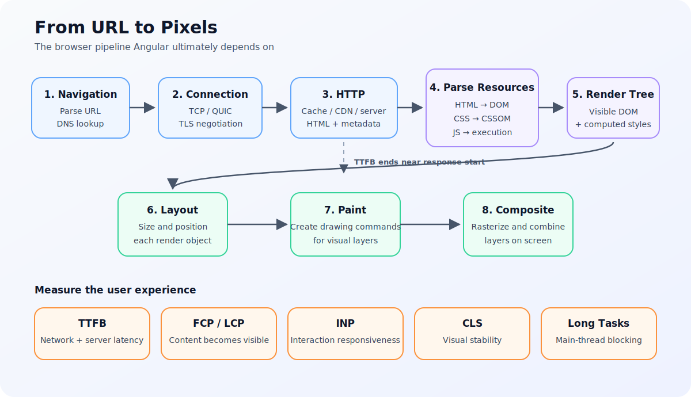
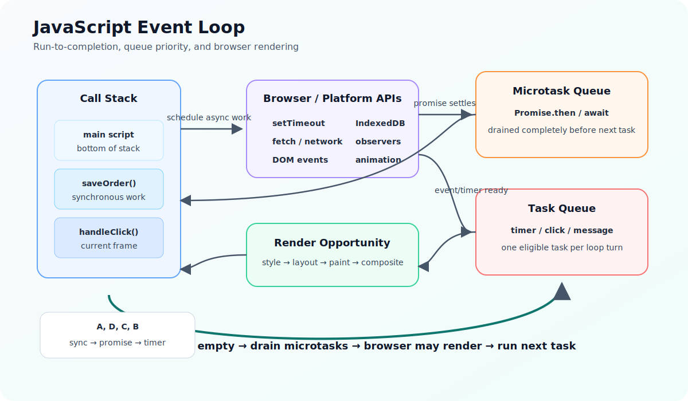
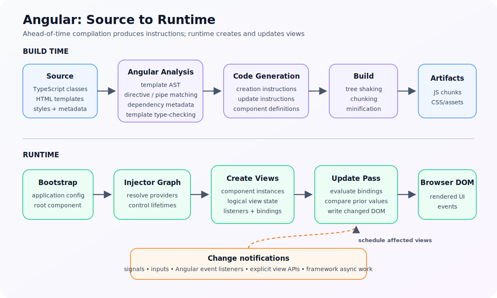
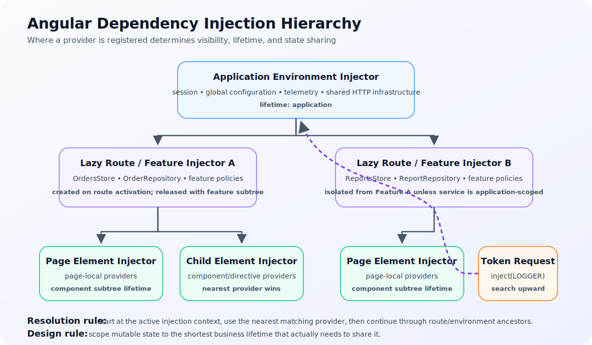
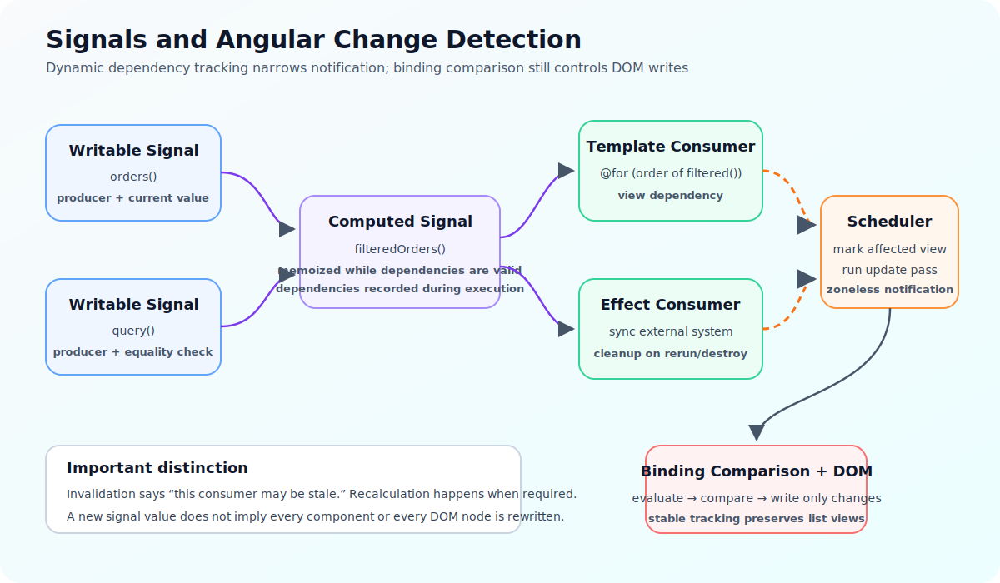
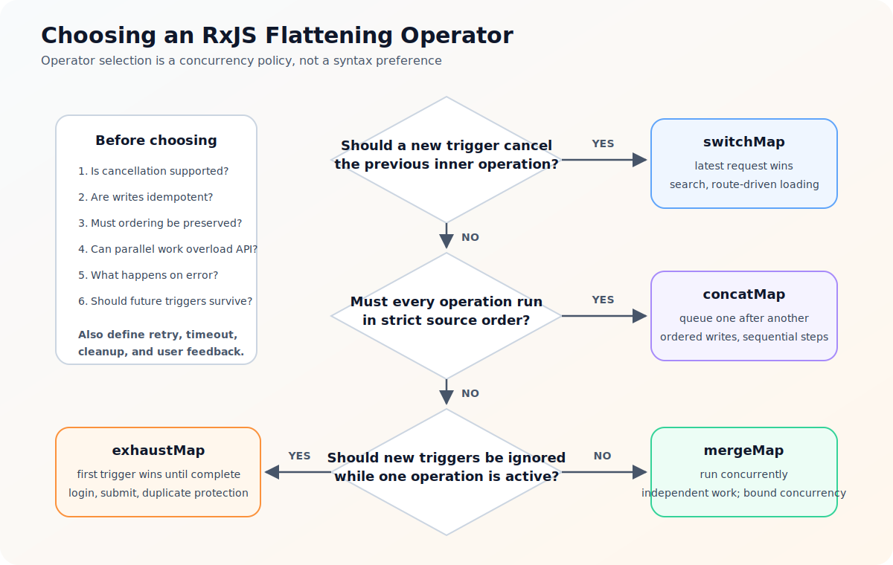
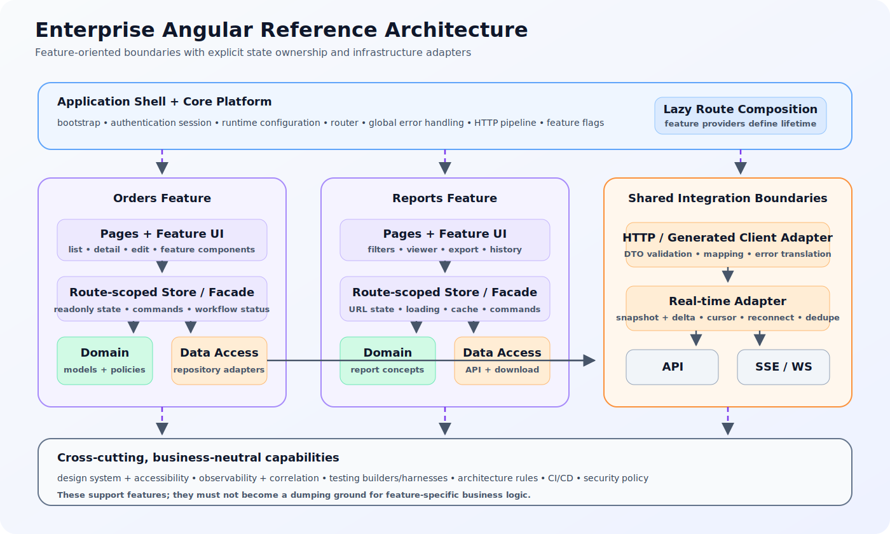
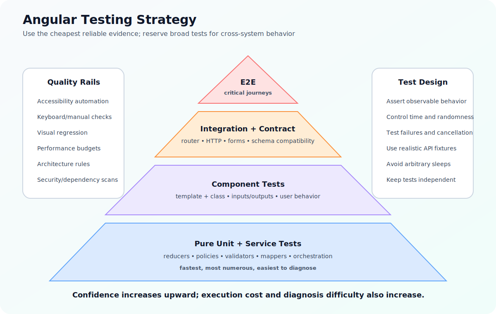
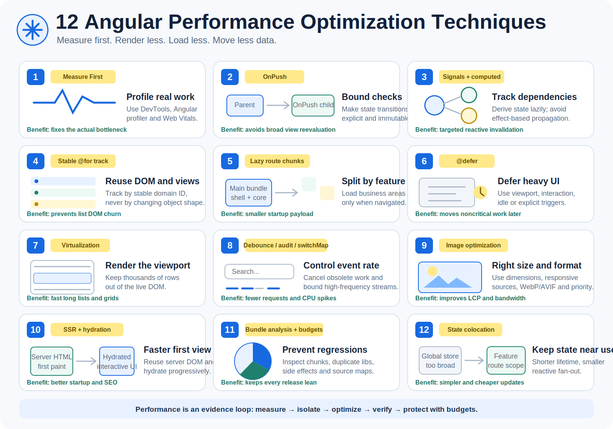
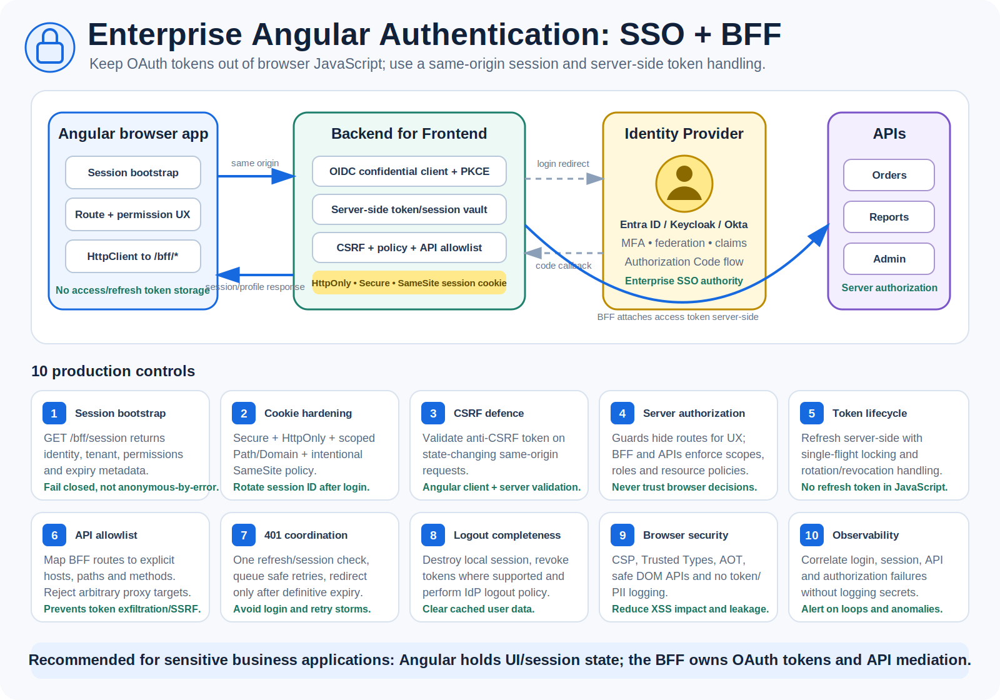

# Angular Visual Engineering Guide

This guide connects the most important runtime, security, performance, and architecture visuals to the detailed chapters. The SVG sources are stored under [`assets/`](assets/) and can be edited directly without proprietary design tools.

## 1. Browser navigation and rendering

Use this diagram to reason from URL entry through DNS, transport, HTTP, parsing, layout, paint, compositing, and user-centric performance metrics.

Detailed chapter: [Frontend and browser foundations](01-frontend-browser-foundations.md#1-navigation-to-rendering)

## 2. JavaScript event loop

The important ordering is: execute the current stack, drain microtasks, allow a rendering opportunity, and then run the next eligible task. This explains promise/timer ordering, UI starvation, and many Angular scheduling questions.

Detailed chapter: [JavaScript deep dive](02-javascript-deep-dive.md#10-event-loop)

## 3. Angular compilation and runtime

Angular templates are compiled into framework instructions. At runtime Angular bootstraps providers, creates logical views and component instances, evaluates bindings, and writes only relevant DOM changes.

Detailed chapter: [Angular internals](05-angular-internals.md#1-compilation-pipeline)

## 4. Dependency injection hierarchy

Provider placement controls visibility, sharing, lifetime, and cleanup. Prefer application scope only for truly application-wide concerns and route scope for feature state.

Detailed chapter: [Angular internals](05-angular-internals.md#9-dependency-injection-internals)

## 5. Signals and targeted change detection

Signal reads establish dynamic dependencies. Updates invalidate dependent consumers, Angular schedules affected views, and binding comparison determines actual DOM writes.

Detailed chapter: [Angular internals](05-angular-internals.md#7-signals-internals)

## 6. RxJS flattening operator selection

Choose a flattening operator by defining cancellation, ordering, concurrency, and duplicate-trigger behavior. The operator is the implementation of that policy.

Detailed chapter: [RxJS, signals, and state management](07-reactivity-and-state.md#5-essential-operators)

## 7. Enterprise Angular reference architecture

The blueprint separates a small application shell, lazy business features, route-scoped state, domain models, infrastructure adapters, external systems, and business-neutral cross-cutting capabilities.

Detailed chapter: [Enterprise Angular application blueprint](11-enterprise-blueprint.md)

## 8. Testing strategy

Most behavior should be proven with fast unit and component tests. Integration, contract, and E2E tests provide broader evidence at greater execution and diagnosis cost. Accessibility, visual, performance, architecture, and security checks run across the pyramid.

Detailed chapter: [Testing and engineering quality](09-testing-quality.md#1-test-levels)

## 9. Twelve Angular performance techniques

This infographic summarizes measurement, OnPush, signals, stable list tracking, route splitting, `@defer`, virtualization, RxJS rate control, image optimization, SSR/hydration, bundle budgets, and state colocation.

Detailed chapter: [Angular performance optimization](16-angular-performance-optimization.md)

## 10. Enterprise authentication, SSO, and BFF

The browser maintains a secure application session while the BFF acts as the confidential OIDC client, stores tokens server-side, validates CSRF, mediates approved API calls, and keeps authorization enforcement on trusted servers.

Detailed chapter: [Enterprise authentication, SSO, and BFF](17-authentication-sso-bff.md)

## 11. Twelve enterprise implementation patterns

This infographic covers feature boundaries, route-scoped providers, facades, ports and adapters, BFF, typed transport boundaries, state ownership, snapshot-plus-delta real-time integration, stable errors, runtime configuration, observability, and automated architecture rules.

Detailed chapter: [Enterprise Angular implementation patterns](18-enterprise-implementation-patterns.md)

## Diagram usage rules

- Keep diagrams focused on one mental model or one compact implementation checklist.
- Use infographic cards when the topic is a collection of directly actionable techniques.
- Prefer stable engineering concepts over screenshots tied to a temporary UI version.
- Store editable SVG in the repository.
- Include an SVG `title`, `desc`, and meaningful Markdown alternative text.
- Update both diagram and explanation when architecture changes.
- Do not treat a diagram as proof that implementation boundaries are actually enforced; validate with code and tooling.
