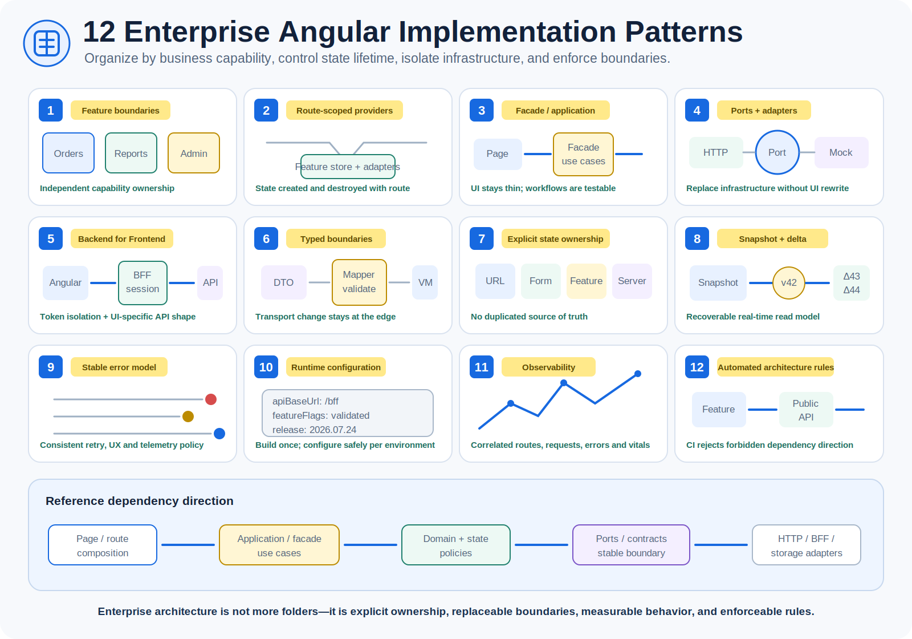

# Angular Engineering Knowledge Base

A structured path from browser and language fundamentals to production Angular architecture, framework internals, testing, performance, security, enterprise authentication, and interview preparation.

> Baseline: Angular v22-era APIs and practices, verified against official documentation in July 2026. Stable web, JavaScript, TypeScript, architecture, and design principles are separated from version-specific Angular behavior.

## Visual overview

The vault now includes both mechanism diagrams and infographic-style learning images. Open the complete [Angular visual engineering guide](15-visual-guide.md) for browser rendering, the JavaScript event loop, Angular compilation, dependency injection, signals, RxJS concurrency, testing, performance, SSO/BFF authentication, and enterprise implementation patterns.

## How to use this vault

1. Follow the roadmap in order when learning from scratch.
2. Use the topic files as durable reference notes.
3. Build the projects instead of only reading.
4. Use the interview file after completing the corresponding technical section.
5. Revisit framework internals whenever an Angular API feels magical.
6. Use the visual guide when you need a fast mental model before reading details.
7. Use the enterprise guides as implementation and architecture-review checklists.

## Curriculum

| Stage | File | Outcome |
|---|---|---|
| 0 | [Learning roadmap](00-roadmap.md) | Study order, milestones, revision system |
| 1 | [Frontend and browser foundations](01-frontend-browser-foundations.md) | Browser pipeline, DOM, CSS, networking, accessibility |
| 2 | [JavaScript deep dive](02-javascript-deep-dive.md) | Runtime model, closures, prototypes, async, modules |
| 3 | [TypeScript deep dive](03-typescript-deep-dive.md) | Type system, generics, narrowing, compiler behavior |
| 4 | [Angular from scratch](04-angular-from-scratch.md) | Workspace, components, templates, DI, services |
| 5 | [Angular internals](05-angular-internals.md) | Compilation, views, change detection, signals, DI internals |
| 6 | [Angular platform features](06-angular-platform-features.md) | Routing, forms, HTTP, content projection, lifecycle |
| 7 | [RxJS, signals, and state](07-reactivity-and-state.md) | Correct reactive design and state ownership |
| 8 | [Architecture and design patterns](08-architecture-design-patterns.md) | Scalable boundaries, patterns, anti-patterns |
| 9 | [Testing and engineering quality](09-testing-quality.md) | Unit, integration, component, E2E, maintainability |
| 10 | [Performance, SSR, security, accessibility](10-production-readiness.md) | Production optimization and operational readiness |
| 11 | [Enterprise Angular blueprint](11-enterprise-blueprint.md) | Reference architecture for a large application |
| 12 | [Hands-on projects](12-projects.md) | Progressive real-world implementation practice |
| 13 | [Interview preparation](13-interview-preparation.md) | Questions, scenarios, coding exercises, system design |
| 14 | [Cheat sheets and official references](14-cheatsheets-references.md) | Fast revision and primary documentation |
| 15 | [Visual engineering guide](15-visual-guide.md) | Editable diagrams and infographic learning cards |
| 16 | [Angular performance optimization](16-angular-performance-optimization.md) | Measurement-driven runtime, loading, rendering and bundle optimization |
| 17 | [Authentication, SSO, and BFF](17-authentication-sso-bff.md) | Enterprise OIDC, secure sessions, CSRF, token lifecycle and BFF implementation |
| 18 | [Enterprise implementation patterns](18-enterprise-implementation-patterns.md) | Production feature boundaries, ports, facades, real-time, observability and migration |

## Competency model

A strong Angular engineer must understand five layers:

1. **Platform:** browser, DOM, rendering, networking, storage, security, accessibility.
2. **Language:** JavaScript runtime and TypeScript type system.
3. **Framework:** Angular compilation, templates, DI, reactivity, routing, forms, HTTP, rendering.
4. **Architecture:** boundaries, state ownership, data flow, authentication, testing, performance, deployment.
5. **Delivery:** debugging, observability, CI/CD, code review, migration, and technical communication.

## Current Angular direction

Modern Angular favors:

- standalone components and functional providers;
- signals for local and derived synchronous state;
- RxJS for asynchronous streams, cancellation, and event composition;
- explicit and increasingly zoneless change notification;
- deferred loading, SSR, hydration, and incremental rendering;
- strict typing, immutable data flow, and small dependency boundaries;
- functional HTTP interceptors and modern application initializers;
- feature-oriented architecture instead of type-oriented dumping grounds;
- secure same-origin BFF architecture for sensitive browser applications when OAuth tokens should remain server-side.

## Definition of completion

You are ready for a mid-to-senior Angular role when you can:

- explain what happens from URL entry to pixels on screen;
- reason about event loop, microtasks, closures, prototypes, and module loading;
- model complex types without weakening the system with `any`;
- explain Angular compilation, dependency resolution, view creation, and change detection;
- choose correctly between signals, RxJS, local state, URL state, and server state;
- design lazy feature boundaries and stable public APIs;
- implement SSO and BFF session handling without exposing tokens to Angular;
- test behavior at the cheapest reliable level;
- diagnose bundle, rendering, network, memory, and change-detection problems;
- secure templates, cookies, routes, and backend interactions without trusting the client;
- design and defend an enterprise Angular architecture in an interview.
